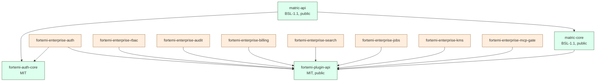
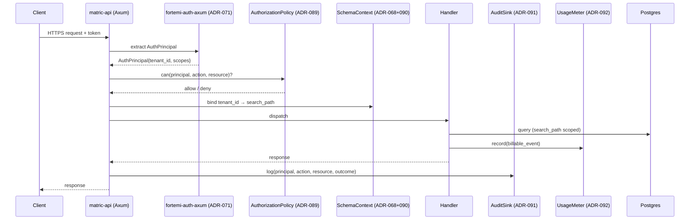
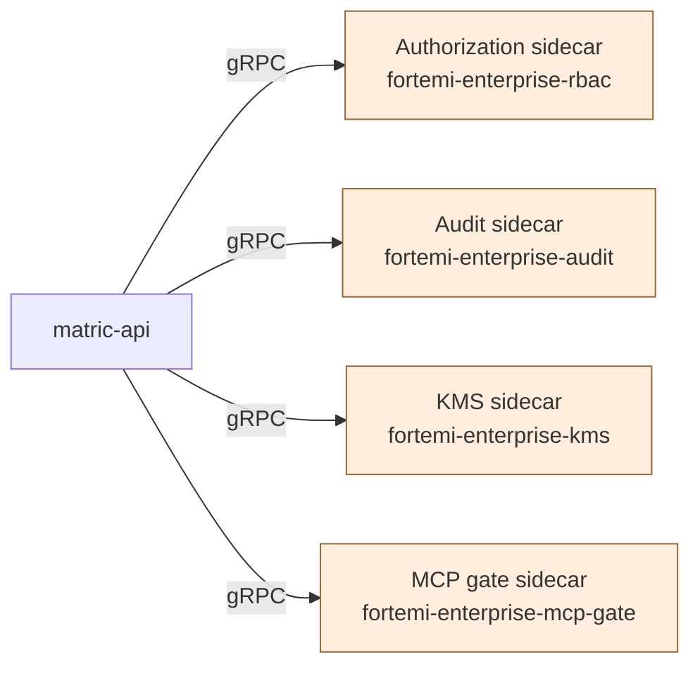

# Fortemi CE/EE Plugin Viability Audit

## 1. Executive Summary

Fortemi is well-positioned to support a Community Edition / Enterprise Edition split, but the current codebase is not yet contractually ready for third-party Enterprise plugins. The strongest asset is `matric-core/src/traits.rs`, which already declares fourteen `Send + Sync` repository and backend traits — most of the data-plane surface area an EE distribution would want to override is already an interface, not a concrete dependency. ADR-072 (inference provider registry), ADR-068 (archive isolation via `SchemaContext`), and ADR-071 (auth middleware) demonstrate a mature pattern of capability-typed, slug-routed, health-tracked services. Sixty existing ADRs show this team writes its decisions down before it writes its code.

The gaps cluster on the control plane: authorization, multi-tenant identity propagation, audit, metering, key custody, and the supply-chain story for the `fortemi-auth` Gitea-hosted crates. The most acute single finding is that `REQUIRE_AUTH` defaults off in `crates/matric-api/src/main.rs` near line 1756 — an open-by-default posture is acceptable for the localhost developer experience that the HotM Electron/Tauri shell targets, but it is unacceptable as a default for any hosted multi-tenant deployment. Closely related: an `AuthPrincipal` exists, but there is no `can(principal, action, resource)` decision point, no `tenant_id` carried through `AuthContext`, and `SchemaContext` (ADR-068) currently isolates archives, not tenants. A handler that forgets `for_schema()` will silently read across boundaries.

We recommend a CE/EE split anchored on **Cargo feature flags plus private EE crates** (Option A) for performance-critical and tightly-coupled surfaces, with **out-of-process gRPC sidecars** (Option C) for surfaces where blast-radius or compliance scope dominates — authorization, audit egress, KMS, billing meter. Dynamic loading (Option B) is rejected on Rust ABI grounds. WASM (Option D) is parked. The public crates remain BSL-1.1 / MIT / AGPL as today; the new `fortemi-enterprise-*` crates ship under a commercial license against the same public trait surface.

A thirteen-ADR program (ADR-088 through ADR-100) is proposed to convert the current implicit interfaces into the public contract third parties can build against without seeing Enterprise source. Phases run roughly four months: harden the security defaults, ratify the trait surface, implement the EE crates, then refactor the runtime to support both. None of the proposed work invalidates existing ADRs; ADR-068, ADR-071, and ADR-072 are extended rather than replaced.

## 2. Scope and Methodology

This audit covers four sibling repositories under `/home/roctinam/dev/fortemi`:

- `fortemi/` — Rust workspace, BSL-1.1, GitHub. Crates: `matric-core`, `matric-db`, `matric-search`, `matric-inference`, `matric-crypto`, `matric-jobs`, `matric-api`. PostgreSQL 18 + pgvector + HNSW. MCP server with 43 tools.
- `fortemi-auth/` — Rust workspace, MIT, Gitea (private). Crates: `fortemi-auth-core` (`OAuthProvider` trait, `AuthContext` extractor, JWT primitives), `fortemi-auth-clerk`, `fortemi-auth-axum` (`tower::Layer`).
- `fortemi-react/` — Browser-only PGlite WASM client, AGPL-3.0, pnpm workspace.
- `HotM/` — Electron/Tauri SPA plus `agent-proxy` Node sidecar (BSL-1.1). `agent-proxy` holds raw cloud API keys, localhost-only.

Methodology was static: we read trait declarations, ADRs, and the small number of source locations cited in this report. We did not run the code, did not exercise the test suite, and did not audit dependency-tree CVEs. Claims tied to specific files (`crates/matric-core/src/traits.rs`, `crates/matric-api/src/main.rs:1756`) are GRADE: MODERATE — single-pass static read, no execution. Claims about plugin-model viability (Cargo features vs. `libloading` vs. gRPC vs. WASM) are GRADE: MODERATE — based on well-established Rust ecosystem behavior but not benchmarked against this codebase. Claims framed as "would likely" or "is expected to" are GRADE: LOW and are flagged for human review in §10.

## 3. Current State — Strengths

| Area | Asset | Why it matters for CE/EE |
|---|---|---|
| Data plane traits | 14 `Send + Sync` traits in `matric-core/src/traits.rs` (`NoteRepository`, `EmbeddingRepository`, `LinkRepository`, `TagRepository`, `CollectionRepository`, `JobRepository`, `EmbeddingBackend`, `GenerationBackend`, `InferenceBackend`, `SearchProvider`, `JobNotifier`, `ExtractionAdapter`, `ContentProcessor`, `TemplateRepository`, `DocumentTypeRepository`, `ArchiveRepository`) | Most data-plane EE plugins (Pinecone search, SQS jobs, S3 archives) can implement existing traits — no new contract needed. |
| Inference registry | ADR-072 — capability-typed (`Generation`/`Embedding`/`Vision`/`Transcription`), health-tracked, slug-routed (`ollama:qwen3:8b`, `openai:gpt-4o`) | Pattern is reusable for an `AuthorizationPolicy` registry, an `AuditSink` registry, etc. |
| Archive isolation | ADR-068 — `SchemaContext` wraps `SET LOCAL search_path TO {schema}, public` per request | Foundation for tenant scoping; needs extension, not replacement. |
| Auth scaffolding | ADR-071 — `REQUIRE_AUTH` env-gated, OAuth tokens (`mm_at_*`), API keys (`mm_key_*`), SHA-256 hashed | `AuthPrincipal` type already exists; gap is the missing authorization step, not authentication. |
| Optional backends | ADR-002 — `#[cfg(feature = "openai")]` etc. | Cargo features are the established mechanism; the EE plan extends, not invents. |
| ADR discipline | 60 ADRs, consistent template at `docs/architecture/adr/ADR-TEMPLATE.md` | Adding 13 more is a known-cost, low-risk activity for this team. |
| Out-of-process pattern | HotM `agent-proxy` is a localhost-only Node sidecar holding cloud keys | The IPC discipline is already in the team's muscle memory — re-using it for gRPC EE sidecars is a known move. |

## 4. Findings

Each finding lists severity (CRITICAL / HIGH / MEDIUM / LOW), evidence with file path where verified, and the ADR that will document the remedy. Severity reflects exploitability or blast radius in a hosted multi-tenant deployment; for self-hosted single-tenant CE use, several drop a tier.

### 4.1 Security

**S-1. `REQUIRE_AUTH` defaults off. [CRITICAL for hosted; LOW for localhost CE]**
Evidence: `crates/matric-api/src/main.rs:1756` (per survey). The default is documented in ADR-071 as a developer-experience choice. Risk: a hosted deployment that fails to set the env var ships an open API. Remedy: fail-closed default; opt-in `INSECURE_NO_AUTH=1` flag for local dev only; startup banner that names the mode unambiguously. **ADR-094: Fail-closed authentication defaults.**

**S-2. No authorization layer. [CRITICAL for multi-tenant; MEDIUM for single-user]**
Evidence: `AuthPrincipal` is extractable per ADR-071, but no `can(principal, action, resource)` decision point exists in the request path. Authentication answers *who*; authorization answers *what they may do*. The two are not interchangeable. Risk: any authenticated principal can call any handler their token reaches. Remedy: define an `AuthorizationPolicy` trait, route every handler through it, ship a permissive CE default and an RBAC EE policy. **ADR-089: AuthorizationPolicy trait and policy decision point.**

**S-3. Tenancy is not modeled. [CRITICAL for SaaS]**
Evidence: `SchemaContext` (ADR-068) wraps `SET LOCAL search_path` per archive, not per tenant. `AuthContext` does not carry `tenant_id`. Risk: in a multi-tenant deployment, any handler that forgets `for_schema()` reads cross-tenant rows. The trap is shape-correct and silent. Remedy: thread `tenant_id` through `AuthContext` → `SchemaContext` and enforce at the connection-acquisition layer, not the handler. A handler that wants un-scoped access must declare it explicitly. **ADR-090: Tenant identity propagation and connection-scoped enforcement.**

**S-4. `fortemi-auth` consumed via SSH git deps. [HIGH]**
Evidence: `fortemi-auth` is on Gitea, MIT-licensed, but pulled by `fortemi` via `git = "ssh://..."` style references. Risk: no checksum verification beyond Cargo's `Cargo.lock` hash; key rotation cost is non-trivial; mirror-and-verify story is informal. This is the same class of failure pattern documented in `.claude/rules/dependency-source-policy.md`. Remedy: vendor `fortemi-auth-core` (the trait crate) into the public workspace, or publish all three `fortemi-auth-*` crates to a private cargo registry with checksum pinning. Document the allowlist. **ADR-096: fortemi-auth distribution and supply-chain hardening.**

**S-5. `agent-proxy` design must not be reused for hosted. [HIGH if violated]**
Evidence: HotM's `agent-proxy` holds raw cloud API keys and binds localhost-only — appropriate for an Electron/Tauri desktop client where the user *is* the operator. Risk: any future temptation to "just move agent-proxy to the cloud" inherits a design that was never threat-modeled for hosted multi-tenant. Remedy: document the architectural boundary; explicitly require a `KeyProvider` (BYOK/KMS/HSM) for any non-desktop deployment. **ADR-093: KeyProvider trait and BYOK/KMS contract.**

**S-6. No visible CSP/SRI hardening in `fortemi-react`. [MEDIUM, escalates to HIGH on plugin JS]**
Evidence: `fortemi-react` is browser-only PGlite WASM (AGPL-3.0). No CSP or SRI manifest was located in this audit. Risk: when EE plugins ship JS UI extensions, an unprovisioned CSP becomes a plugin-supply-chain attack surface. Remedy: define CSP and SRI requirements as part of the plugin contract before any plugin JS lands. **ADR-098: Client-side plugin trust boundary (CSP/SRI).**
GRADE: LOW — absence of CSP not directly observed; flagged for human verification.

**S-7. No `AuditSink`. [HIGH for enterprise compliance]**
Evidence: no audit-egress trait was located in the survey's enumeration of `matric-core` traits. Risk: SOC2 / ISO27001 / customer audit asks have no answer. Remedy: define `AuditSink` and route privileged operations (auth, authz decisions, archive read/write, tenant administration) through it. Permissive default writes to stdout/JSONL; EE adapter writes to SIEM/Splunk/S3-WORM. **ADR-091: AuditSink trait and audit event taxonomy.**

**S-8. MCP tool surface is broad. [HIGH if multi-tenant MCP]**
Evidence: 43 MCP tools per the survey. Risk: an authorization-aware deployment must gate the MCP surface at *tool* granularity, not just transport. Remedy: an MCP authorization gate that consults `AuthorizationPolicy` per-tool, with per-tool scopes registered in a manifest. **ADR-100: MCP tool authorization gate.**

**S-9. No `DataSubjectRequestHandler`. [MEDIUM for GDPR/CCPA scope]**
Evidence: not located. Risk: GDPR Article 15/17 (access, erasure) requires a deterministic procedure across `NoteRepository`, `EmbeddingRepository`, `ArchiveRepository`, audit log retention, and any EE billing meter. Without a trait, every adapter answers differently. Remedy: define DSAR as a coordination trait, not a single repository. **ADR-099: DataSubjectRequestHandler trait.**

### 4.2 Scalability

**Sc-1. Schema-per-archive scaling ceiling. [MEDIUM]**
Evidence: ADR-068 establishes schema-per-archive. PostgreSQL handles hundreds of schemas cleanly; thousands degrade planner performance, complicate `pg_dump`, and inflate `pg_class` lookups.
GRADE: MODERATE — well-known PG behavior, not benchmarked here. Remedy: document the supported archive-count envelope; offer a hybrid model where below-threshold tenants share a schema with row-level security, above-threshold tenants get dedicated schemas. **ADR-095: Archive scaling model and threshold guidance.**

**Sc-2. In-process job runner. [MEDIUM]**
Evidence: `matric-jobs` is in-process with PostgreSQL backing. `JobRepository` is already a trait, which makes external swap mechanically possible. Risk: in-process is the right CE default; horizontal-scaled EE deployments need SQS / PubSub / NATS adapters. Remedy: verify `JobNotifier` and `JobRepository` together fully describe the run-loop boundary so external runners are drop-in. **ADR-097: External job runner integration (`fortemi-enterprise-jobs`).**

**Sc-3. Event bus pluggability not confirmed. [LOW]**
Evidence: ADR-037 (unified event bus) is referenced in the survey but not re-read in this audit. Risk: Kafka/NATS fan-out support is plausible from the trait shape but not verified.
GRADE: LOW — confirm by re-reading ADR-037 before committing to the EE story.

**Sc-4. `matric-api` statelessness not confirmed. [HIGH if violated]**
Evidence: not verified in this audit. The 12-factor `stateless-processes` rule is well-known; the team is rule-literate, so the prior is "stateless." Risk: any per-request state cached in-process breaks horizontal scaling and rolling deploys. Remedy: confirm and document; if any in-process state exists, externalize it. **ADR-088: Stateless `matric-api` confirmation and 12-factor audit.**

**Sc-5. PG vector index growth. [MEDIUM]**
Evidence: pgvector + HNSW per ADR-014. Risk: HNSW memory footprint and rebuild cost grow with corpus size; at some inflection point an external vector store (Pinecone / Weaviate / Qdrant) becomes cheaper than scaling PG. `SearchProvider` already abstracts this. Remedy: surface the inflection point as guidance, ship `fortemi-enterprise-search` as the EE adapter. No new ADR required for the trait; **ADR-095** subsection covers the guidance.

### 4.3 Pluggability

**P-1. Trait surface is public-by-accident. [HIGH for contract stability]**
Evidence: 14 traits exist in `matric-core/src/traits.rs`, but they were designed for internal substitution, not for third-party stability. Risk: any minor refactor breaks downstream EE crates that the team can no longer fix in-tree. Remedy: split the public-contract subset into a `fortemi-plugin-api` crate with `#![deny(missing_docs)]`, semver-versioned, and *frozen* relative to the implementation crate's churn. **ADR-088: Public plugin-API crate.**

**P-2. No `UsageMeter`. [HIGH for hosted/billed]**
Evidence: not located. Risk: every billable surface (inference tokens, storage GB-hours, search QPS, MCP tool invocations) is currently un-metered. Stripe metering plugged in late is invariably worse than designing the touchpoint up front. Remedy: define `UsageMeter` and call it at the same chokepoints `AuditSink` is called from. **ADR-092: UsageMeter trait and metering touchpoints.**

**P-3. No standard registration story for EE plugins. [MEDIUM]**
Evidence: ADR-072 establishes a registry pattern for inference, but it is per-domain. Risk: each new EE surface re-invents registration. Remedy: lift ADR-072's registry pattern to a generic `PluginRegistry<T: Capability>` and use it consistently for `InferenceBackend`, `AuthorizationPolicy`, `AuditSink`, `UsageMeter`, `KeyProvider`. No new ADR — extend ADR-072 in a follow-up amendment.

**P-4. Feature-flag matrix not enumerated. [LOW]**
Evidence: ADR-002 establishes the pattern; the full matrix is not catalogued. Risk: feature-flag combinatorics explode silently. Remedy: ship a `features.md` in `matric-core` enumerating the supported on/off combinations and the unsupported ones.
GRADE: MODERATE.

## 5. Proposed CE/EE Distribution

### 5.1 Public (CE) crates

| Crate | License | Repo | Role |
|---|---|---|---|
| `fortemi` workspace (`matric-*`) | BSL-1.1 | GitHub `fortemi` | Core runtime |
| `fortemi-plugin-api` (new, extracted from `matric-core`) | MIT | GitHub `fortemi` | The public trait surface EE crates build against |
| `fortemi-auth-core` | MIT | TBD (see ADR-096) | OAuth/JWT primitives, `OAuthProvider` trait |
| `fortemi-auth-clerk` | MIT | TBD | Clerk OAuth adapter |
| `fortemi-auth-axum` | MIT | TBD | `tower::Layer` integration |
| `fortemi-react` | AGPL-3.0 | GitHub | Browser-only PGlite WASM client |
| `HotM` | BSL-1.1 | GitHub | Electron/Tauri shell + localhost `agent-proxy` |

### 5.2 Enterprise (private, commercial) crates

| Crate | Replaces / Extends | Why EE |
|---|---|---|
| `fortemi-enterprise-auth` | `OAuthProvider` impls | SAML, Okta, Azure AD, SCIM provisioning |
| `fortemi-enterprise-rbac` | `AuthorizationPolicy` | Role/attribute model, policy DSL, admin UI hooks |
| `fortemi-enterprise-audit` | `AuditSink` | SIEM/Splunk push, S3-WORM, signed envelopes |
| `fortemi-enterprise-billing` | `UsageMeter` | Stripe meter integration, invoice line-item shaping |
| `fortemi-enterprise-search` | `SearchProvider` | Pinecone / Weaviate / Qdrant adapters |
| `fortemi-enterprise-jobs` | `JobRepository`, `JobNotifier` | SQS / Google PubSub / NATS Jetstream |
| `fortemi-enterprise-kms` | `KeyProvider` | AWS KMS, HashiCorp Vault Transit, HSM |
| `fortemi-enterprise-mcp-gate` | MCP tool dispatcher | Per-tool scopes, audit, rate limits |

### 5.3 Dependency shape

The key property: **EE crates depend only on `fortemi-plugin-api` (and where relevant `fortemi-auth-core`), never on `matric-core` directly**. That is the contract boundary.

## 6. Plugin Model Decision

| Option | Verdict | Rationale |
|---|---|---|
| **A. Cargo feature flags + private EE crates** | **PRIMARY** | Zero runtime cost; type-safe; matches ADR-002 precedent; private EE crates ship as commercial licensed sources or compiled rlibs to customers, never to the public registry. |
| **B. Dynamic loading via `libloading` / `abi_stable`** | **REJECTED** | Rust has no stable ABI. Even `abi_stable` requires every crossed boundary to live in a separate crate with `#[sabi_trait]` — multiplying maintenance for marginal gain over Option A or C. Async traits across the FFI line remain rough. |
| **C. Out-of-process sidecars via gRPC/HTTP** | **PRIMARY for high-risk surfaces** | Use for `AuthorizationPolicy`, `AuditSink`, `KeyProvider`, and `fortemi-enterprise-mcp-gate`. Process isolation reduces blast radius; sidecars can run with different secrets/network policy; matches HotM `agent-proxy` design vocabulary. Cost: one network hop per call — acceptable for control-plane operations, not for hot data-plane paths. |
| **D. WASM via `wasmtime`** | **PARK** | Async story still rough as of 2026; sandbox is attractive for untrusted third-party plugins but Fortemi's EE customers are trusted contracts. Revisit when WASI Preview 3 stabilizes. |

### 6.1 Request flow with plugin chokepoints

In a CE-only deployment, `AuthorizationPolicy` is permissive, `UsageMeter` is a no-op, and `AuditSink` writes JSONL to stdout. In an EE deployment, each is bound to the corresponding `fortemi-enterprise-*` implementation. The handler does not know the difference.

### 6.2 Where sidecars apply

Data-plane traits (`SearchProvider`, `EmbeddingBackend`, `GenerationBackend`, `JobRepository`) remain in-process — the latency budget will not tolerate a sidecar hop for every embedding lookup.

## 7. ADR Plan

| ADR | Title | Status |
|---|---|---|
| ADR-088 | Public `fortemi-plugin-api` crate and 12-factor `matric-api` confirmation | Proposed |
| ADR-089 | `AuthorizationPolicy` trait and policy decision point | Proposed |
| ADR-090 | Tenant identity propagation and connection-scoped enforcement | Proposed |
| ADR-091 | `AuditSink` trait and audit event taxonomy | Proposed |
| ADR-092 | `UsageMeter` trait and metering touchpoints | Proposed |
| ADR-093 | `KeyProvider` trait and BYOK/KMS contract | Proposed |
| ADR-094 | Fail-closed authentication defaults | Proposed |
| ADR-095 | Archive scaling model and threshold guidance (shared-schema/dedicated-schema hybrid) | Proposed |
| ADR-096 | `fortemi-auth` distribution and supply-chain hardening | Proposed |
| ADR-097 | External job runner integration (`fortemi-enterprise-jobs`) | Proposed |
| ADR-098 | Client-side plugin trust boundary (CSP/SRI for `fortemi-react`) | Proposed |
| ADR-099 | `DataSubjectRequestHandler` coordination trait | Proposed |
| ADR-100 | MCP tool authorization gate | Proposed |

## 8. Cross-Cutting Risks

**License / BSL grant interaction.** BSL-1.1 has an Additional Use Grant that the team will need to phrase carefully. The grant should explicitly cover Enterprise customers who run `matric-api` in production *and* link their own `fortemi-enterprise-*` crates. Without that, the EE story is licensable on paper but ambiguous in practice. AGPL on `fortemi-react` is unaffected — browser-only and already isolated.

**Supply chain.** The `fortemi-auth` SSH-git dependency is the most concrete risk. Vendoring `fortemi-auth-core` into the public workspace is the cleanest fix; a private cargo registry is the second-best option. Either way, the public workspace stops needing SSH credentials to build. Pin every CI action by 40-character commit SHA per the existing `ci-action-pinning` rule.

**Deployment topology.** The HotM `agent-proxy` localhost pattern must remain off-limits for hosted deployment. The architectural rule is: any deployment that serves more than one human binds `KeyProvider`, `AuthorizationPolicy`, `AuditSink`, and `UsageMeter` to non-default implementations. ADR-094's fail-closed default is the enforcement mechanism — a misconfigured server refuses to start, rather than starting with the developer-default open.

**Operational.** The schema-per-archive ceiling (ADR-095) is a known scaling cliff. Customers will hit it before the team does internally. Surface the threshold in product documentation, not just in an ADR.

**Plugin contract churn.** The `fortemi-plugin-api` crate must use additive-only changes within a major version. Every removed or signature-changed trait method is an EE-customer breaking change with no in-tree fix path. The team's existing ADR discipline is the right mitigation; tie every breaking `fortemi-plugin-api` change to an ADR.

## 9. Implementation Roadmap

Four phases, ordered by dependency. Each phase produces a working deployable; no phase requires future work to be useful.

**Phase 1 — Security hardening (ADR-094, ADR-090, ADR-096).**
Flip `REQUIRE_AUTH` default. Thread `tenant_id` through `AuthContext` and bind it at the connection-acquisition layer. Resolve the `fortemi-auth` distribution question. Phase 1 ships a CE that is safe to expose to the public internet for a single-tenant use case.

**Phase 2 — Plugin API ratification (ADR-088, ADR-089, ADR-091, ADR-092).**
Extract `fortemi-plugin-api` from `matric-core`. Add `AuthorizationPolicy`, `AuditSink`, `UsageMeter` traits with permissive defaults. Define the decision points in the request path. Phase 2 ships a CE with all hooks present and no-op'd; no behavior change for existing users.

**Phase 3 — EE crate implementations (ADR-093, ADR-097, ADR-100, ADR-099).**
Build `fortemi-enterprise-auth`, `fortemi-enterprise-rbac`, `fortemi-enterprise-audit`, `fortemi-enterprise-billing`, `fortemi-enterprise-kms`, `fortemi-enterprise-jobs`, `fortemi-enterprise-mcp-gate`. Implement the gRPC sidecar contracts for the control-plane surfaces. Phase 3 ships a usable EE distribution to design partners.

**Phase 4 — Scaling and DSAR (ADR-095, ADR-098).**
Implement the hybrid shared-schema/dedicated-schema model. Add `DataSubjectRequestHandler` coordination across CE traits and EE adapters. Lock in the CSP/SRI policy for `fortemi-react` before the first plugin JS lands. Phase 4 ships an EE that survives enterprise procurement and a SOC2 audit.

## 10. Open Questions for Human Review

1. **Statelessness of `matric-api`.** Confirm or refute Sc-4 by reading the request handlers for any cached state. If state exists, the Phase 1 scope grows.
2. **Event bus pluggability (ADR-037).** Re-read ADR-037; confirm `JobNotifier` plus the event bus together describe the full surface external runners need.
3. **CSP/SRI in `fortemi-react`.** Confirm S-6 by checking the current build output and any embed/extension story; the audit flagged absence by survey, not by direct read.
4. **`fortemi-auth` ownership.** Is Gitea-private the long-term home, or is the intent to publish? The answer determines whether ADR-096 vendors or publishes.
5. **EE pricing model.** Does the EE distribution license per-seat, per-tenant, or per-deployment? This determines whether `UsageMeter` (ADR-092) is a compliance artefact or a revenue mechanism — same trait, different testing rigor.
6. **MCP scope granularity.** 43 tools is a lot. Should ADR-100 group them into scope families (read / write / admin / inference / archive), or should each tool be its own scope? Operationally easier with families; finer-grained authorization wants per-tool.
7. **BSL grant phrasing.** Confirm with counsel that the BSL Additional Use Grant explicitly permits hosting `matric-api` with linked `fortemi-enterprise-*` crates under commercial license. If not, the grant needs editing before Phase 3.
8. **WASM revisit timeline.** WASI Preview 3 lands sometime in 2026; should ADR-100 leave a door open for sandboxed third-party MCP tools, or commit to in-tree-only?

---

*End of audit. Next action: circulate to technical leads; on approval, open ADR-088 through ADR-100 as draft PRs against `docs/architecture/adr/`.*
