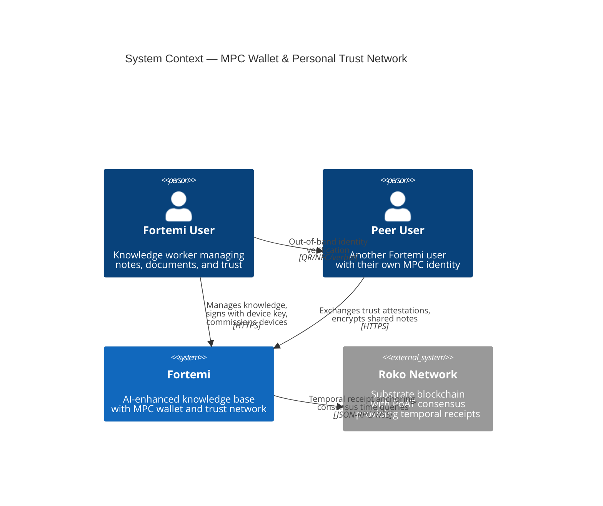
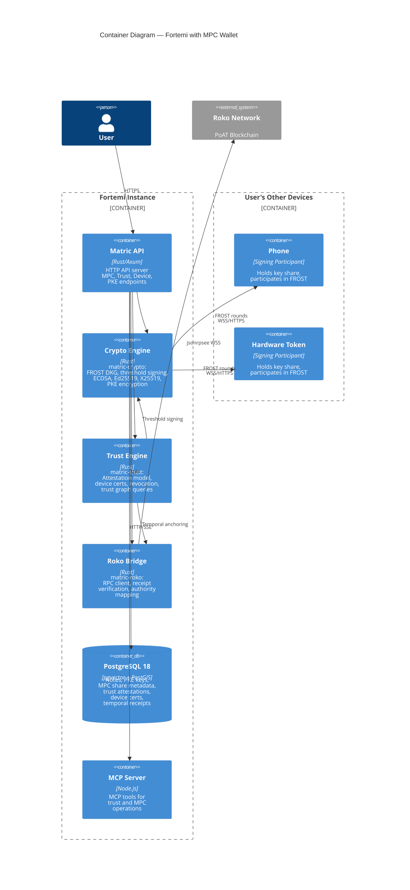
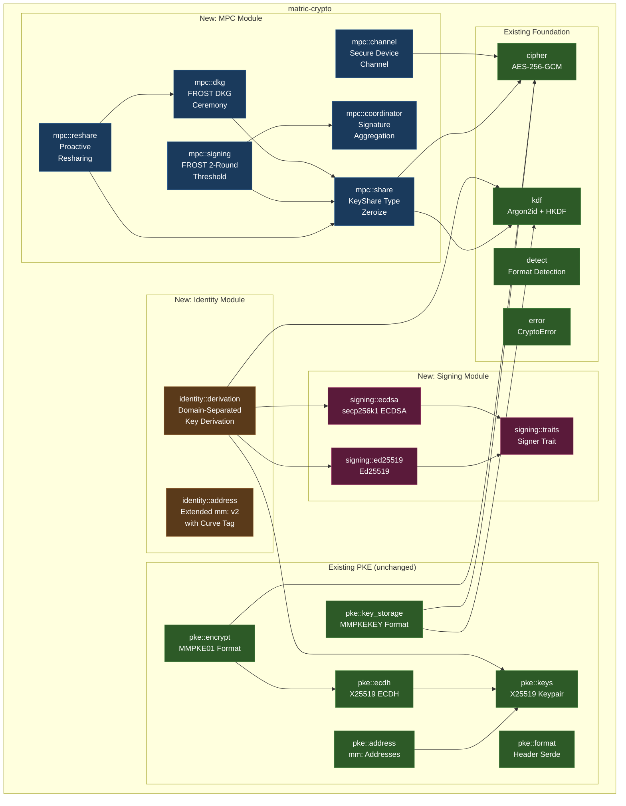
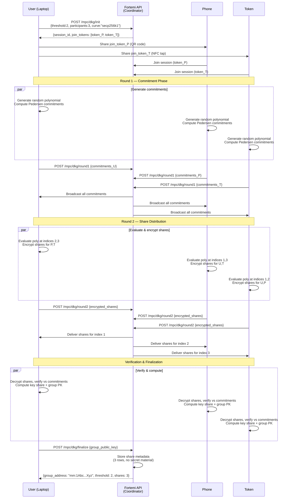
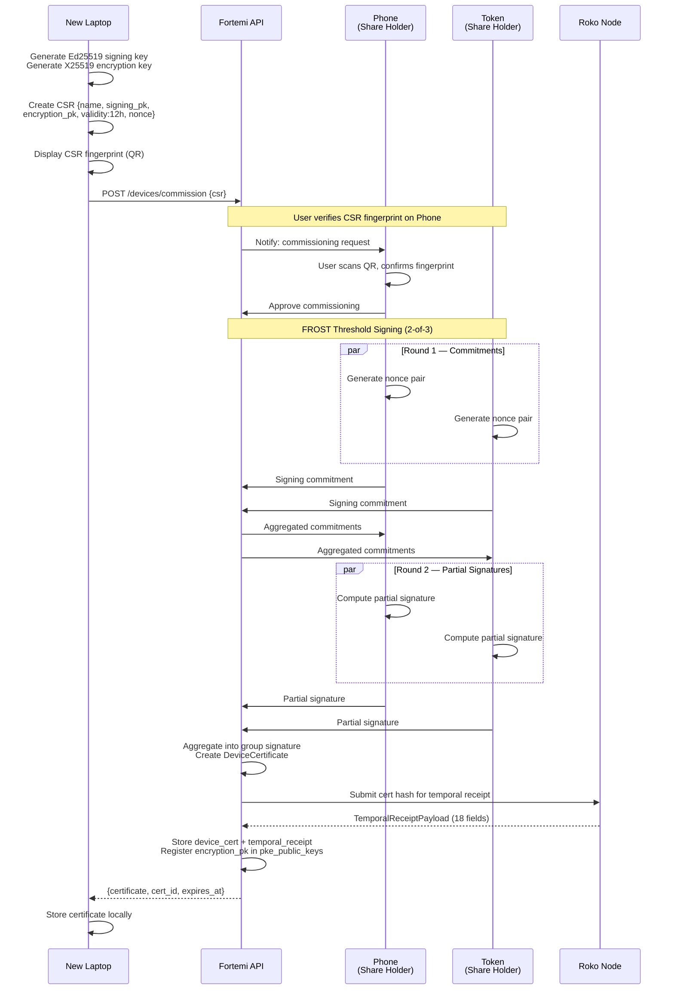
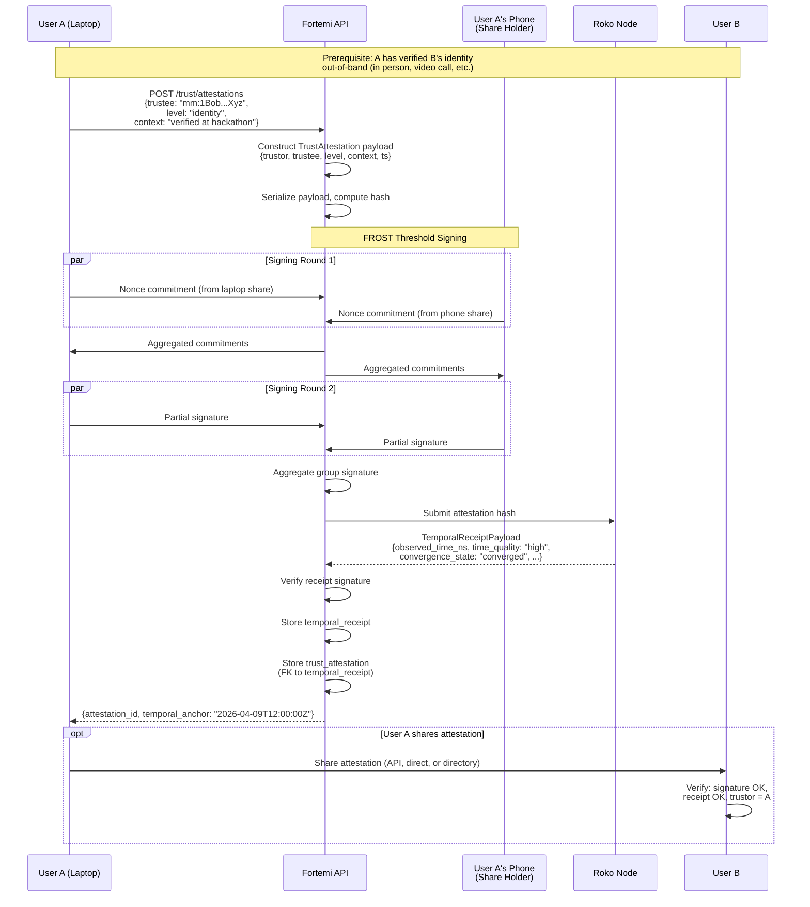

# Software Architecture Document: MPC Wallet & Personal Trust Network

**Version**: 1.0.0-draft  
**Date**: 2026-04-09  
**Status**: DRAFT  
**Authors**: Architecture Team  
**Crate Scope**: `matric-crypto`, `matric-trust` (new), `matric-roko` (new)

---

## Table of Contents

1. [Introduction](#1-introduction)
2. [Architectural Overview](#2-architectural-overview)
3. [Architecturally Significant Requirements](#3-architecturally-significant-requirements)
4. [Architectural Views](#4-architectural-views)
5. [Runtime Scenarios](#5-runtime-scenarios)
6. [Design Decisions](#6-design-decisions)
7. [Technology Stack](#7-technology-stack)
8. [Quality Attribute Tactics](#8-quality-attribute-tactics)
9. [Risks and Mitigations](#9-risks-and-mitigations)
10. [Implementation Guidelines](#10-implementation-guidelines)
11. [Diagrams](#11-diagrams)

---

## 1. Introduction

### 1.1 Purpose

This document defines the software architecture for the MPC Wallet & Personal Trust Network feature in Fortemi. The feature introduces distributed key management via FROST threshold signatures, a self-sovereign device certificate authority, and a peer-to-peer trust attestation model anchored to temporal proofs on the Roko Network.

### 1.2 Scope

The architecture covers:

- **Multi-Party Computation (MPC) wallet**: FROST-based 2-of-3 threshold signing distributed across a single user's own devices (phone, laptop, hardware token).
- **Personal Trust Network**: Each user acts as their own trust root. Users issue device certificates and trust attestations signed by their MPC wallet. Trust is direct (peer-to-peer), not hierarchical or transitive.
- **Roko Network Bridge**: Temporal anchoring of trust attestations and key lifecycle events via Substrate RPC, using the existing PoAT consensus mechanism and `ROKO_TX_RECEIPT_V1` temporal receipts.
- **Backward Compatibility**: The existing PKE subsystem (`matric-crypto::pke`, X25519/AES-256-GCM, `mm:...` addresses, MMPKE01 format) remains fully operational. MPC capabilities are additive.

Out of scope: on-chain smart contract development, consensus protocol changes in Roko, mobile application UI, hardware security module (HSM) integration.

### 1.3 Audience

- **Developers** implementing the MPC, trust, and bridge modules.
- **Security reviewers** auditing the cryptographic architecture.
- **Integrators** building on the Fortemi API or MCP server.
- **Operators** deploying Fortemi instances with MPC-enabled wallets.

### 1.4 Architectural Drivers

| Driver | Category | Impact |
|--------|----------|--------|
| No single point of key compromise | Security | Fundamental — drives MPC over single-key |
| Sub-100ms threshold signing on LAN | Performance | Constrains protocol selection to 2-round FROST |
| Backward compatibility with PKE | Compatibility | Existing `mm:...` addresses, MMPKE01 format must remain |
| Self-sovereign identity (no central CA) | Trust Model | Each user is their own root — no hierarchy |
| Temporal proof anchoring | Auditability | All trust mutations timestamped via Roko PoAT |
| Multi-curve support | Extensibility | secp256k1 (Roko), X25519 (PKE), Ed25519 (signing) |
| Device loss tolerance | Reliability | 2-of-3 threshold tolerates single device loss |

### 1.5 Definitions

| Term | Definition |
|------|-----------|
| **DKG** | Distributed Key Generation — multi-round protocol producing key shares without any party seeing the full secret |
| **FROST** | Flexible Round-Optimized Schnorr Threshold Signatures — 2-round threshold signing protocol |
| **Key Share** | A party's portion of the distributed secret; t-of-n shares required to produce a signature |
| **Commissioning** | Rare MPC wallet operation: signing a device certificate or trust attestation |
| **Device Key** | Per-device Ed25519 or X25519 keypair used for routine signing/encryption; certified by MPC wallet |
| **Trust Attestation** | A signed statement from User A expressing trust in User B's identity, anchored to a Roko temporal receipt |
| **Temporal Receipt** | A `ROKO_TX_RECEIPT_V1` structure with 18 fields providing PoAT-backed timestamp proof |
| **NanoMoment** | Roko's u128 nanosecond timestamp type (nanoseconds since UNIX epoch) |

---

## 2. Architectural Overview

### 2.1 System Context

The MPC wallet sits as an **identity layer** between Fortemi (data and knowledge management) and the Roko Network (temporal trust anchor). It serves three distinct functions:

1. **Identity root**: The distributed key (never materialized on any single device) is the user's cryptographic identity.
2. **Commissioning authority**: The MPC wallet threshold-signs device certificates and trust attestations (rare, high-ceremony operations).
3. **Bridge anchor**: Trust events are temporally anchored to Roko via signed receipts.

Runtime operations (encrypting notes, signing API requests, authenticating to peers) use **device keys** — fast, local, single-device operations that never involve MPC coordination.

### 2.2 Three-Plane Architecture

The feature is organized into three architectural planes:

**Identity Plane** — Manages the distributed cryptographic identity.
- FROST DKG ceremonies (key generation, resharing, refresh)
- Key share storage and lifecycle on each device
- Threshold signing coordination (2-round FROST)
- Multi-curve key derivation (secp256k1, Ed25519, X25519 from a single identity)

**Trust Plane** — Manages trust relationships and device authorization.
- Device certificate issuance and revocation (short-lived, hours not years)
- Trust attestation creation and storage
- Revocation lists (local-first, optionally published)
- Trust graph queries (direct trust only, no transitive trust by default)

**Bridge Plane** — Connects Fortemi identity to the Roko temporal blockchain.
- Roko RPC client (`jsonrpsee`) for temporal RPCs
- Temporal receipt creation, verification, and storage
- Authority index mapping (Fortemi identity to Roko validator identity)
- Receipt chain validation for trust attestation audit trails

```
+------------------+       +------------------+       +------------------+
|  Identity Plane  |       |   Trust Plane    |       |  Bridge Plane    |
|                  |       |                  |       |                  |
| FROST DKG        |------>| Device Certs     |------>| Roko RPC Client  |
| Threshold Signing|       | Trust Attestation|       | Receipt Verify   |
| Key Shares       |       | Revocation       |       | Authority Map    |
| Multi-Curve      |       | Trust Graph      |       | Receipt Storage  |
+------------------+       +------------------+       +------------------+
        |                          |                          |
        v                          v                          v
+--------------------------------------------------------------+
|                  Existing Fortemi Layer                       |
|  matric-crypto (PKE)  |  matric-api  |  matric-db  |  MCP    |
+--------------------------------------------------------------+
```

### 2.3 Key Separation Principle

The architecture enforces strict separation between key types:

| Key Type | Curve | Purpose | Lifetime | Storage |
|----------|-------|---------|----------|---------|
| MPC Identity (group key) | secp256k1 | Commissioning authority | Long-lived (years), reshare-able | Shares on devices; public key in Fortemi DB |
| MPC Identity (group key) | Ed25519 | Signing attestations/certs | Long-lived, reshare-able | Same DKG, separate curve derivation |
| Device Signing Key | Ed25519 | Runtime signing, API auth | Medium (cert-bounded, hours) | Device-local, certified by MPC |
| Device Encryption Key | X25519 | Note encryption (PKE) | Medium (cert-bounded) | Device-local, registered in `pke_public_keys` |
| Ephemeral | X25519 | Per-message ECDH | Single use | Memory only, zeroized after use |

The same private key is never used for both signing and encryption. This prevents cross-protocol attacks where a signing oracle can be abused to decrypt, or vice versa.

---

## 3. Architecturally Significant Requirements

### ASR-1: No Full Key Materialization

**Statement**: The full private key corresponding to the MPC group public key MUST never exist in memory on any single device at any point in the key's lifecycle — including generation, signing, resharing, and recovery.

**Rationale**: This is the fundamental security property that distinguishes MPC from passphrase-split or Shamir secret sharing schemes. Shamir requires reconstruction (full key in memory) to sign; FROST does not.

**Verification**: Property-based tests asserting that no byte buffer in the signing path ever contains all coefficients of the secret polynomial. Code audit of all `frost-*` crate integration points.

### ASR-2: Sub-100ms Threshold Signing on LAN

**Statement**: A 2-of-3 FROST threshold signing operation MUST complete in under 100ms end-to-end when all participating devices are on the same local network.

**Rationale**: Roko temporal receipt signing has timing constraints imposed by PoAT consensus. Signatures that arrive after the consensus window are rejected. The 100ms budget accounts for:
- Round 1 (preprocessing/commitment): ~5ms computation + ~10ms network
- Round 2 (signing): ~5ms computation + ~10ms network
- Coordinator aggregation: ~2ms
- Safety margin: ~68ms for retransmissions and jitter

**Verification**: Integration benchmark with 3 participants on loopback. P99 latency measurement under load.

### ASR-3: Short-Lived Device Certificates

**Statement**: Device certificates issued by the MPC wallet MUST have a maximum validity period of 24 hours (configurable down to 1 hour). Certificates MUST be automatically renewed before expiry when the MPC quorum is available.

**Rationale**: Short-lived certificates limit the blast radius of device compromise. A stolen device's certificate expires within hours, eliminating the need for real-time revocation distribution. This follows the BeyondCorp / SPIFFE model.

**Verification**: Certificate parser rejects certs with `not_after - not_before > 24h`. Integration test for automatic renewal.

### ASR-4: Temporal Anchoring via Roko Receipts

**Statement**: All trust-mutating operations (trust attestation creation, revocation, device cert issuance) MUST be anchored to a Roko temporal receipt before being considered committed.

**Rationale**: Temporal receipts provide an immutable, consensus-backed timestamp that prevents backdating trust attestations. The `TemporalReceiptPayload` with its 18 fields (including `time_quality`, `convergence_state`, `mesh_offset_ns`) provides cryptographic proof of when the trust event occurred.

**Verification**: Integration test asserting that trust attestations without valid `temporal_receipt_id` foreign keys are rejected at the API layer.

### ASR-5: PKE Backward Compatibility

**Statement**: The existing PKE subsystem MUST remain fully operational. All current functionality — `mm:...` addresses, MMPKE01 encryption format, X25519 ECDH key exchange, `pke_public_keys`/`pke_keysets`/`pke_active_keyset` tables, and all 13 MCP PKE tools — MUST work identically after MPC wallet introduction.

**Rationale**: Fortemi instances in production use PKE for encrypted note sharing. MPC wallet is additive; it does not replace single-device PKE. Users who choose not to set up MPC continue using PKE unchanged. MPC-enabled users can register their device X25519 keys in the existing PKE registry.

**Verification**: The entire existing `matric-crypto` test suite passes without modification. API integration tests for all `/api/v1/pke/*` endpoints pass without changes.

### ASR-6: Key Material Zeroization

**Statement**: All key material (private keys, key shares, shared secrets, derived encryption keys, intermediate DKG values) MUST be zeroized from memory on drop. No key material may persist in memory after its holding struct is dropped.

**Rationale**: Extends the existing zeroization discipline in `matric-crypto` (which already uses `zeroize::Zeroize` and `ZeroizeOnDrop` on `PrivateKey`, `SharedSecret`, `DerivedEncryptionKey`, `DerivedKey`) to all new MPC and trust structures.

**Verification**: All types holding key material derive `Zeroize` and `ZeroizeOnDrop`. Clippy lint for missing `ZeroizeOnDrop` on types containing `[u8; N]` fields (custom lint or code review checklist).

### ASR-7: Multi-Curve Without Sign+Encrypt Anti-Pattern

**Statement**: The architecture MUST support secp256k1 (Roko compatibility), Ed25519 (signing), and X25519 (encryption) without using any single key for both signing and encryption operations.

**Rationale**: Using the same key for signing and encryption enables cross-protocol attacks. The `Keypair` type in `matric-crypto::pke::keys` is X25519-only (encryption). Signing keys MUST be separate Ed25519 or secp256k1 keys. The MPC wallet derives separate sub-keys per curve from the master secret polynomial using domain-separated derivation.

**Verification**: Type system enforcement — signing functions accept only `SigningKey` types, encryption functions accept only `EncryptionKey` types. No `impl From<SigningKey> for EncryptionKey>` or vice versa.

---

## 4. Architectural Views

### 4.1 Logical View

#### 4.1.1 Module Structure

The feature spans three crates, extending `matric-crypto` and adding two new crates:

```
crates/
  matric-crypto/src/
    lib.rs                    # Existing — add re-exports for new modules
    cipher.rs                 # Existing — AES-256-GCM (unchanged)
    detect.rs                 # Existing — format detection (unchanged)
    error.rs                  # Existing — extend with MPC/trust error variants
    format.rs                 # Existing — base64, FileFormat (unchanged)
    kdf.rs                    # Existing — Argon2id KDF (unchanged)
    pke/                      # Existing — PKE subsystem (unchanged)
      mod.rs
      address.rs              # mm: address format (unchanged)
      ecdh.rs                 # X25519 ECDH (unchanged)
      encrypt.rs              # MMPKE01 encrypt/decrypt (unchanged)
      format.rs               # Header serialization (unchanged)
      key_storage.rs          # MMPKEKEY encrypted key storage (unchanged)
      keys.rs                 # X25519 Keypair, PublicKey, PrivateKey (unchanged)
    mpc/                      # NEW — MPC primitives
      mod.rs                  # Module root, re-exports
      dkg.rs                  # FROST DKG ceremony coordination
      signing.rs              # FROST threshold signing (2-round)
      reshare.rs              # Proactive secret resharing
      share.rs                # KeyShare type with zeroization
      coordinator.rs          # Signing coordinator (aggregates partial sigs)
      channel.rs              # Secure inter-device communication channel
    signing/                  # NEW — Single-device signing primitives
      mod.rs
      ecdsa.rs                # secp256k1 ECDSA (Roko-compatible)
      ed25519.rs              # Ed25519 signatures
      traits.rs               # Signer trait abstraction
    identity/                 # NEW — Multi-curve identity derivation
      mod.rs
      derivation.rs           # Domain-separated key derivation from MPC root
      address.rs              # Extended address format (mm: v2 with curve tag)

  matric-trust/               # NEW CRATE — Trust attestation logic
    Cargo.toml
    src/
      lib.rs
      attestation.rs          # TrustAttestation type, creation, verification
      device_cert.rs          # DeviceCertificate type, issuance, validation
      revocation.rs           # Revocation lists, certificate status checks
      graph.rs                # Direct trust graph queries
      types.rs                # Shared types (TrustLevel, CertificateStatus, etc.)

  matric-roko/                # NEW CRATE — Roko Network bridge
    Cargo.toml
    src/
      lib.rs
      client.rs               # jsonrpsee RPC client
      receipt.rs              # TemporalReceiptPayload (18-field structure)
      verify.rs               # Receipt signature and timestamp verification
      authority.rs            # Authority index mapping
      types.rs                # NanoMoment, ConvergenceState, TimeQuality
```

#### 4.1.2 Dependency Graph

```
matric-api
  --> matric-trust  --> matric-crypto (mpc/, signing/, identity/)
  --> matric-roko   --> matric-crypto (signing/ecdsa)
  --> matric-db     (stores attestations, certs, receipts, share metadata)
  --> matric-crypto (existing PKE — unchanged)

matric-trust
  --> matric-crypto (mpc/ for threshold signing, signing/ for verification)
  --> matric-roko   (temporal receipt references)

matric-roko
  --> matric-crypto (signing/ecdsa for receipt verification)
  (no dependency on matric-trust — bridge is trust-unaware)
```

#### 4.1.3 New Database Tables

**`mpc_share_metadata`** — Tracks which devices hold shares for which group keys. Does NOT store key share material (shares remain on devices).

```sql
CREATE TABLE mpc_share_metadata (
  id UUID PRIMARY KEY DEFAULT gen_random_uuid(),
  group_public_key BYTEA NOT NULL,          -- 33 bytes compressed secp256k1
  group_address TEXT NOT NULL,              -- mm: address of the group key
  curve TEXT NOT NULL CHECK (curve IN ('secp256k1', 'ed25519')),
  threshold SMALLINT NOT NULL,              -- t (e.g., 2)
  total_shares SMALLINT NOT NULL,           -- n (e.g., 3)
  share_index SMALLINT NOT NULL,            -- This device's share index (1-based)
  device_id UUID NOT NULL REFERENCES device_certs(id),
  dkg_session_id UUID NOT NULL,             -- Links shares from same DKG ceremony
  created_at TIMESTAMPTZ NOT NULL DEFAULT NOW(),
  reshared_from UUID REFERENCES mpc_share_metadata(id),  -- NULL for original DKG
  revoked_at TIMESTAMPTZ,
  UNIQUE (dkg_session_id, share_index)
);
```

**`device_certs`** — Short-lived device certificates issued by the MPC wallet.

```sql
CREATE TABLE device_certs (
  id UUID PRIMARY KEY DEFAULT gen_random_uuid(),
  device_name TEXT NOT NULL,
  device_public_key_signing BYTEA NOT NULL,  -- Ed25519 public key (32 bytes)
  device_public_key_encryption BYTEA,        -- X25519 public key (32 bytes), optional
  issuer_group_address TEXT NOT NULL,         -- mm: address of issuing MPC wallet
  certificate_bytes BYTEA NOT NULL,          -- Signed certificate blob
  not_before TIMESTAMPTZ NOT NULL,
  not_after TIMESTAMPTZ NOT NULL,
  revoked_at TIMESTAMPTZ,
  revocation_reason TEXT,
  temporal_receipt_id UUID REFERENCES temporal_receipts(id),
  created_at TIMESTAMPTZ NOT NULL DEFAULT NOW()
);

CREATE INDEX idx_device_certs_issuer ON device_certs(issuer_group_address);
CREATE INDEX idx_device_certs_expiry ON device_certs(not_after) WHERE revoked_at IS NULL;
```

**`trust_attestations`** — Signed trust statements between users.

```sql
CREATE TABLE trust_attestations (
  id UUID PRIMARY KEY DEFAULT gen_random_uuid(),
  trustor_address TEXT NOT NULL,             -- mm: address of user granting trust
  trustee_address TEXT NOT NULL,             -- mm: address of user being trusted
  trust_level TEXT NOT NULL CHECK (trust_level IN ('identity', 'content', 'full')),
  attestation_bytes BYTEA NOT NULL,          -- Signed attestation blob
  context TEXT,                              -- Optional: "verified in person", "via video call"
  temporal_receipt_id UUID NOT NULL REFERENCES temporal_receipts(id),
  revoked_at TIMESTAMPTZ,
  revocation_receipt_id UUID REFERENCES temporal_receipts(id),
  created_at TIMESTAMPTZ NOT NULL DEFAULT NOW(),
  UNIQUE (trustor_address, trustee_address, trust_level)
);

CREATE INDEX idx_trust_attestations_trustor ON trust_attestations(trustor_address);
CREATE INDEX idx_trust_attestations_trustee ON trust_attestations(trustee_address);
```

**`temporal_receipts`** — Cached Roko temporal receipts for local verification.

```sql
CREATE TABLE temporal_receipts (
  id UUID PRIMARY KEY DEFAULT gen_random_uuid(),
  tx_hash BYTEA NOT NULL UNIQUE,             -- BLAKE2-256 hash (32 bytes)
  observed_time_ns NUMERIC(39,0) NOT NULL,   -- NanoMoment (u128)
  mesh_offset_ns NUMERIC(39,0) NOT NULL,
  time_quality TEXT NOT NULL,                -- e.g., "high", "medium", "low"
  convergence_state TEXT NOT NULL,           -- e.g., "converged", "converging"
  authority_index SMALLINT NOT NULL,
  receipt_signature BYTEA NOT NULL,          -- ECDSA secp256k1 signature
  receipt_payload BYTEA NOT NULL,            -- Full serialized TemporalReceiptPayload
  verified_at TIMESTAMPTZ,                   -- NULL until locally verified
  created_at TIMESTAMPTZ NOT NULL DEFAULT NOW()
);

CREATE INDEX idx_temporal_receipts_tx_hash ON temporal_receipts(tx_hash);
CREATE INDEX idx_temporal_receipts_time ON temporal_receipts(observed_time_ns);
```

#### 4.1.4 New API Routes

**MPC Wallet endpoints** (`/api/v1/mpc/*`):

| Method | Path | Description |
|--------|------|-------------|
| POST | `/api/v1/mpc/dkg/init` | Initialize a DKG ceremony (returns session ID + round-1 payload) |
| POST | `/api/v1/mpc/dkg/round1` | Submit round-1 commitments from a participant |
| POST | `/api/v1/mpc/dkg/round2` | Submit round-2 shares from a participant |
| POST | `/api/v1/mpc/dkg/finalize` | Finalize DKG, store share metadata |
| POST | `/api/v1/mpc/sign/request` | Request a threshold signature (returns signing session) |
| POST | `/api/v1/mpc/sign/commit` | Submit signing commitment (round 1) |
| POST | `/api/v1/mpc/sign/respond` | Submit signing response (round 2) |
| POST | `/api/v1/mpc/sign/aggregate` | Aggregate partial signatures into final signature |
| GET | `/api/v1/mpc/shares` | List share metadata for this device |
| POST | `/api/v1/mpc/reshare/init` | Initiate proactive resharing |
| GET | `/api/v1/mpc/groups` | List group public keys and their threshold configs |

**Trust endpoints** (`/api/v1/trust/*`):

| Method | Path | Description |
|--------|------|-------------|
| POST | `/api/v1/trust/attestations` | Create a trust attestation (triggers MPC signing + Roko receipt) |
| GET | `/api/v1/trust/attestations` | List trust attestations (filter by trustor/trustee) |
| DELETE | `/api/v1/trust/attestations/:id` | Revoke a trust attestation |
| GET | `/api/v1/trust/attestations/:id/verify` | Verify attestation signature + temporal receipt |
| GET | `/api/v1/trust/graph` | Query direct trust graph for a given address |

**Device endpoints** (`/api/v1/devices/*`):

| Method | Path | Description |
|--------|------|-------------|
| POST | `/api/v1/devices/commission` | Submit CSR for device commissioning (triggers MPC signing) |
| GET | `/api/v1/devices` | List commissioned devices and cert status |
| POST | `/api/v1/devices/:id/renew` | Renew a device certificate |
| DELETE | `/api/v1/devices/:id` | Revoke a device certificate |
| GET | `/api/v1/devices/:id/cert` | Download current device certificate |

### 4.2 Process View

#### 4.2.1 DKG Ceremony (Multi-Round Protocol)

The DKG ceremony creates a distributed identity across a user's devices. It runs once per identity creation and again for resharing/recovery.

**Participants**: User's own devices (e.g., laptop, phone, hardware token). The Fortemi API server acts as a relay/coordinator but NEVER sees key shares.

**Protocol**: FROST DKG (based on Pedersen DKG with verifiable secret sharing).

1. **Initialization**: User initiates DKG from primary device. Coordinator assigns participant indices (1, 2, 3) and distributes parameters (t=2, n=3, curve).
2. **Round 1 — Commitment**: Each device generates a random polynomial of degree t-1, computes commitments (Pedersen commitments to coefficients), and sends commitments to coordinator.
3. **Round 2 — Share Distribution**: Each device evaluates its polynomial at each other participant's index, encrypts the resulting share for that participant (using an ephemeral ECDH channel), and sends encrypted shares via coordinator.
4. **Verification**: Each device verifies received shares against the broadcasted commitments. If verification fails, the device broadcasts a complaint.
5. **Finalization**: Each device computes its final key share and the group public key. The coordinator publishes the group public key. Share metadata (not shares) is stored in `mpc_share_metadata`.

**Security Properties**:
- The coordinator sees commitments and encrypted share ciphertexts but never plaintext shares.
- The full secret polynomial is never reconstructed on any device.
- Each device can independently verify the correctness of its share.

#### 4.2.2 Threshold Signing (2-Round FROST)

FROST signing produces a standard Schnorr (Ed25519) or ECDSA (secp256k1) signature that is indistinguishable from a single-signer signature. Any 2 of 3 share holders can participate.

**Round 1 — Preprocessing (Commitment)**:
1. Coordinator broadcasts signing request with message hash.
2. Each participating signer (at least t=2 of n=3) generates a nonce pair (hiding nonce, binding nonce) and sends commitments to coordinator.
3. Coordinator collects commitments and broadcasts the full set to all participants.

**Round 2 — Signing (Response)**:
1. Each signer computes their partial signature using their key share, the nonce pair, and the aggregated commitment set.
2. Signers send partial signatures to coordinator.
3. Coordinator aggregates partial signatures into the final group signature.
4. Coordinator verifies the aggregate signature against the group public key.

**Performance Budget** (100ms LAN target):
- Commitment generation: ~1ms per signer
- Network round-trip (LAN): ~2-5ms
- Partial signature generation: ~2ms per signer
- Aggregation + verification: ~1ms
- Total (serial path): ~15-25ms with margin

#### 4.2.3 Device Commissioning

Device commissioning is the process by which a new device (e.g., a new laptop) is authorized to act on behalf of the user's identity.

1. **New device** generates a local Ed25519 signing keypair and X25519 encryption keypair.
2. **New device** creates a Certificate Signing Request (CSR) containing:
   - Device name
   - Ed25519 public key
   - X25519 public key (optional)
   - Requested validity period (max 24 hours)
   - Nonce (anti-replay)
3. **User** verifies the CSR on an existing commissioned device (visual confirmation of fingerprint via QR code, NFC tap, or manual comparison).
4. **Existing devices** (2 of 3) perform FROST threshold signing of the CSR to produce a device certificate.
5. **Certificate** is stored in `device_certs` table and returned to the new device.
6. **New device's** X25519 public key is registered in the existing `pke_public_keys` table (enabling PKE encryption to this device).
7. **Temporal receipt** from Roko anchors the commissioning event.

#### 4.2.4 Trust Attestation Flow

Trust attestations are explicit, user-initiated, one-directional statements: "I (User A) trust User B's identity at level X."

1. **User A** initiates trust attestation via API or MCP tool, specifying:
   - Trustee address (`mm:...` of User B)
   - Trust level: `identity` (verified they are who they claim), `content` (trust their authored content), or `full` (both)
   - Context string (e.g., "verified in person at conference")
2. **Fortemi** constructs the `TrustAttestation` payload (trustor, trustee, level, context, timestamp).
3. **MPC wallet** threshold-signs the attestation (FROST 2-round via 2 of user A's devices).
4. **Roko bridge** submits the signed attestation hash for temporal receipt.
5. **Temporal receipt** is stored in `temporal_receipts`.
6. **Attestation** with receipt reference is stored in `trust_attestations`.
7. **Optionally**, the attestation is published to a shared directory or directly to User B.

Trust is NOT transitive: if A trusts B and B trusts C, A does NOT automatically trust C. Users can opt into friend-of-friend discovery (query who their trusted peers trust) but must explicitly attest trust themselves.

#### 4.2.5 Runtime Operations (No MPC Involvement)

After commissioning, the vast majority of operations use device-local keys with zero MPC coordination:

- **Encrypting a note**: Device's X25519 key performs standard PKE (MMPKE01 format, existing `encrypt_pke` path).
- **Signing an API request**: Device's Ed25519 key signs the request. The peer verifies against the device certificate, which chains to the group public key.
- **Authenticating to a peer**: Device presents its certificate. Peer checks: (a) certificate is not expired, (b) certificate signature verifies against a group public key the peer trusts, (c) group public key has a valid trust attestation from a user the peer trusts.

### 4.3 Development View

#### 4.3.1 Crate Organization

| Crate | Responsibility | Dependencies |
|-------|---------------|--------------|
| `matric-crypto` | Cryptographic primitives: PKE (existing), MPC (new), signing (new), identity derivation (new) | `frost-secp256k1`, `frost-ed25519`, `k256`, `ed25519-dalek`, existing deps |
| `matric-trust` | Trust logic: attestation model, device cert lifecycle, revocation, trust graph queries | `matric-crypto`, `matric-roko` |
| `matric-roko` | Roko Network bridge: RPC client, receipt types, verification | `matric-crypto` (signing only), `jsonrpsee` |
| `matric-db` | Database repositories for new tables | `matric-trust` types, `matric-roko` types, `sqlx` |
| `matric-api` | HTTP handlers for MPC, trust, device endpoints | All above |
| `matric-core` | Shared types if needed (e.g., `DeviceId`, `GroupAddress`) | Minimal |

#### 4.3.2 Trait Abstractions

**`Signer` trait** — Unifies single-device and threshold signing behind one interface:

```rust
#[async_trait]
pub trait Signer: Send + Sync {
    type PublicKey;
    type Signature;

    fn public_key(&self) -> &Self::PublicKey;

    async fn sign(&self, message: &[u8]) -> CryptoResult<Self::Signature>;
}
```

Implementations:
- `Ed25519DeviceSigner` — signs with local Ed25519 key (fast, no network)
- `EcdsaDeviceSigner` — signs with local secp256k1 key
- `FrostThresholdSigner` — coordinates FROST 2-round signing across devices (async, network-dependent)

**`CertificateVerifier` trait** — Verifies device certificates against trust roots:

```rust
pub trait CertificateVerifier {
    fn verify_certificate(&self, cert: &DeviceCertificate) -> Result<CertStatus, TrustError>;
    fn is_trusted_group(&self, group_address: &Address) -> bool;
}
```

#### 4.3.3 Feature Flags

New functionality behind Cargo feature flags for incremental adoption:

```toml
[features]
default = ["pke"]  # Existing PKE only
pke = []           # X25519/AES-256-GCM encryption (existing)
mpc = ["frost"]    # FROST DKG + threshold signing
frost = ["dep:frost-secp256k1", "dep:frost-ed25519"]
trust = ["mpc"]    # Trust attestations + device certs (requires MPC)
roko = ["dep:jsonrpsee-client"]  # Roko Network bridge
full = ["pke", "mpc", "trust", "roko"]
```

### 4.4 Deployment View

#### 4.4.1 Component Distribution

```
User's Device A (laptop)              User's Device B (phone)
+----------------------------+        +----------------------------+
| Fortemi Instance           |        | Fortemi Mobile / CLI       |
|  - matric-api              |        |  - matric-crypto (mpc/)    |
|  - matric-crypto (full)    |        |  - Key share storage       |
|  - matric-db (PostgreSQL)  |        |  - Signing participant     |
|  - Key share (encrypted)   |        +----------------------------+
|  - Trust attestation store |
|  - Device cert store       |        User's Device C (hardware token)
|  - Temporal receipt cache  |        +----------------------------+
+----------------------------+        | Minimal FROST participant  |
        |                             |  - Key share (secure elem) |
        | RPC                         |  - Signing participant     |
        v                             +----------------------------+
+----------------------------+
| Roko Network Node          |
|  - Substrate PoAT          |
|  - Temporal RPCs           |
|  - Receipt signing         |
+----------------------------+
```

**Fortemi Instance** (Device A — primary):
- Full API server with all MPC, trust, and bridge functionality.
- PostgreSQL stores share metadata, device certs, trust attestations, temporal receipts.
- Key shares are stored on the device's local filesystem (encrypted with device passphrase via Argon2id, same KDF as existing `MMPKEKEY` format).

**Participant Devices** (B, C):
- Minimal: only need `matric-crypto` with `mpc` feature for DKG and signing participation.
- Communicate with the coordinator (Device A's API) over HTTPS or local network.
- Key shares stored locally (never transmitted in plaintext).

**Roko Network Node**:
- External dependency. Fortemi connects via `jsonrpsee` RPC client.
- Can be a local node or a remote trusted node.
- Provides temporal RPCs: `temporal_getConsensusTime`, `temporal_getTransactionTimestamp`, etc.

#### 4.4.2 Network Requirements

| Communication Path | Protocol | Latency Requirement | Encryption |
|-------------------|----------|--------------------|----|
| Device A <-> Device B (DKG/signing) | HTTPS / WebSocket | <50ms (LAN), <500ms (WAN) | TLS 1.3 + ephemeral ECDH per share |
| Device A <-> Roko Node | JSON-RPC over HTTPS | <1s (acceptable) | TLS 1.3 |
| Device A <-> Peer Users | HTTPS (Fortemi API) | Best effort | TLS 1.3 |

### 4.5 Data View

#### 4.5.1 Entity Relationships

```
pke_public_keys (existing)         mpc_share_metadata
  address TEXT PK                    id UUID PK
  public_key BYTEA                   group_public_key BYTEA
  label TEXT                         group_address TEXT
                                     curve TEXT
pke_keysets (existing)               threshold SMALLINT
  id UUID PK                         total_shares SMALLINT
  name TEXT UNIQUE                   share_index SMALLINT
  public_key BYTEA                   device_id UUID FK --> device_certs.id
  encrypted_private_key BYTEA        dkg_session_id UUID
  address TEXT                       reshared_from UUID FK --> self
                                     revoked_at TIMESTAMPTZ

device_certs                       trust_attestations
  id UUID PK                         id UUID PK
  device_name TEXT                   trustor_address TEXT
  device_public_key_signing BYTEA    trustee_address TEXT
  device_public_key_encryption BYTEA trust_level TEXT
  issuer_group_address TEXT          attestation_bytes BYTEA
  certificate_bytes BYTEA           context TEXT
  not_before TIMESTAMPTZ             temporal_receipt_id UUID FK --> temporal_receipts.id
  not_after TIMESTAMPTZ              revoked_at TIMESTAMPTZ
  revoked_at TIMESTAMPTZ             revocation_receipt_id UUID FK --> temporal_receipts.id
  temporal_receipt_id UUID FK
                                   temporal_receipts
                                     id UUID PK
                                     tx_hash BYTEA UNIQUE
                                     observed_time_ns NUMERIC(39,0)
                                     mesh_offset_ns NUMERIC(39,0)
                                     time_quality TEXT
                                     convergence_state TEXT
                                     authority_index SMALLINT
                                     receipt_signature BYTEA
                                     receipt_payload BYTEA
                                     verified_at TIMESTAMPTZ
```

**Key relationships**:
- `device_certs.issuer_group_address` references the group key's `mm:` address (logical FK to `mpc_share_metadata.group_address`).
- `device_certs.device_public_key_encryption` can be registered in `pke_public_keys.public_key` to integrate with existing PKE.
- `trust_attestations.temporal_receipt_id` is a hard FK to `temporal_receipts` — enforcing ASR-4.
- `mpc_share_metadata.device_id` references `device_certs.id` — bootstrapping problem solved by the first DKG creating a self-signed bootstrap cert.

#### 4.5.2 Data at Rest

| Data | Storage Location | Encryption |
|------|-----------------|------------|
| Key shares | Device-local filesystem | Argon2id KDF + AES-256-GCM (same as `MMPKEKEY` format) |
| Share metadata | PostgreSQL `mpc_share_metadata` | Database-level (no share secrets stored) |
| Device certificates | PostgreSQL `device_certs` | Not encrypted (public data; signed by group key) |
| Trust attestations | PostgreSQL `trust_attestations` | Not encrypted (public data; signed by trustor's group key) |
| Temporal receipts | PostgreSQL `temporal_receipts` | Not encrypted (public data; signed by Roko authority) |
| Device private keys | Device-local filesystem | Argon2id KDF + AES-256-GCM |

---

## 5. Runtime Scenarios

### 5.1 Scenario: Initial DKG Ceremony (User Creates Distributed Identity)

**Actors**: User with 3 devices (Laptop [L], Phone [P], Token [T])  
**Preconditions**: All 3 devices have Fortemi client or signing participant installed.

```
Step  Actor    Action
----  -------  ------
1     User     Initiates "Create MPC Identity" on Laptop
2     L        POST /api/v1/mpc/dkg/init {threshold: 2, participants: 3, curve: "secp256k1"}
3     L        Returns session_id, distributes join tokens to P and T (QR code / NFC)
4     P, T     Join DKG session using join token
5     L,P,T    Each generates random polynomial, computes Pedersen commitments
6     L,P,T    POST /api/v1/mpc/dkg/round1 {session_id, commitments}
7     L        Coordinator collects all commitments, broadcasts to all
8     L,P,T    Each evaluates polynomial at other indices, encrypts shares
9     L,P,T    POST /api/v1/mpc/dkg/round2 {session_id, encrypted_shares}
10    L,P,T    Each decrypts received shares, verifies against commitments
11    L,P,T    If verification passes: compute final key share + group public key
12    L        POST /api/v1/mpc/dkg/finalize {session_id, group_public_key}
13    L        Store share metadata in mpc_share_metadata (3 rows, one per device)
14    L        Derive mm: address from group public key
15    L        Display: "Your MPC identity: mm:1Abc...Xyz (2-of-3)"
```

**Duration**: ~5-15 seconds (dominated by user interaction for device enrollment, not cryptography).

**Error Handling**: If any device fails verification in step 10, it broadcasts a complaint. The DKG aborts and must be restarted. No partial state persists.

### 5.2 Scenario: Device Commissioning (New Laptop Gets Cert)

**Actors**: User with existing MPC identity on [Phone, Token], new Laptop  
**Preconditions**: MPC identity exists. Phone and Token hold shares.

```
Step  Actor      Action
----  ---------  ------
1     NewLaptop  Generates Ed25519 signing key + X25519 encryption key
2     NewLaptop  Creates CSR {name: "Work Laptop", signing_pk, encryption_pk, validity: 12h}
3     NewLaptop  Displays CSR fingerprint as QR code
4     User       Scans QR with Phone, confirms fingerprint matches
5     Phone      POST /api/v1/devices/commission {csr, approved: true}
6     Phone,Token FROST 2-round threshold signing of CSR:
                   - Round 1: Phone + Token send commitments
                   - Round 2: Phone + Token send partial signatures
                   - Coordinator aggregates into group signature
7     API        Creates DeviceCertificate {csr_data, group_signature, not_before: now, not_after: +12h}
8     API        POST to Roko bridge → obtains temporal receipt
9     API        Stores device_cert + temporal_receipt in DB
10    API        Registers encryption_pk in pke_public_keys (existing table)
11    NewLaptop  Receives certificate, stores locally
12    NewLaptop  Can now sign API requests, encrypt/decrypt notes
```

**Duration**: ~2-5 seconds (dominated by Roko receipt, not MPC signing).

### 5.3 Scenario: Trust Attestation (User A Trusts User B)

**Actors**: User A (with MPC identity), User B (with MPC identity, already known)  
**Preconditions**: Both users have MPC identities. User A has verified User B's identity through an out-of-band channel.

```
Step  Actor    Action
----  -------  ------
1     User A   Initiates trust attestation via MCP tool or API:
               "I trust mm:1Bob...Xyz at level 'identity', context: 'verified at hackathon'"
2     API      Constructs TrustAttestation payload:
               {trustor: mm:1Alice...Abc, trustee: mm:1Bob...Xyz, level: identity,
                context: "verified at hackathon", timestamp: now()}
3     API      Serializes payload, requests FROST threshold signature
4     Phone,Laptop  FROST 2-round signing (2 of User A's 3 devices)
5     API      Submits signed attestation hash to Roko bridge
6     Roko     Returns TemporalReceiptPayload with 18 fields:
               {tx_hash, observed_time_ns: 1744156800000000000, time_quality: "high",
                convergence_state: "converged", authority_index: 7, ...}
7     API      Stores temporal_receipt in temporal_receipts table
8     API      Stores trust_attestation with FK to temporal_receipt
9     API      Returns attestation ID to User A
10    User A   Optionally shares attestation with User B or publishes to directory
```

### 5.4 Scenario: Roko Temporal Receipt Verification

**Actors**: Any user verifying a trust attestation's temporal claim  
**Preconditions**: Trust attestation exists with a temporal_receipt_id.

```
Step  Actor    Action
----  -------  ------
1     Verifier GET /api/v1/trust/attestations/{id}/verify
2     API      Loads attestation + linked temporal_receipt from DB
3     API      Step 1: Verify attestation signature against trustor's group public key
4     API      Step 2: Verify temporal receipt:
               a. Deserialize TemporalReceiptPayload (18 fields)
               b. Recompute tx_hash = BLAKE2-256(attestation_bytes)
               c. Verify receipt_signature against Roko authority's public key
               d. Check authority_index maps to a known Roko validator
               e. Call temporal_getTransactionTimestamp(tx_hash) on Roko node
               f. Compare on-chain timestamp with receipt's observed_time_ns (within tolerance)
5     API      Step 3: Check attestation not revoked (revoked_at IS NULL)
6     API      Step 4: Check receipt metadata quality:
               - time_quality should be "high" or "medium"
               - convergence_state should be "converged"
7     API      Returns verification result:
               {valid: true, attestation_verified: true, receipt_verified: true,
                temporal_anchor: "2026-04-09T12:00:00Z", time_quality: "high"}
```

### 5.5 Scenario: Key Recovery After Device Loss

**Actors**: User who lost one device (e.g., Phone destroyed)  
**Preconditions**: 2-of-3 threshold. User still has Laptop and Token (quorum met).

```
Step  Actor        Action
----  -----------  ------
1     User         Reports device loss via Laptop
2     Laptop       DELETE /api/v1/devices/{phone_id} (revokes Phone's device cert)
3     API          Roko-anchored revocation receipt stored
4     API          Marks Phone's mpc_share_metadata as revoked_at = now()
5     User         Obtains replacement device (NewPhone)
6     User         Initiates resharing: POST /api/v1/mpc/reshare/init
7     Laptop,Token Run FROST resharing protocol:
                   - Generate new polynomial with same group secret
                   - Distribute new shares for indices {1, 2, 3}
                   - Old shares become invalid
8     NewPhone     Receives its new share via secure channel
9     All devices  Store new shares, link to reshared_from in metadata
10    User         Commissions NewPhone (Scenario 5.2)
11    API          Old Phone's share is cryptographically invalidated
                   (even if Phone is recovered, its share cannot produce valid signatures)
```

**Key property**: Resharing produces new shares that are incompatible with old shares. Even if an attacker recovers the lost Phone and its old share, they cannot combine it with new shares from Laptop or Token.

---

## 6. Design Decisions

### 6.1 ADR-001: FROST Protocol Selection

**Status**: Accepted  
**Context**: Need threshold signatures that produce standard-looking signatures (indistinguishable from single-signer) with minimal round complexity.  
**Decision**: FROST (Flexible Round-Optimized Schnorr Threshold Signatures) with 2-round signing protocol.  
**Alternatives Rejected**:
- **GG20/GG18 (ECDSA threshold)**: 4+ rounds, higher latency, more complex.
- **Shamir + reconstruction**: Requires full key in memory — violates ASR-1.
- **Multi-signature (e.g., MuSig2)**: Requires all signers participate; no t-of-n flexibility.

**Consequences**: FROST signatures are Schnorr-based, which means Ed25519 signatures are native. For secp256k1 ECDSA (Roko compatibility), we use the FROST-to-ECDSA adapter from the ZCash Foundation crates.

### 6.2 ADR-002: Multi-Curve Architecture

**Status**: Accepted  
**Context**: Three curves needed — secp256k1 (Roko), Ed25519 (signing), X25519 (encryption).  
**Decision**: Domain-separated key derivation from a single MPC root. The DKG runs independently per curve (separate ceremonies for secp256k1 and Ed25519). X25519 device keys are generated independently and certified by the Ed25519 group key.  
**Rationale**: Running separate DKGs per curve avoids cross-curve security assumptions. The overhead is acceptable because DKG is a rare ceremony.

### 6.3 ADR-003: Trust Attestation Format

**Status**: Accepted  
**Context**: Need a compact, verifiable trust statement format.  
**Decision**: Custom binary format with JSON-serialized payload + detached signature:

```
FMTRUST01 (magic, 9 bytes)
payload_length: u32 LE
payload: {trustor, trustee, level, context, timestamp} (JSON)
signature: 64 bytes (Ed25519 group signature)
receipt_hash: 32 bytes (BLAKE2-256 of temporal receipt)
```

**Alternatives Rejected**:
- **X.509 certificates**: Overly complex for peer-to-peer trust; designed for hierarchical PKI.
- **W3C Verifiable Credentials**: Good standard but heavyweight for embedded systems / edge deployment.
- **PGP Web of Trust**: Transitive trust by default, which violates the design principle.

### 6.4 ADR-004: Device Certificate Model

**Status**: Accepted  
**Context**: Devices need short-lived authorization from the MPC wallet.  
**Decision**: Custom short-lived certificates (not X.509) with:
- Maximum 24-hour validity (configurable)
- Ed25519 group signature from MPC wallet
- Automatic renewal when quorum is available
- Immediate revocation stored locally (no CRL/OCSP needed due to short lifetimes)

**Rationale**: Short lifetimes eliminate the revocation distribution problem. X.509 carries too much unused complexity (extensions, OIDs, ASN.1 encoding). A purpose-built certificate format is simpler to implement, audit, and parse.

### 6.5 ADR-005: No Transitive Trust by Default

**Status**: Accepted  
**Context**: Web-of-trust models (PGP) allow transitive trust, which creates unexpected trust paths.  
**Decision**: Trust attestations are strictly direct. If A trusts B and B trusts C, A does NOT trust C unless A explicitly attests trust in C. Users can query the trust graph to discover friend-of-friend relationships, but discovery does not imply trust.  
**Rationale**: Transitive trust leads to trust inflation and makes revocation semantics complex. Direct trust is easier to reason about and audit.

---

## 7. Technology Stack

### 7.1 New Dependencies

| Crate | Version | Purpose | Audit Status |
|-------|---------|---------|-------------|
| `frost-secp256k1` | 2.x | FROST DKG + threshold signing for secp256k1 | ZCash Foundation maintained, audited |
| `frost-ed25519` | 2.x | FROST DKG + threshold signing for Ed25519 | ZCash Foundation maintained, audited |
| `frost-core` | 2.x | Shared FROST traits and types | ZCash Foundation maintained, audited |
| `k256` | 0.13 | secp256k1 curve operations (single-device ECDSA) | RustCrypto, widely audited |
| `ed25519-dalek` | 2.x | Ed25519 signatures (single-device) | dalek-cryptography, audited |
| `jsonrpsee` | 0.24 | JSON-RPC client for Roko temporal RPCs | Parity Technologies |
| `blake2` | 0.10 | BLAKE2-256 hashing (Roko receipt compatibility) | RustCrypto |

### 7.2 Existing Dependencies (Unchanged)

| Crate | Purpose | Used By |
|-------|---------|---------|
| `x25519-dalek` 2.x | X25519 ECDH key exchange | PKE subsystem (encryption only) |
| `aes-gcm` 0.10 | AES-256-GCM symmetric encryption | PKE subsystem, key share storage |
| `argon2` 0.5 | Argon2id KDF for passphrase-based key derivation | Key share encryption, existing private key storage |
| `blake3` 1.x | BLAKE3 hashing for `mm:` addresses, checksums | Address generation, format detection |
| `zeroize` 1.x | Secure memory zeroization | All key material types |
| `bs58` 0.5 | Base58 encoding for addresses | Address format |
| `hkdf` 0.12 | HKDF-SHA256 for key derivation | ECDH-derived key expansion |

### 7.3 Runtime Dependencies

| Component | Purpose | Required |
|-----------|---------|----------|
| PostgreSQL 18 + pgvector + PostGIS | Data persistence for all new tables | Yes (existing) |
| Roko Network node | Temporal receipt anchoring | Yes (new external dependency) |
| Network (LAN/WAN) | Inter-device MPC communication | Yes for MPC operations |

---

## 8. Quality Attribute Tactics

### 8.1 Security

| Tactic | Implementation |
|--------|---------------|
| No full key materialization | FROST DKG and signing operate on shares only. `frost-*` crate APIs enforce this structurally. |
| Key zeroization on drop | All new types holding secret material derive `Zeroize` + `ZeroizeOnDrop`. Extends existing pattern from `PrivateKey`, `SharedSecret`, `DerivedKey`. |
| Domain-separated key derivation | Separate HKDF contexts per curve and purpose: `"fortemi-mpc-secp256k1-signing"`, `"fortemi-mpc-ed25519-signing"`, `"fortemi-device-x25519-encryption"`. |
| Short-lived device certificates | Max 24h validity. Automatic renewal. No need for revocation distribution infrastructure. |
| No sign+encrypt with same key | Type system enforces separation: `SigningKey` and `EncryptionKey` are distinct types with no conversion path. |
| Temporal anchoring | All trust mutations require a valid Roko temporal receipt before commit. DB enforces via NOT NULL FK. |
| Encrypted share storage | Key shares on disk use same Argon2id + AES-256-GCM format as existing `MMPKEKEY`. |
| Anti-replay for device commissioning | CSR includes a nonce. Coordinator rejects duplicate nonces within a time window. |

### 8.2 Performance

| Tactic | Implementation |
|--------|---------------|
| 2-round FROST protocol | Minimal network round-trips. Preprocessing (round 1) can be batched ahead of time. |
| Device-local runtime signing | 99%+ of signing operations use the local Ed25519 device key with zero MPC overhead. |
| Nonce precomputation | FROST allows pre-generating nonce commitments during idle time, reducing signing to effectively 1 round. |
| Connection pooling for Roko RPC | `jsonrpsee` client maintains persistent WebSocket connection to Roko node. |
| Lazy temporal receipt fetching | Receipts are fetched asynchronously; attestation is provisionally stored and marked as receipt-pending. |

### 8.3 Reliability

| Tactic | Implementation |
|--------|---------------|
| 2-of-3 threshold | Tolerates loss of any single device. User retains full signing capability with remaining 2 devices. |
| Proactive resharing | After device loss, resharing creates new shares that invalidate old ones. No window of compromise. |
| Graceful Roko unavailability | If Roko node is unreachable, trust operations queue locally with a `receipt_pending` flag. Receipts are fetched when connectivity returns. |
| DKG abort safety | Failed DKG ceremonies leave no partial state. All-or-nothing completion semantics. |
| Certificate auto-renewal | Background task renews device certificates before expiry (at 75% of validity period). |

### 8.4 Maintainability

| Tactic | Implementation |
|--------|---------------|
| Trait-based crypto backends | `Signer` trait abstracts over device-local and MPC signing. New curves or protocols can be added without changing callers. |
| Feature flags | MPC, trust, and Roko bridge are independently toggleable Cargo features. Minimal default (PKE-only) preserved. |
| Modular crate structure | `matric-trust` and `matric-roko` are separate crates with narrow, well-defined interfaces. |
| Existing pattern preservation | New code follows the same patterns as existing `matric-crypto`: `Zeroize` on secrets, `CryptoResult<T>` error handling, `#[derive(Clone, Debug, Serialize)]` on public types. |

---

## 9. Risks and Mitigations

### R1: MPC Protocol Implementation Bugs

**Likelihood**: Medium  
**Impact**: Critical (key compromise)  
**Mitigation**:
- Use audited `frost-*` crates from the ZCash Foundation (not custom implementation).
- Property-based testing (proptest/quickcheck) asserting: (a) no byte buffer contains full secret, (b) t-1 shares cannot produce a valid signature, (c) signatures verify against group public key.
- External security audit before production deployment.
- Fuzzing of DKG round handlers with malformed inputs.

### R2: Multi-Curve Complexity

**Likelihood**: Medium  
**Impact**: High (subtle cross-curve bugs)  
**Mitigation**:
- Separate DKG ceremonies per curve (no curve-bridging assumptions).
- Type-level curve tagging (e.g., `KeyShare<Secp256k1>` vs `KeyShare<Ed25519>`) prevents mixing.
- Trait-based abstractions with curve-specific implementations.
- Comprehensive test matrix: {secp256k1, ed25519} x {DKG, sign, reshare, verify}.

### R3: Trust Graph Fragmentation

**Likelihood**: High (inherent in P2P trust)  
**Impact**: Medium (reduced utility if users don't attest trust)  
**Mitigation**:
- Optional friend-of-friend discovery (query path, not automatic trust).
- Trust attestation UX designed for minimal friction (one-click after identity verification).
- MCP tools make trust operations accessible to AI agents.
- Community trust directories (opt-in publication of attestations).

### R4: First-Contact Key Exchange (TOFU Problem)

**Likelihood**: High  
**Impact**: High (MitM during initial key exchange)  
**Mitigation**:
- Multiple verification channels: QR code (visual), NFC (physical proximity), Roko on-chain (temporal), verbal fingerprint comparison.
- Trust attestation context field records HOW verification was performed.
- No automatic trust from first contact — user must explicitly attest.

### R5: Roko Network Unavailability

**Likelihood**: Medium (network partitions, node maintenance)  
**Impact**: Medium (trust operations delayed, not blocked)  
**Mitigation**:
- Temporal receipt fetching is asynchronous with a `receipt_pending` queue.
- Trust attestations are locally valid immediately (signature verification works offline).
- Temporal anchoring is eventually consistent — receipts backfill when Roko returns.
- Configurable fallback: allow trust operations without temporal anchoring in air-gapped deployments (explicit opt-in, logged as reduced assurance).

### R6: Device Compromise Before Revocation

**Likelihood**: Low  
**Impact**: High (attacker has one share + valid device cert)  
**Mitigation**:
- Short-lived device certificates (max 24h) limit the window of exposure.
- One share alone cannot produce a signature (2-of-3 threshold).
- Proactive resharing after suspected compromise invalidates the compromised share.
- Device certificates include a unique device fingerprint for auditing.

### R7: Bootstrapping Problem (First Device)

**Likelihood**: Certain (architectural)  
**Impact**: Low (well-understood, solvable)  
**Mitigation**:
- First DKG ceremony uses self-signed bootstrap certificates for inter-device communication.
- Bootstrap certs are replaced with MPC-signed certs immediately after DKG completes.
- The bootstrap window is seconds, not days.

---

## 10. Implementation Guidelines

### Phase 1: Foundation — ECDSA secp256k1 Signing (Non-MPC)

**Scope**: Add single-device secp256k1 ECDSA signing to `matric-crypto`. This is the foundation that later phases build upon.

**Deliverables**:
- `matric-crypto::signing::ecdsa` module with `k256` crate integration
- `matric-crypto::signing::ed25519` module with `ed25519-dalek` integration
- `matric-crypto::signing::traits` with `Signer` trait
- Unit tests for sign/verify round-trip on both curves
- `Zeroize` on all new key types
- No API changes, no DB changes

### Phase 2: FROST DKG + Threshold Signing

**Scope**: Integrate `frost-secp256k1` and `frost-ed25519`. Implement DKG ceremony and threshold signing coordinator.

**Deliverables**:
- `matric-crypto::mpc` module (DKG, signing, share types, coordinator)
- `mpc_share_metadata` migration and DB repository
- `/api/v1/mpc/*` API endpoints (DKG init/rounds/finalize, sign request/commit/respond/aggregate)
- Inter-device communication channel (WebSocket-based, TLS-encrypted)
- Integration tests: 3-participant DKG on loopback, 2-of-3 threshold signing
- Performance benchmark: assert <100ms for threshold signing on loopback

### Phase 3: Trust Attestations + Device Certificates

**Scope**: Build the trust plane. Device commissioning, trust attestations, certificate lifecycle.

**Deliverables**:
- `matric-trust` crate (attestation, device cert, revocation, trust graph)
- `device_certs` and `trust_attestations` migrations and DB repositories
- `/api/v1/trust/*` and `/api/v1/devices/*` API endpoints
- MCP tools for trust operations (commission device, attest trust, revoke, verify)
- Auto-renewal background task for device certificates
- Integration tests: full commissioning flow, trust attestation round-trip

### Phase 4: Roko Temporal Bridge

**Scope**: Connect trust events to Roko Network for temporal anchoring.

**Deliverables**:
- `matric-roko` crate (RPC client, receipt types, verification)
- `temporal_receipts` migration and DB repository
- Bridge integration: trust operations obtain temporal receipts
- Receipt verification against Roko node
- Graceful degradation when Roko is unavailable (receipt-pending queue)
- Integration tests with mock Roko node

### Phase 5: Recovery + Resharing

**Scope**: Handle device loss, proactive resharing, and key refresh.

**Deliverables**:
- Resharing protocol implementation in `matric-crypto::mpc::reshare`
- `/api/v1/mpc/reshare/*` API endpoints
- Device revocation with Roko-anchored receipts
- Recovery flow: 2-of-3 reshare to new 3-device set
- Key refresh (periodic share rotation without changing group public key)
- End-to-end recovery test: simulate device loss, reshare, verify new shares work

### Cross-Cutting Concerns (All Phases)

- **Testing**: Property-based tests for all crypto operations. No `#[ignore]` on failing tests (per CLAUDE.md testing standards).
- **Zeroization**: Every type holding secret material derives `Zeroize` + `ZeroizeOnDrop`.
- **Error handling**: All new error variants added to `CryptoError` enum.
- **Documentation**: Rustdoc on all public types and functions.
- **Migration safety**: No `CREATE INDEX CONCURRENTLY` (sqlx transaction constraint). Unique timestamps on all migration files.

---

## 11. Diagrams

### 11.1 C4 Context Diagram



### 11.2 C4 Container Diagram



### 11.3 Component Diagram — matric-crypto Internal Structure



### 11.4 Sequence Diagram — DKG Ceremony



### 11.5 Sequence Diagram — Device Commissioning



### 11.6 Sequence Diagram — Trust Attestation Flow



---

## Appendix A: Wire Formats

### A.1 Trust Attestation Binary Format

```
Offset  Length  Field
------  ------  -----
0       9       Magic: "FMTRUST01"
9       4       Payload length (u32 LE)
13      var     Payload (JSON): {
                  "version": 1,
                  "trustor": "mm:1Alice...Abc",
                  "trustee": "mm:1Bob...Xyz",
                  "level": "identity",
                  "context": "verified at hackathon",
                  "issued_at": "2026-04-09T12:00:00Z"
                }
13+len  64      Ed25519 group signature (FROST aggregate)
77+len  32      BLAKE2-256 hash of temporal receipt payload
```

### A.2 Device Certificate Binary Format

```
Offset  Length  Field
------  ------  -----
0       9       Magic: "FMDEVCRT1"
9       4       Payload length (u32 LE)
13      var     Payload (JSON): {
                  "version": 1,
                  "device_name": "Work Laptop",
                  "device_signing_pk": "<base64 Ed25519 public key>",
                  "device_encryption_pk": "<base64 X25519 public key>",
                  "issuer": "mm:1Alice...Abc",
                  "not_before": "2026-04-09T08:00:00Z",
                  "not_after": "2026-04-09T20:00:00Z",
                  "nonce": "<base64 16 bytes>"
                }
13+len  64      Ed25519 group signature (FROST aggregate)
77+len  32      BLAKE2-256 hash of temporal receipt payload
```

### A.3 Key Share Storage Format

Key shares on disk use the existing `MMPKEKEY` format from `matric-crypto::pke::key_storage`, extended with a curve identifier:

```
Offset  Length  Field
------  ------  -----
0       10      Magic: "MMPKEKEY\x00\x02" (version 2 for MPC shares)
10      1       Curve tag: 0x01=secp256k1, 0x02=ed25519
11      2       Share index (u16 LE)
13      2       Threshold t (u16 LE)
15      2       Total shares n (u16 LE)
17      16      Argon2id salt
33      4       Argon2id m_cost (u32 LE)
37      4       Argon2id t_cost (u32 LE)
41      4       Argon2id p_cost (u32 LE)
45      12      AES-256-GCM nonce
57      var     AES-256-GCM ciphertext (encrypted share bytes + 16-byte tag)
```

---

## Appendix B: Roko TemporalReceiptPayload Fields

For reference, the 18-field `TemporalReceiptPayload` structure from the Roko Network:

| # | Field | Type | Description |
|---|-------|------|-------------|
| 1 | tx_hash | [u8; 32] | BLAKE2-256 hash of the anchored data |
| 2 | observed_time_ns | u128 | NanoMoment: nanoseconds since UNIX epoch |
| 3 | mesh_offset_ns | u128 | Mesh synchronization offset |
| 4 | time_quality | enum | Confidence in temporal measurement |
| 5 | convergence_state | enum | Whether mesh has converged |
| 6 | authority_index | u32 | Index of the signing authority |
| 7 | block_number | u32 | Block containing the receipt |
| 8 | block_hash | [u8; 32] | Hash of the containing block |
| 9 | extrinsic_index | u32 | Index within the block |
| 10 | receipt_signature | [u8; 65] | ECDSA secp256k1 recoverable signature |
| 11 | signer_public_key | [u8; 33] | Compressed secp256k1 public key |
| 12 | chain_id | u32 | Network identifier |
| 13 | protocol_version | u16 | Receipt protocol version |
| 14 | receipt_nonce | u64 | Anti-replay nonce |
| 15 | parent_receipt_hash | Option<[u8; 32]> | Chained receipt reference |
| 16 | metadata_hash | Option<[u8; 32]> | Optional metadata commitment |
| 17 | ttl_blocks | u32 | Receipt time-to-live in blocks |
| 18 | prefix | [u8; 20] | "ROKO_TX_RECEIPT_V1\0\0" magic bytes |

---

## Appendix C: Glossary Cross-Reference

| This Document | Roko Network Term | Fortemi Existing Term |
|--------------|-------------------|----------------------|
| Group Public Key | Authority Public Key | PKE Public Key (`pke_public_keys.public_key`) |
| Group Address | — | PKE Address (`mm:...`) |
| Key Share | — | — (new concept) |
| Device Certificate | — | — (new concept) |
| Trust Attestation | — | — (new concept) |
| Temporal Receipt | `TemporalReceiptPayload` | — (new concept) |
| MPC Signing | — | PKE Encryption (different operation, similar commissioning model) |
| Device Signing Key | — | — (new; device keys are local, not in PKE registry) |
| Device Encryption Key | — | PKE Private Key (registered in `pke_public_keys` after commissioning) |
