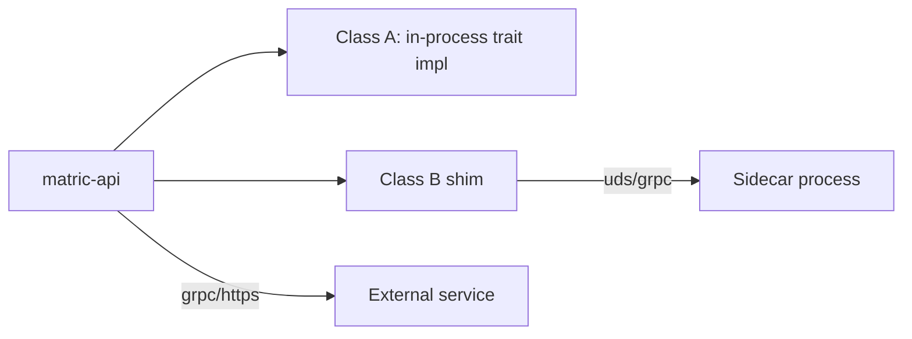

# Plugin Contract Specification

**Status:** Draft for review
**Date:** 2026-05-20
**Audience:** Enterprise Edition (EE) plugin authors and Community Edition (CE) core maintainers
**Related ADRs:** ADR-088 (plugin strategy), ADR-089 (authorization), ADR-091 (audit), ADR-092 (metering), ADR-093 (key provider), ADR-099 (DSAR), ADR-100 (MCP gate)
**Related docs:** `.aiwg/architecture/ce-ee-audit-2026-05.md`, `.aiwg/security/multi-tenant-threat-model.md`

---

## 1. Purpose

This document defines the formal contract between the Fortemi Community Edition (CE) core and pluggable extensions, including the private Enterprise Edition (EE) crates that compose the full enterprise distribution. It exists so that:

- EE plugin authors have a single, stable surface to implement against
- CE core maintainers know which traits and contracts cannot break without a major version bump
- Third-party integrators (compliance vendors, identity providers, observability stacks) can build certified plugins without forking core

**This document is not:**
- A tutorial — see `.aiwg/templates/ee-plugin-crate/` for a starter kit
- A list of EE features — see `.aiwg/architecture/ce-ee-audit-2026-05.md` §5
- The license — plugin licensing is governed by `LICENSE.txt` (BSL-1.1) for CE, individual licenses for EE crates

## 2. Plugin Classification

Three classes are defined. Class A is the default; B and C exist for plugins whose deployment, language, or risk profile makes in-process Rust impractical.

| Class | Mechanism | Process | Latency | When to use |
|---|---|---|---|---|
| **A** | Rust crate implementing core trait(s); linked via Cargo feature flag | In-process | μs | Default. All EE plugins start here. |
| **B** | Thin Rust trait impl in core that forwards to a gRPC sidecar over UDS/TLS | Sidecar | low ms | When plugin needs proprietary deps that pollute Cargo graph; when plugin must be hot-restarted independently of core |
| **C** | Pure external service consumed via core HTTP/gRPC client; no Rust trait impl needed | Network | ms-100s ms | Cloud-only EE features (e.g., SaaS audit pipelines, vendor-managed KMS) |

Class B and C plugins MUST still register a configuration entry so `aiwg`/operators can manage them through the same lifecycle as A.



## 3. Plug-Point Matrix

Existing traits are STABLE under semver — additions are minor, signature changes are major.
New traits introduced for EE are BETA until first EE shipment; then promoted to STABLE.

| # | Trait | Crate | Classes | Stability | CE default | Example EE impls | Versioning |
|---|---|---|---|---|---|---|---|
| 1 | `NoteRepository` | `matric-core` | A | **Stable** | `PgNoteRepository` (`matric-db`) | Sharded Citus impl | Strict semver |
| 2 | `EmbeddingRepository` | `matric-core` | A | **Stable** | `PgEmbeddingRepository` | Pinecone, Weaviate, Qdrant | Strict semver |
| 3 | `LinkRepository` | `matric-core` | A | **Stable** | `PgLinkRepository` | Neo4j adapter | Strict semver |
| 4 | `TagRepository` | `matric-core` | A | **Stable** | `PgTagRepository` | — | Strict semver |
| 5 | `CollectionRepository` | `matric-core` | A | **Stable** | `PgCollectionRepository` | — | Strict semver |
| 6 | `JobRepository` | `matric-core` | A, B | **Stable** | `PgJobRepository` | SQS, Cloud Tasks, Temporal | Strict semver |
| 7 | `JobNotifier` | `matric-core` | A | **Stable** | `NoOpNotifier` | Pub/Sub fan-out | Strict semver |
| 8 | `TemplateRepository` | `matric-core` | A | **Stable** | `PgTemplateRepository` | — | Strict semver |
| 9 | `DocumentTypeRepository` | `matric-core` | A | **Stable** | `PgDocumentTypeRepository` | — | Strict semver |
| 10 | `ArchiveRepository` | `matric-core` | A | **Stable** | `PgArchiveRepository` | — | Strict semver |
| 11 | `EmbeddingBackend` | `matric-core` | A, B, C | **Stable** | `OllamaBackend` (`matric-inference`) | OpenAI, Cohere, Voyage | Strict semver |
| 12 | `GenerationBackend` | `matric-core` | A, B, C | **Stable** | `OllamaBackend` | OpenAI, Anthropic, OpenRouter | Strict semver |
| 13 | `InferenceBackend` | `matric-core` | A, B, C | **Stable** | `OllamaBackend` | — | Strict semver |
| 14 | `SearchProvider` | `matric-core` | A | **Stable** | `HybridSearchProvider` (`matric-search`) | Hosted vector DBs | Strict semver |
| 15 | `ExtractionAdapter` | `matric-core` | A, B | **Stable** | 18 adapters in `matric-jobs` | Proprietary CAD/medical extractors | Strict semver |
| 16 | `ContentProcessor` | `matric-core` | A | **Stable** | `DefaultContentProcessor` | — | Strict semver |
| 17 | `OAuthProvider` | `fortemi-auth-core` | A, B | **Stable** | `ClerkProvider` | SAML, Okta, Azure AD, Auth0 | Strict semver |
| 18 | `AuthorizationPolicy` | `matric-core` | A, B, C | **Beta** (ADR-089) | `AllowAllPolicy` (CE) | Casbin, OPA, custom RBAC/ABAC | Beta → Stable @ 2026.Q3 |
| 19 | `AuditSink` | `matric-core` | A, B, C | **Beta** (ADR-091) | `TracingSink` | Splunk, Elastic SIEM, S3-WORM, Datadog | Beta → Stable @ 2026.Q3 |
| 20 | `UsageMeter` + `QuotaPolicy` | `matric-core` | A, B | **Beta** (ADR-092) | `NoOpMeter` | Stripe Metering, OpenMeter, custom | Beta → Stable @ 2026.Q4 |
| 21 | `KeyProvider` | `matric-core` (re-exported from `matric-crypto`) | A, B, C | **Beta** (ADR-093 Rev 1) | `KmsKeyProvider` (AWS KMS, GCP KMS, or Vault Transit) for hosted multi-tenant; `EnvKeyProvider` for single-tenant HotM desktop sidecar only | YubiHSM2 (`fortemi-enterprise-kms-yubihsm`), BYOK wrapper (`fortemi-enterprise-kms-byok`) | Beta → Stable @ 2026.Q4 |
| 22 | `DataSubjectRequestHandler` | `matric-core` | A | **Experimental** (ADR-099) | `NotImplemented` | Privacy automation vendors | Experimental → Beta @ 2026.Q4 |
| 23 | MCP scope gate (extension of OAuth scope) | `matric-api` | A | **Beta** (ADR-100) | Default scope map | Custom scope policies | Beta → Stable @ 2026.Q3 |

## 4. Contract Guarantees: Core → Plugins

The core promises every plugin the following:

1. **Single construction at startup.** Plugins are built once via `from_env() -> Result<Self>` or `from_config(&Config) -> Result<Self>` and then held in an `Arc` for the process lifetime. There is no runtime hot-swap. Restarts are required for config changes.

2. **AuthContext on every call.** Every plugin method whose surface area touches user data receives `&AuthContext` (defined in `fortemi-auth-core`). Plugins may enforce their own authorization on top of the core's `AuthorizationPolicy` (defense in depth), but MUST NOT downgrade the core's decision.

3. **Tenant scope is enforced upstream.** Plugins do NOT receive a raw `Database` handle in multi-tenant mode. They receive a `TenantScopedConn` (per ADR-090 Rev 1) — an extractor that opens a transaction and issues `SET LOCAL app.current_tenant = <tenant_id>` before any tenant-scoped query. RLS policies on every user-data table enforce isolation at the database tier. Plugins that need cross-tenant access MUST declare `system:tenant_admin` in their manifest and call the explicit `SystemScopedConn` extractor, which itself is audit-logged via the `system.cross_tenant_access` event.

4. **Panic containment.** A plugin panic is caught at the call boundary and converted to `ApiError::Plugin { name, kind, source }`. The API process does not crash. Repeated panics trip the per-plugin circuit breaker.

5. **Namespaced logging.** Plugin logs are routed through `tracing` with the span field `plugin = "<name>"`. The configured `AuditSink` automatically receives any event tagged `audit_relevant = true`.

6. **Telemetry context propagation.** OpenTelemetry trace and span IDs are propagated to plugin methods through the standard `tracing::Span::current()` mechanism for Class A, and via the `traceparent` header for Class B/C.

7. **Configuration surface.** Plugins read configuration from a namespaced section (`config.plugins.<name>`) of the central `Config` struct, never from arbitrary environment variables. This makes the config surface discoverable, validatable, and auditable.

## 5. Contract Guarantees: Plugins → Core

Every plugin MUST guarantee:

1. **`Send + Sync`.** All trait implementations work safely across Tokio runtime threads.

2. **Async-safe.** No blocking I/O on Tokio runtime threads. Use `tokio::task::spawn_blocking` for CPU-bound or sync-IO work and document why.

3. **Errors map to `matric_core::Error`.** Plugin-internal error types implement `From<E> for matric_core::Error`. The free-form `Other(String)` variant is acceptable for unanticipated cases but should not be the common path.

4. **No unbounded retries inside the plugin.** Retries against external services use a bounded `backoff` policy. Persistent failures surface to the core's circuit breaker; the core decides whether to retry.

5. **Idempotency keys honored.** When the core passes a `job_id` or `idempotency_key`, the plugin treats repeat invocations as no-ops on the second-and-subsequent call. This is mandatory for `JobRepository`, `ExtractionAdapter`, `AuditSink`.

6. **No secret material logged.** Plugin logs must not contain raw API keys, OAuth tokens, JWTs, private keys, or PII beyond what the core's redaction policy permits (`AuthContext::redact()`). The core's `tracing` subscriber redacts known token formats by regex as a backstop, but this is defense in depth, not a substitute.

7. **Cleanup on shutdown.** The `shutdown(&self)` hook (see §9) drains in-flight work, flushes buffers, and releases external connections within the configured grace window.

## 6. Semver Discipline

The contract version is the version of `matric-core`. Plugins declare their compatibility with a caret range:

```toml
[dependencies]
matric-core = "^2026.5"
```

| Change | Bump |
|---|---|
| New trait added | Minor |
| New method added to existing trait, with a default impl | Minor |
| New method added without a default impl | **Major** (every plugin must update) |
| Method signature changed (params, return type) | **Major** |
| Method removed | **Major** |
| Default implementation logic changed in a way that affects observable behavior | Minor + CHANGELOG note |
| Trait moved between crates | **Major** |

### `PLUGIN_ABI_VERSION` constant

`matric-core` exports:

```rust
/// Plugin ABI version. Bumped on any major contract change.
/// EE plugins MUST check this at startup; mismatches refuse to load.
pub const PLUGIN_ABI_VERSION: u32 = 1;
```

Plugins assert at startup:

```rust
use matric_core::PLUGIN_ABI_VERSION;
assert_eq!(PLUGIN_ABI_VERSION, 1, "Plugin built for ABI v1; core is v{}", PLUGIN_ABI_VERSION);
```

This catches the case where a plugin was compiled against an older `matric-core` than the running core (the Cargo build will usually catch this, but the assertion provides a clear error message if it doesn't, particularly in Class B sidecar deploys where the plugin and core are built separately).

## 7. Wire Contract for Class B and C Plugins

When a plugin runs out-of-process, the core uses gRPC over either a Unix domain socket (preferred for B) or TCP+TLS (required for C).

### Example: `AuthorizationPolicy` (Class B/C)

```protobuf
// fortemi/protos/authorization.proto
syntax = "proto3";
package fortemi.authorization.v1;

service AuthorizationPolicy {
  rpc Authorize(AuthorizeRequest) returns (AuthorizeResponse);
  rpc HealthCheck(HealthRequest) returns (HealthResponse);
}

message AuthorizeRequest {
  Principal principal = 1;
  Action action = 2;
  Resource resource = 3;
  AuthContext ctx = 4;
}

message AuthorizeResponse {
  Decision decision = 1;          // ALLOW | DENY | INDETERMINATE
  string reason = 2;              // Audit-grade explanation
  repeated string obligations = 3; // e.g., ["mfa_required", "log_pii_access"]
}
```

Retry policy: caller retries `INDETERMINATE` once with exponential backoff; treats `DENY` and `ALLOW` as terminal. `Authorize` calls are idempotent.

### Example: `AuditSink` (Class B/C)

```protobuf
// fortemi/protos/audit.proto
syntax = "proto3";
package fortemi.audit.v1;

service AuditSink {
  rpc Emit(EmitRequest) returns (EmitResponse);
  rpc HealthCheck(HealthRequest) returns (HealthResponse);
}

message EmitRequest {
  repeated AuditEvent events = 1;  // Batched
  string idempotency_key = 2;       // For retry safety
}

message EmitResponse {
  uint32 accepted = 1;
  repeated EventError errors = 2;   // Per-event failures
}
```

`AuditSink.Emit` is required to be idempotent; the core retries with the same `idempotency_key` on transient failure. The sink MUST de-duplicate.

## 8. Authentication Between Core and Out-of-Process Plugins

Class B and C plugins authenticate to the core (and vice versa) using **mTLS** as the primary mechanism, with **short-TTL core-issued JWT** as a documented fallback.

| Property | mTLS | JWT |
|---|---|---|
| Identity | Client cert subject | `sub` claim |
| TTL | Cert validity (long) | 15 minutes |
| Configuration | `config.plugins.<name>.tls.client_cert_path` | `config.plugins.<name>.jwt.signing_key_id` |
| Rotation | PKI (manual or cert-manager) | Automatic |

Key material storage MUST follow `.claude/rules/no-key-reuse-across-purposes.md` and `.claude/rules/no-adhoc-kdf.md`:
- mTLS keys are distinct from JWT signing keys
- JWT signing keys are derived from a `KeyProvider`-managed master via HKDF-Expand with a domain-separation `info` of `"fortemi/plugin-jwt/v1"`
- Keys never appear in logs or environment variables (file paths only, mode `0400`)

## 9. Lifecycle Hooks

Every plugin SHOULD implement these four methods. The first three are required for any plugin loaded via the registry; `shutdown` is required for any plugin that holds external resources.

```rust
#[async_trait]
pub trait Plugin: Send + Sync {
    /// Stable, human-readable identifier. Used in logs, telemetry, audit events.
    fn name(&self) -> &'static str;

    /// Plugin version (semver string). Reported in `/healthz` and audit events.
    fn version(&self) -> &'static str;

    /// Health probe. Mirrors `ProviderHealth` from ADR-072.
    /// Called periodically by the core; an `Unhealthy` result trips the circuit breaker.
    async fn health_check(&self) -> Result<HealthStatus>;

    /// Graceful shutdown. Called once at API shutdown.
    /// Plugins drain in-flight work, flush buffers, close connections within `grace`.
    async fn shutdown(&self, grace: Duration) -> Result<()>;
}
```

`HealthStatus` mirrors `ProviderHealth` (Healthy / Degraded / Unhealthy / Unknown).

## 10. Telemetry Contract

Plugins emit two kinds of signal:

**OpenTelemetry spans (every call):**
```rust
let span = tracing::info_span!("plugin.call", plugin = self.name(), method = "authorize");
let _enter = span.enter();
// ... work ...
```

**Mandatory audit events (per surface):**

| Surface | Required events |
|---|---|
| `AuthorizationPolicy` | `auth.decision` (every Allow/Deny with reason) |
| `KeyProvider` | `key.use` (encrypt/decrypt/sign), `key.rotate`, `key.export_attempt` |
| `DataSubjectRequestHandler` | `dsar.request_received`, `dsar.export_completed`, `dsar.deletion_completed` |
| `AuditSink` | None (the sink IS the audit destination) |
| `OAuthProvider` | `auth.login_success`, `auth.login_failure`, `auth.token_issued`, `auth.token_revoked` |
| `JobRepository` | `job.created`, `job.completed`, `job.failed` (on transitions, not polls) |
| `UsageMeter` | `quota.consumed`, `quota.exceeded` |

Events are emitted by calling `audit::emit(event)`, which routes through the configured `AuditSink`. The CE default sink logs via `tracing` only; EE sinks ship to SIEM/Splunk/S3.

## 11. Stability Tier Matrix

| Tier | What plugin authors may rely on | Breaking-change policy | Production use |
|---|---|---|---|
| **Stable** | Method signatures, semantic contracts, default impl behavior | Only on major version of `matric-core` | ✓ Yes |
| **Beta** | Method signatures within a major version; semantic contracts may refine | Breaking changes allowed with one minor's deprecation notice (CHANGELOG entry + `#[deprecated]` attribute) | ✓ Yes, with watch on CHANGELOG |
| **Experimental** | Nothing structurally; expect breakage | Any time, with patch notes only | ✗ Not recommended |

Stability tiers are declared in the plug-point matrix (§3). Promotion (Experimental → Beta → Stable) is announced in CHANGELOG.

## 12. Worked Example: Minimal AuditSink Plugin

A complete plugin that writes audit events to a local JSONL file. Useful for compliance-export scenarios and as a starter for SIEM sinks.

**`Cargo.toml`:**
```toml
[package]
name = "fortemi-enterprise-audit-jsonl"
version = "0.1.0"
edition = "2021"
license-file = "LICENSE"  # Commercial; not BSL

[dependencies]
matric-core = { version = "^2026.5", default-features = false }
async-trait = "0.1"
tokio = { version = "1", features = ["fs", "io-util", "sync"] }
serde_json = "1"
tracing = "0.1"

[lib]
crate-type = ["rlib"]
```

**`src/lib.rs`:**
```rust
use async_trait::async_trait;
use matric_core::{
    AuditEvent, AuditSink, HealthStatus, Plugin, PLUGIN_ABI_VERSION, Result,
};
use std::path::PathBuf;
use std::time::Duration;
use tokio::fs::OpenOptions;
use tokio::io::AsyncWriteExt;
use tokio::sync::Mutex;

pub struct JsonlAuditSink {
    path: PathBuf,
    handle: Mutex<tokio::fs::File>,
}

impl JsonlAuditSink {
    pub async fn from_config(cfg: &matric_core::Config) -> Result<Self> {
        assert_eq!(PLUGIN_ABI_VERSION, 1, "ABI mismatch");
        let path = cfg.plugin_path("audit_jsonl", "out_path")?;
        let file = OpenOptions::new()
            .create(true)
            .append(true)
            .open(&path)
            .await?;
        Ok(Self { path, handle: Mutex::new(file) })
    }
}

#[async_trait]
impl Plugin for JsonlAuditSink {
    fn name(&self) -> &'static str { "audit_jsonl" }
    fn version(&self) -> &'static str { env!("CARGO_PKG_VERSION") }

    async fn health_check(&self) -> Result<HealthStatus> {
        // Confirm we can still write
        let mut h = self.handle.lock().await;
        h.flush().await.map(|_| HealthStatus::Healthy)
            .map_err(Into::into)
    }

    async fn shutdown(&self, _grace: Duration) -> Result<()> {
        self.handle.lock().await.flush().await?;
        Ok(())
    }
}

#[async_trait]
impl AuditSink for JsonlAuditSink {
    async fn emit(&self, events: &[AuditEvent], idempotency_key: &str) -> Result<()> {
        let mut h = self.handle.lock().await;
        for event in events {
            // Includes idempotency_key for replay-safety on the consumer side
            let line = serde_json::json!({
                "idempotency_key": idempotency_key,
                "event": event,
            });
            h.write_all(line.to_string().as_bytes()).await?;
            h.write_all(b"\n").await?;
        }
        h.flush().await?;
        Ok(())
    }
}
```

A consumer in the core wires it via Cargo feature:

```toml
# fortemi/Cargo.toml (enterprise build only)
[features]
enterprise = ["dep:fortemi-enterprise-audit-jsonl"]

[dependencies]
fortemi-enterprise-audit-jsonl = { version = "0.1", optional = true, registry = "fortemi-ee" }
```

And registers it at startup:

```rust
#[cfg(feature = "enterprise")]
fn register_audit_sink(state: &mut AppState, cfg: &Config) -> Result<()> {
    let sink = JsonlAuditSink::from_config(cfg)?;
    state.audit_sink = Arc::new(sink);
    Ok(())
}
```

---

## Open questions for review

1. Should `PLUGIN_ABI_VERSION` be a per-trait version vector instead of a monolithic `u32`? (Pros: finer-grained compat checks. Cons: more bookkeeping.)
2. Class B sidecars over Unix domain sockets vs Vsock vs gRPC-Web — pick one default for ADR-088.
3. Do Class C plugins get to declare authorization policy (e.g., "this audit sink may not be called for cross-tenant events"), or is core the sole policy decision point?
4. Plugin certification / signing — should EE plugins be cosign-signed and verified at load? (Defers to `.aiwg/process/plugin-certification.md`.)

## Sign-off requirements (before EE GA)

- [ ] Each new trait (§3 rows 18–23) has its own ADR
- [ ] `PLUGIN_ABI_VERSION` constant landed in `matric-core` with CI gate
- [ ] At least one Class A and one Class B EE plugin built end-to-end to validate the contract
- [ ] CHANGELOG entry process documented for breaking trait changes
