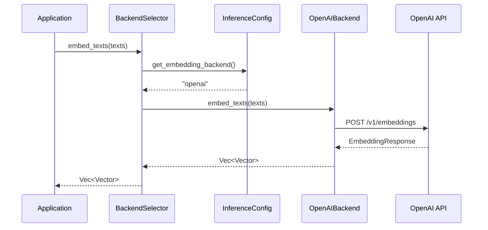
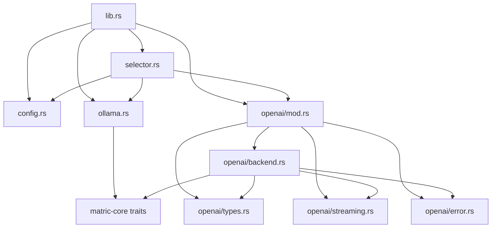

# Architecture Design: OpenAI-Compatible Backend (ARCH-010)

**Document ID:** ARCH-010
**Status:** Elaboration Complete
**Created:** 2026-01-22
**Requirements Reference:** REQ-010-openai-backend.md

---

## 1. Architecture Overview

This document describes the architecture for adding an OpenAI-compatible API backend to `matric-inference`. The design follows the existing Ollama backend patterns while introducing a unified configuration system for backend selection.

### High-Level Architecture

```
+---------------------------+
|      matric-inference     |
+---------------------------+
|                           |
|  +---------------------+  |
|  |  InferenceBackend   |  |  <-- Unified trait interface
|  |  (matric-core)      |  |
|  +----------+----------+  |
|             |             |
|    +--------+--------+    |
|    |                 |    |
| +--v---+         +---v--+ |
| |Ollama|         |OpenAI| |  <-- Pluggable backends
| |Backend|        |Backend| |
| +------+         +------+ |
|                           |
|  +---------------------+  |
|  | BackendConfig       |  |  <-- Unified configuration
|  +---------------------+  |
|                           |
|  +---------------------+  |
|  | BackendSelector     |  |  <-- Runtime backend selection
|  +---------------------+  |
+---------------------------+
```

### Request Flow Sequence



---

## 2. Module Structure

### Directory Layout

```
crates/matric-inference/src/
|-- lib.rs              # Public exports and feature gates
|-- config.rs           # NEW: Backend configuration types
|-- selector.rs         # NEW: Runtime backend selection
|-- ollama.rs           # Existing Ollama backend
|-- openai/             # NEW: OpenAI backend module
|   |-- mod.rs          # Module re-exports
|   |-- backend.rs      # OpenAIBackend implementation
|   |-- types.rs        # Request/response types
|   |-- streaming.rs    # SSE stream handling
|   |-- error.rs        # OpenAI-specific errors
|-- model_config.rs     # Existing model configuration
|-- profiles.rs         # Existing model profiles
|-- thinking.rs         # Existing thinking detection
```

### Module Dependency Graph



---

## 3. Trait Definitions

The existing traits in `matric-core/src/traits.rs` already define the interface. No changes are required to the core traits.

### Existing Traits (matric-core)

```rust
/// Backend for generating text embeddings.
#[async_trait]
pub trait EmbeddingBackend: Send + Sync {
    /// Generate embeddings for the given texts.
    async fn embed_texts(&self, texts: &[String]) -> Result<Vec<Vector>>;

    /// Get the expected dimension of embedding vectors.
    fn dimension(&self) -> usize;

    /// Get the model name being used.
    fn model_name(&self) -> &str;
}

/// Backend for text generation (LLM).
#[async_trait]
pub trait GenerationBackend: Send + Sync {
    /// Generate text given a prompt.
    async fn generate(&self, prompt: &str) -> Result<String>;

    /// Generate text with system context.
    async fn generate_with_system(&self, system: &str, prompt: &str) -> Result<String>;

    /// Get the model name being used.
    fn model_name(&self) -> &str;
}

/// Combined inference backend supporting both embedding and generation.
#[async_trait]
pub trait InferenceBackend: EmbeddingBackend + GenerationBackend {
    /// Check if the backend is available and responding.
    async fn health_check(&self) -> Result<bool>;
}
```

### Extended Traits (matric-inference)

```rust
// src/config.rs

use serde::{Deserialize, Serialize};

/// Backend type identifier.
#[derive(Debug, Clone, Copy, PartialEq, Eq, Serialize, Deserialize)]
#[serde(rename_all = "lowercase")]
pub enum BackendType {
    Ollama,
    OpenAI,
}

/// Configuration for Ollama backend.
#[derive(Debug, Clone, Serialize, Deserialize)]
pub struct OllamaConfig {
    pub base_url: String,
    pub embed_model: String,
    pub gen_model: String,
    pub embed_dimension: usize,
    #[serde(default = "default_timeout")]
    pub timeout_seconds: u64,
}

/// Configuration for OpenAI-compatible backend.
#[derive(Debug, Clone, Serialize, Deserialize)]
pub struct OpenAIConfig {
    pub base_url: String,
    #[serde(default)]
    pub api_key: Option<String>,
    pub embed_model: String,
    pub gen_model: String,
    pub embed_dimension: usize,
    #[serde(default = "default_timeout")]
    pub timeout_seconds: u64,
    #[serde(default)]
    pub skip_tls_verify: bool,
}

/// Unified inference configuration.
#[derive(Debug, Clone, Serialize, Deserialize)]
pub struct InferenceConfig {
    /// Default backend for embedding operations.
    #[serde(default = "default_embed_backend")]
    pub default_embedding: BackendType,

    /// Default backend for generation operations.
    #[serde(default = "default_gen_backend")]
    pub default_generation: BackendType,

    /// Ollama backend configuration.
    #[serde(default)]
    pub ollama: Option<OllamaConfig>,

    /// OpenAI backend configuration.
    #[serde(default)]
    pub openai: Option<OpenAIConfig>,
}

fn default_timeout() -> u64 { 300 }
fn default_embed_backend() -> BackendType { BackendType::Ollama }
fn default_gen_backend() -> BackendType { BackendType::Ollama }
```

---

## 4. OpenAI Backend Implementation

### Core Types (openai/types.rs)

```rust
use serde::{Deserialize, Serialize};

// =============================================================================
// EMBEDDING TYPES
// =============================================================================

#[derive(Debug, Serialize)]
pub struct EmbeddingRequest {
    pub model: String,
    pub input: Vec<String>,
    #[serde(skip_serializing_if = "Option::is_none")]
    pub encoding_format: Option<String>,
}

#[derive(Debug, Deserialize)]
pub struct EmbeddingResponse {
    pub data: Vec<EmbeddingData>,
    pub model: String,
    pub usage: EmbeddingUsage,
}

#[derive(Debug, Deserialize)]
pub struct EmbeddingData {
    pub embedding: Vec<f32>,
    pub index: usize,
}

#[derive(Debug, Deserialize)]
pub struct EmbeddingUsage {
    pub prompt_tokens: u32,
    pub total_tokens: u32,
}

// =============================================================================
// CHAT COMPLETION TYPES
// =============================================================================

#[derive(Debug, Serialize)]
pub struct ChatCompletionRequest {
    pub model: String,
    pub messages: Vec<ChatMessage>,
    #[serde(skip_serializing_if = "Option::is_none")]
    pub temperature: Option<f32>,
    #[serde(skip_serializing_if = "Option::is_none")]
    pub max_tokens: Option<u32>,
    #[serde(default)]
    pub stream: bool,
}

#[derive(Debug, Clone, Serialize, Deserialize)]
pub struct ChatMessage {
    pub role: String,
    pub content: String,
}

#[derive(Debug, Deserialize)]
pub struct ChatCompletionResponse {
    pub id: String,
    pub choices: Vec<ChatChoice>,
    pub usage: Option<ChatUsage>,
}

#[derive(Debug, Deserialize)]
pub struct ChatChoice {
    pub index: usize,
    pub message: ChatMessage,
    pub finish_reason: Option<String>,
}

#[derive(Debug, Deserialize)]
pub struct ChatUsage {
    pub prompt_tokens: u32,
    pub completion_tokens: u32,
    pub total_tokens: u32,
}

// =============================================================================
// STREAMING TYPES
// =============================================================================

#[derive(Debug, Deserialize)]
pub struct ChatCompletionChunk {
    pub id: String,
    pub choices: Vec<ChatChunkChoice>,
}

#[derive(Debug, Deserialize)]
pub struct ChatChunkChoice {
    pub index: usize,
    pub delta: ChatDelta,
    pub finish_reason: Option<String>,
}

#[derive(Debug, Deserialize)]
pub struct ChatDelta {
    #[serde(default)]
    pub role: Option<String>,
    #[serde(default)]
    pub content: Option<String>,
}

// =============================================================================
// ERROR TYPES
// =============================================================================

#[derive(Debug, Deserialize)]
pub struct OpenAIErrorResponse {
    pub error: OpenAIError,
}

#[derive(Debug, Deserialize)]
pub struct OpenAIError {
    pub message: String,
    #[serde(rename = "type")]
    pub error_type: String,
    pub code: Option<String>,
}
```

### Backend Implementation (openai/backend.rs)

```rust
use async_trait::async_trait;
use reqwest::Client;
use std::time::Duration;
use tracing::{debug, info, warn};

use matric_core::{EmbeddingBackend, Error, GenerationBackend, InferenceBackend, Result, Vector};
use crate::config::OpenAIConfig;
use super::types::*;

/// Default OpenAI API endpoint.
pub const DEFAULT_OPENAI_URL: &str = "https://api.openai.com/v1";

/// Default embedding model.
pub const DEFAULT_EMBED_MODEL: &str = "text-embedding-3-small";

/// Default generation model.
pub const DEFAULT_GEN_MODEL: &str = "gpt-4o-mini";

/// Default embedding dimension for text-embedding-3-small.
pub const DEFAULT_DIMENSION: usize = 1536;

/// OpenAI-compatible inference backend.
pub struct OpenAIBackend {
    client: Client,
    config: OpenAIConfig,
}

impl OpenAIBackend {
    /// Create a new OpenAI backend with the given configuration.
    pub fn new(config: OpenAIConfig) -> Result<Self> {
        let mut client_builder = Client::builder()
            .timeout(Duration::from_secs(config.timeout_seconds));

        if config.skip_tls_verify {
            client_builder = client_builder
                .danger_accept_invalid_certs(true);
        }

        let client = client_builder
            .build()
            .map_err(|e| Error::Inference(format!("Failed to create HTTP client: {}", e)))?;

        info!(
            "Initializing OpenAI backend: url={}, embed={}, gen={}",
            config.base_url, config.embed_model, config.gen_model
        );

        Ok(Self { client, config })
    }

    /// Create from environment variables.
    pub fn from_env() -> Result<Self> {
        let config = OpenAIConfig {
            base_url: std::env::var("OPENAI_BASE_URL")
                .unwrap_or_else(|_| DEFAULT_OPENAI_URL.to_string()),
            api_key: std::env::var("OPENAI_API_KEY").ok(),
            embed_model: std::env::var("OPENAI_EMBED_MODEL")
                .unwrap_or_else(|_| DEFAULT_EMBED_MODEL.to_string()),
            gen_model: std::env::var("OPENAI_GEN_MODEL")
                .unwrap_or_else(|_| DEFAULT_GEN_MODEL.to_string()),
            embed_dimension: std::env::var("OPENAI_EMBED_DIM")
                .ok()
                .and_then(|s| s.parse().ok())
                .unwrap_or(DEFAULT_DIMENSION),
            timeout_seconds: std::env::var("OPENAI_TIMEOUT")
                .ok()
                .and_then(|s| s.parse().ok())
                .unwrap_or(300),
            skip_tls_verify: std::env::var("OPENAI_SKIP_TLS_VERIFY")
                .map(|v| v == "1" || v.to_lowercase() == "true")
                .unwrap_or(false),
        };

        Self::new(config)
    }

    /// Build a request with authentication if configured.
    fn build_request(&self, endpoint: &str) -> reqwest::RequestBuilder {
        let url = format!("{}{}", self.config.base_url.trim_end_matches('/'), endpoint);
        let mut req = self.client.post(&url);

        if let Some(ref api_key) = self.config.api_key {
            req = req.header("Authorization", format!("Bearer {}", api_key));
        }

        req.header("Content-Type", "application/json")
    }
}

#[async_trait]
impl EmbeddingBackend for OpenAIBackend {
    async fn embed_texts(&self, texts: &[String]) -> Result<Vec<Vector>> {
        if texts.is_empty() {
            return Ok(vec![]);
        }

        debug!(
            "Embedding {} texts with model {}",
            texts.len(),
            self.config.embed_model
        );

        let request = EmbeddingRequest {
            model: self.config.embed_model.clone(),
            input: texts.to_vec(),
            encoding_format: Some("float".to_string()),
        };

        let response = self
            .build_request("/embeddings")
            .json(&request)
            .send()
            .await
            .map_err(|e| Error::Embedding(format!("Request failed: {}", e)))?;

        if !response.status().is_success() {
            let status = response.status();
            let body: OpenAIErrorResponse = response
                .json()
                .await
                .unwrap_or(OpenAIErrorResponse {
                    error: OpenAIError {
                        message: "Unknown error".to_string(),
                        error_type: "unknown".to_string(),
                        code: None,
                    },
                });
            return Err(Error::Embedding(format!(
                "OpenAI returned {}: {}",
                status, body.error.message
            )));
        }

        let result: EmbeddingResponse = response
            .json()
            .await
            .map_err(|e| Error::Embedding(format!("Failed to parse response: {}", e)))?;

        // Sort by index to ensure correct ordering
        let mut data = result.data;
        data.sort_by_key(|d| d.index);

        let vectors: Vec<Vector> = data
            .into_iter()
            .map(|d| Vector::from(d.embedding))
            .collect();

        debug!("Generated {} embeddings", vectors.len());
        Ok(vectors)
    }

    fn dimension(&self) -> usize {
        self.config.embed_dimension
    }

    fn model_name(&self) -> &str {
        &self.config.embed_model
    }
}

#[async_trait]
impl GenerationBackend for OpenAIBackend {
    async fn generate(&self, prompt: &str) -> Result<String> {
        self.generate_with_system("", prompt).await
    }

    async fn generate_with_system(&self, system: &str, prompt: &str) -> Result<String> {
        debug!(
            "Generating with model {}, prompt length: {}",
            self.config.gen_model,
            prompt.len()
        );

        let mut messages = Vec::new();

        if !system.is_empty() {
            messages.push(ChatMessage {
                role: "system".to_string(),
                content: system.to_string(),
            });
        }

        messages.push(ChatMessage {
            role: "user".to_string(),
            content: prompt.to_string(),
        });

        let request = ChatCompletionRequest {
            model: self.config.gen_model.clone(),
            messages,
            temperature: None,
            max_tokens: None,
            stream: false,
        };

        let response = self
            .build_request("/chat/completions")
            .json(&request)
            .send()
            .await
            .map_err(|e| Error::Inference(format!("Request failed: {}", e)))?;

        if !response.status().is_success() {
            let status = response.status();
            let body: OpenAIErrorResponse = response
                .json()
                .await
                .unwrap_or(OpenAIErrorResponse {
                    error: OpenAIError {
                        message: "Unknown error".to_string(),
                        error_type: "unknown".to_string(),
                        code: None,
                    },
                });
            return Err(Error::Inference(format!(
                "OpenAI returned {}: {}",
                status, body.error.message
            )));
        }

        let result: ChatCompletionResponse = response
            .json()
            .await
            .map_err(|e| Error::Inference(format!("Failed to parse response: {}", e)))?;

        let content = result
            .choices
            .first()
            .map(|c| c.message.content.clone())
            .unwrap_or_default();

        debug!("Generation complete, response length: {}", content.len());
        Ok(content)
    }

    fn model_name(&self) -> &str {
        &self.config.gen_model
    }
}

#[async_trait]
impl InferenceBackend for OpenAIBackend {
    async fn health_check(&self) -> Result<bool> {
        // For OpenAI-compatible APIs, we try a minimal models list request
        // or fall back to a simple embedding request with one token
        let url = format!("{}/models", self.config.base_url.trim_end_matches('/'));

        let mut req = self.client.get(&url);
        if let Some(ref api_key) = self.config.api_key {
            req = req.header("Authorization", format!("Bearer {}", api_key));
        }

        let response = req
            .timeout(Duration::from_secs(5))
            .send()
            .await;

        match response {
            Ok(resp) => {
                if resp.status().is_success() {
                    info!("OpenAI health check passed");
                    Ok(true)
                } else {
                    warn!("OpenAI health check failed: {}", resp.status());
                    Ok(false)
                }
            }
            Err(e) => {
                warn!("OpenAI health check error: {}", e);
                Ok(false)
            }
        }
    }
}
```

---

## 5. Streaming Support (openai/streaming.rs)

```rust
use futures::{Stream, StreamExt};
use reqwest::Response;
use std::pin::Pin;

use matric_core::{Error, Result};
use super::types::*;

/// Stream of generation tokens.
pub type TokenStream = Pin<Box<dyn Stream<Item = Result<String>> + Send>>;

/// Parse SSE stream from OpenAI-compatible endpoint.
pub async fn parse_sse_stream(response: Response) -> Result<TokenStream> {
    let stream = response.bytes_stream();

    let token_stream = stream
        .map(|chunk_result| {
            chunk_result
                .map_err(|e| Error::Inference(format!("Stream error: {}", e)))
        })
        .filter_map(|result| async move {
            match result {
                Ok(bytes) => {
                    let text = String::from_utf8_lossy(&bytes);
                    parse_sse_chunk(&text)
                }
                Err(e) => Some(Err(e)),
            }
        });

    Ok(Box::pin(token_stream))
}

/// Parse a single SSE chunk.
fn parse_sse_chunk(chunk: &str) -> Option<Result<String>> {
    let mut content = String::new();

    for line in chunk.lines() {
        let line = line.trim();

        if line.is_empty() || line.starts_with(':') {
            continue;
        }

        if line == "data: [DONE]" {
            return None;
        }

        if let Some(data) = line.strip_prefix("data: ") {
            match serde_json::from_str::<ChatCompletionChunk>(data) {
                Ok(chunk) => {
                    for choice in chunk.choices {
                        if let Some(c) = choice.delta.content {
                            content.push_str(&c);
                        }
                    }
                }
                Err(e) => {
                    return Some(Err(Error::Inference(format!(
                        "Failed to parse chunk: {}",
                        e
                    ))));
                }
            }
        }
    }

    if content.is_empty() {
        None
    } else {
        Some(Ok(content))
    }
}

/// Streaming generation trait extension.
#[async_trait::async_trait]
pub trait StreamingGeneration: Send + Sync {
    /// Generate text with streaming response.
    async fn generate_stream(&self, prompt: &str) -> Result<TokenStream>;

    /// Generate text with system context and streaming response.
    async fn generate_with_system_stream(
        &self,
        system: &str,
        prompt: &str,
    ) -> Result<TokenStream>;
}
```

---

## 6. Backend Selector (selector.rs)

```rust
use async_trait::async_trait;
use std::sync::Arc;

use matric_core::{EmbeddingBackend, Error, GenerationBackend, InferenceBackend, Result, Vector};
use crate::config::{BackendType, InferenceConfig};

#[cfg(feature = "ollama")]
use crate::ollama::OllamaBackend;

#[cfg(feature = "openai")]
use crate::openai::OpenAIBackend;

/// Runtime backend selector that delegates to configured backends.
pub struct BackendSelector {
    config: InferenceConfig,
    #[cfg(feature = "ollama")]
    ollama: Option<OllamaBackend>,
    #[cfg(feature = "openai")]
    openai: Option<crate::openai::OpenAIBackend>,
}

impl BackendSelector {
    /// Create a new backend selector from configuration.
    pub fn new(config: InferenceConfig) -> Result<Self> {
        #[cfg(feature = "ollama")]
        let ollama = config.ollama.as_ref().map(|cfg| {
            OllamaBackend::with_config(
                cfg.base_url.clone(),
                cfg.embed_model.clone(),
                cfg.gen_model.clone(),
                cfg.embed_dimension,
            )
        });

        #[cfg(feature = "openai")]
        let openai = config.openai.as_ref()
            .map(|cfg| crate::openai::OpenAIBackend::new(cfg.clone()))
            .transpose()?;

        Ok(Self {
            config,
            #[cfg(feature = "ollama")]
            ollama,
            #[cfg(feature = "openai")]
            openai,
        })
    }

    /// Create from environment variables with defaults.
    pub fn from_env() -> Result<Self> {
        let config = InferenceConfig::from_env()?;
        Self::new(config)
    }

    /// Get the configured embedding backend.
    fn get_embedding_backend(&self) -> Result<&dyn EmbeddingBackend> {
        match self.config.default_embedding {
            #[cfg(feature = "ollama")]
            BackendType::Ollama => {
                self.ollama.as_ref()
                    .map(|b| b as &dyn EmbeddingBackend)
                    .ok_or_else(|| Error::Config("Ollama backend not configured".into()))
            }
            #[cfg(feature = "openai")]
            BackendType::OpenAI => {
                self.openai.as_ref()
                    .map(|b| b as &dyn EmbeddingBackend)
                    .ok_or_else(|| Error::Config("OpenAI backend not configured".into()))
            }
            #[allow(unreachable_patterns)]
            _ => Err(Error::Config("No backend available for embedding".into())),
        }
    }

    /// Get the configured generation backend.
    fn get_generation_backend(&self) -> Result<&dyn GenerationBackend> {
        match self.config.default_generation {
            #[cfg(feature = "ollama")]
            BackendType::Ollama => {
                self.ollama.as_ref()
                    .map(|b| b as &dyn GenerationBackend)
                    .ok_or_else(|| Error::Config("Ollama backend not configured".into()))
            }
            #[cfg(feature = "openai")]
            BackendType::OpenAI => {
                self.openai.as_ref()
                    .map(|b| b as &dyn GenerationBackend)
                    .ok_or_else(|| Error::Config("OpenAI backend not configured".into()))
            }
            #[allow(unreachable_patterns)]
            _ => Err(Error::Config("No backend available for generation".into())),
        }
    }
}

#[async_trait]
impl EmbeddingBackend for BackendSelector {
    async fn embed_texts(&self, texts: &[String]) -> Result<Vec<Vector>> {
        self.get_embedding_backend()?.embed_texts(texts).await
    }

    fn dimension(&self) -> usize {
        self.get_embedding_backend()
            .map(|b| b.dimension())
            .unwrap_or(768)
    }

    fn model_name(&self) -> &str {
        self.get_embedding_backend()
            .map(|b| b.model_name())
            .unwrap_or("unknown")
    }
}

#[async_trait]
impl GenerationBackend for BackendSelector {
    async fn generate(&self, prompt: &str) -> Result<String> {
        self.get_generation_backend()?.generate(prompt).await
    }

    async fn generate_with_system(&self, system: &str, prompt: &str) -> Result<String> {
        self.get_generation_backend()?
            .generate_with_system(system, prompt)
            .await
    }

    fn model_name(&self) -> &str {
        self.get_generation_backend()
            .map(|b| b.model_name())
            .unwrap_or("unknown")
    }
}

#[async_trait]
impl InferenceBackend for BackendSelector {
    async fn health_check(&self) -> Result<bool> {
        // Check all configured backends
        let mut all_healthy = true;

        #[cfg(feature = "ollama")]
        if let Some(ref ollama) = self.ollama {
            all_healthy &= ollama.health_check().await?;
        }

        #[cfg(feature = "openai")]
        if let Some(ref openai) = self.openai {
            all_healthy &= openai.health_check().await?;
        }

        Ok(all_healthy)
    }
}
```

---

## 7. Configuration Schema

### TOML Configuration File

```toml
# matric.toml - Inference configuration section

[inference]
# Default backend for embedding operations
default_embedding = "ollama"  # "ollama" | "openai"

# Default backend for generation operations
default_generation = "ollama"  # "ollama" | "openai"

[inference.ollama]
base_url = "http://127.0.0.1:11434"
embed_model = "nomic-embed-text"
gen_model = "gpt-oss:20b"
embed_dimension = 768
timeout_seconds = 120

[inference.openai]
# Can be OpenAI cloud, Azure, Ollama in OpenAI mode, vLLM, etc.
base_url = "https://api.openai.com/v1"
# API key from environment variable (optional for local endpoints)
api_key = "${OPENAI_API_KEY}"
embed_model = "text-embedding-3-small"
gen_model = "gpt-4o-mini"
embed_dimension = 1536
timeout_seconds = 300
# Skip TLS verification for self-signed certs (local only)
skip_tls_verify = false
```

### Environment Variables

| Variable | Description | Default |
|----------|-------------|---------|
| `MATRIC_INFERENCE_DEFAULT_EMBEDDING` | Default embedding backend | `ollama` |
| `MATRIC_INFERENCE_DEFAULT_GENERATION` | Default generation backend | `ollama` |
| `OLLAMA_BASE` | Ollama API base URL | `http://127.0.0.1:11434` |
| `OLLAMA_EMBED_MODEL` | Ollama embedding model | `nomic-embed-text` |
| `OLLAMA_GEN_MODEL` | Ollama generation model | `gpt-oss:20b` |
| `OLLAMA_EMBED_DIM` | Ollama embedding dimension | `768` |
| `OPENAI_BASE_URL` | OpenAI-compatible API URL | `https://api.openai.com/v1` |
| `OPENAI_API_KEY` | API key for authentication | (none) |
| `OPENAI_EMBED_MODEL` | OpenAI embedding model | `text-embedding-3-small` |
| `OPENAI_GEN_MODEL` | OpenAI generation model | `gpt-4o-mini` |
| `OPENAI_EMBED_DIM` | OpenAI embedding dimension | `1536` |
| `OPENAI_TIMEOUT` | Request timeout in seconds | `300` |
| `OPENAI_SKIP_TLS_VERIFY` | Skip TLS verification | `false` |

### Configuration Priority

1. Environment variables (highest priority)
2. Configuration file (`matric.toml`)
3. Compile-time defaults (lowest priority)

---

## 8. Error Handling Strategy

### Error Types Hierarchy

```rust
// In matric-core/src/error.rs (existing)

#[derive(Debug, thiserror::Error)]
pub enum Error {
    // ... existing variants ...

    /// Embedding operation failed.
    #[error("Embedding error: {0}")]
    Embedding(String),

    /// Inference operation failed.
    #[error("Inference error: {0}")]
    Inference(String),

    /// Configuration error.
    #[error("Configuration error: {0}")]
    Config(String),
}

// In matric-inference/src/openai/error.rs (new)

use matric_core::Error;

/// OpenAI-specific error codes.
#[derive(Debug, Clone, Copy, PartialEq, Eq)]
pub enum OpenAIErrorCode {
    /// Invalid authentication credentials.
    AuthenticationError,
    /// Rate limit exceeded.
    RateLimitExceeded,
    /// Model not found or not available.
    ModelNotFound,
    /// Request too large.
    ContextLengthExceeded,
    /// Server error.
    ServerError,
    /// Unknown error.
    Unknown,
}

impl OpenAIErrorCode {
    pub fn from_response(status: u16, error_type: &str) -> Self {
        match (status, error_type) {
            (401, _) => Self::AuthenticationError,
            (429, _) => Self::RateLimitExceeded,
            (404, _) | (_, "model_not_found") => Self::ModelNotFound,
            (400, "context_length_exceeded") => Self::ContextLengthExceeded,
            (500..=599, _) => Self::ServerError,
            _ => Self::Unknown,
        }
    }

    pub fn is_retryable(&self) -> bool {
        matches!(self, Self::RateLimitExceeded | Self::ServerError)
    }
}

/// Convert OpenAI error to matric Error.
pub fn to_matric_error(code: OpenAIErrorCode, message: &str) -> Error {
    match code {
        OpenAIErrorCode::AuthenticationError => {
            Error::Config(format!("Authentication failed: {}", message))
        }
        OpenAIErrorCode::RateLimitExceeded => {
            Error::Inference(format!("Rate limit exceeded: {}", message))
        }
        OpenAIErrorCode::ModelNotFound => {
            Error::Config(format!("Model not found: {}", message))
        }
        OpenAIErrorCode::ContextLengthExceeded => {
            Error::Inference(format!("Context too long: {}", message))
        }
        OpenAIErrorCode::ServerError => {
            Error::Inference(format!("Server error: {}", message))
        }
        OpenAIErrorCode::Unknown => {
            Error::Inference(message.to_string())
        }
    }
}
```

### Retry Strategy

```rust
// In matric-inference/src/openai/backend.rs

use std::time::Duration;
use tokio::time::sleep;

const MAX_RETRIES: u32 = 3;
const BASE_DELAY_MS: u64 = 1000;

async fn with_retry<T, F, Fut>(f: F) -> Result<T>
where
    F: Fn() -> Fut,
    Fut: std::future::Future<Output = Result<T>>,
{
    let mut last_error = None;

    for attempt in 0..MAX_RETRIES {
        match f().await {
            Ok(result) => return Ok(result),
            Err(e) => {
                // Check if error is retryable
                let should_retry = matches!(&e,
                    Error::Inference(msg) if msg.contains("rate limit") || msg.contains("Server error")
                );

                if should_retry && attempt < MAX_RETRIES - 1 {
                    let delay = BASE_DELAY_MS * 2u64.pow(attempt);
                    tracing::warn!(
                        "Request failed (attempt {}), retrying in {}ms: {}",
                        attempt + 1, delay, e
                    );
                    sleep(Duration::from_millis(delay)).await;
                    last_error = Some(e);
                } else {
                    return Err(e);
                }
            }
        }
    }

    Err(last_error.unwrap_or_else(|| Error::Inference("Max retries exceeded".into())))
}
```

---

## 9. Integration Points

### Integration with matric-api

```rust
// In matric-api/src/state.rs

use matric_inference::{BackendSelector, InferenceConfig};

pub struct AppState {
    // ... existing fields ...
    pub inference: BackendSelector,
}

impl AppState {
    pub async fn new(config: AppConfig) -> Result<Self> {
        let inference_config = InferenceConfig::from_file_or_env(&config.inference_config)?;
        let inference = BackendSelector::new(inference_config)?;

        // Verify backends are healthy on startup
        if !inference.health_check().await? {
            tracing::warn!("One or more inference backends are unhealthy");
        }

        Ok(Self {
            // ... existing fields ...
            inference,
        })
    }
}
```

### Integration with matric-jobs

```rust
// In matric-jobs/src/processors/embedding.rs

use matric_core::EmbeddingBackend;

pub struct EmbeddingProcessor<B: EmbeddingBackend> {
    backend: B,
    // ...
}

// No changes needed - works with any EmbeddingBackend implementation
```

### Feature Flag Updates (Cargo.toml)

```toml
[features]
default = ["ollama"]
ollama = []
openai = ["futures-util"]

# Enable both backends
all-backends = ["ollama", "openai"]

# Integration tests
integration = []
```

---

## 10. Testing Strategy

### Unit Tests

```rust
// tests/openai_types_test.rs

#[test]
fn test_embedding_request_serialization() {
    let request = EmbeddingRequest {
        model: "text-embedding-3-small".to_string(),
        input: vec!["hello".to_string(), "world".to_string()],
        encoding_format: Some("float".to_string()),
    };

    let json = serde_json::to_string(&request).unwrap();
    assert!(json.contains("text-embedding-3-small"));
    assert!(json.contains("hello"));
}

#[test]
fn test_embedding_response_deserialization() {
    let json = r#"{
        "data": [
            {"embedding": [0.1, 0.2, 0.3], "index": 0}
        ],
        "model": "text-embedding-3-small",
        "usage": {"prompt_tokens": 2, "total_tokens": 2}
    }"#;

    let response: EmbeddingResponse = serde_json::from_str(json).unwrap();
    assert_eq!(response.data.len(), 1);
    assert_eq!(response.data[0].embedding, vec![0.1, 0.2, 0.3]);
}

#[test]
fn test_chat_completion_response_deserialization() {
    let json = r#"{
        "id": "chatcmpl-123",
        "choices": [{
            "index": 0,
            "message": {"role": "assistant", "content": "Hello!"},
            "finish_reason": "stop"
        }],
        "usage": {"prompt_tokens": 10, "completion_tokens": 5, "total_tokens": 15}
    }"#;

    let response: ChatCompletionResponse = serde_json::from_str(json).unwrap();
    assert_eq!(response.choices[0].message.content, "Hello!");
}
```

### Integration Tests (with wiremock)

```rust
// tests/openai_backend_test.rs

use wiremock::{MockServer, Mock, ResponseTemplate};
use wiremock::matchers::{method, path, header};

#[tokio::test]
async fn test_embed_texts_success() {
    let mock_server = MockServer::start().await;

    Mock::given(method("POST"))
        .and(path("/embeddings"))
        .and(header("Content-Type", "application/json"))
        .respond_with(ResponseTemplate::new(200).set_body_json(json!({
            "data": [{"embedding": [0.1, 0.2, 0.3], "index": 0}],
            "model": "text-embedding-3-small",
            "usage": {"prompt_tokens": 1, "total_tokens": 1}
        })))
        .mount(&mock_server)
        .await;

    let config = OpenAIConfig {
        base_url: mock_server.uri(),
        api_key: None,
        embed_model: "text-embedding-3-small".to_string(),
        gen_model: "gpt-4o-mini".to_string(),
        embed_dimension: 3,
        timeout_seconds: 10,
        skip_tls_verify: false,
    };

    let backend = OpenAIBackend::new(config).unwrap();
    let texts = vec!["hello".to_string()];

    let vectors = backend.embed_texts(&texts).await.unwrap();

    assert_eq!(vectors.len(), 1);
    assert_eq!(vectors[0].as_slice(), &[0.1, 0.2, 0.3]);
}

#[tokio::test]
async fn test_generate_success() {
    let mock_server = MockServer::start().await;

    Mock::given(method("POST"))
        .and(path("/chat/completions"))
        .respond_with(ResponseTemplate::new(200).set_body_json(json!({
            "id": "test-123",
            "choices": [{
                "index": 0,
                "message": {"role": "assistant", "content": "Hello, world!"},
                "finish_reason": "stop"
            }],
            "usage": {"prompt_tokens": 5, "completion_tokens": 3, "total_tokens": 8}
        })))
        .mount(&mock_server)
        .await;

    let config = OpenAIConfig {
        base_url: mock_server.uri(),
        api_key: None,
        embed_model: "text-embedding-3-small".to_string(),
        gen_model: "gpt-4o-mini".to_string(),
        embed_dimension: 1536,
        timeout_seconds: 10,
        skip_tls_verify: false,
    };

    let backend = OpenAIBackend::new(config).unwrap();

    let response = backend.generate("Say hello").await.unwrap();

    assert_eq!(response, "Hello, world!");
}

#[tokio::test]
async fn test_rate_limit_error() {
    let mock_server = MockServer::start().await;

    Mock::given(method("POST"))
        .and(path("/embeddings"))
        .respond_with(ResponseTemplate::new(429).set_body_json(json!({
            "error": {
                "message": "Rate limit exceeded",
                "type": "rate_limit_error",
                "code": "rate_limit_exceeded"
            }
        })))
        .mount(&mock_server)
        .await;

    let config = OpenAIConfig {
        base_url: mock_server.uri(),
        api_key: None,
        embed_model: "test".to_string(),
        gen_model: "test".to_string(),
        embed_dimension: 3,
        timeout_seconds: 10,
        skip_tls_verify: false,
    };

    let backend = OpenAIBackend::new(config).unwrap();
    let result = backend.embed_texts(&["test".to_string()]).await;

    assert!(result.is_err());
    assert!(result.unwrap_err().to_string().contains("Rate limit"));
}
```

### Live Integration Tests

```rust
// tests/openai_live_test.rs

/// Live integration tests that require an actual OpenAI-compatible endpoint.
/// Run with: cargo test --features integration -- --ignored

#[tokio::test]
#[ignore]
async fn test_live_embedding() {
    let backend = OpenAIBackend::from_env().unwrap();

    let texts = vec!["This is a test sentence for embedding.".to_string()];
    let vectors = backend.embed_texts(&texts).await.unwrap();

    assert_eq!(vectors.len(), 1);
    assert_eq!(vectors[0].as_slice().len(), backend.dimension());
}

#[tokio::test]
#[ignore]
async fn test_live_generation() {
    let backend = OpenAIBackend::from_env().unwrap();

    let response = backend
        .generate("Say 'hello' and nothing else.")
        .await
        .unwrap();

    assert!(!response.is_empty());
    assert!(response.to_lowercase().contains("hello"));
}

#[tokio::test]
#[ignore]
async fn test_live_health_check() {
    let backend = OpenAIBackend::from_env().unwrap();

    let healthy = backend.health_check().await.unwrap();

    assert!(healthy);
}
```

---

## 11. Risk Analysis and Mitigations

| Risk | Impact | Probability | Mitigation |
|------|--------|-------------|------------|
| API rate limiting | Generation/embedding fails | Medium | Exponential backoff retry, rate limit headers monitoring |
| Model name differences between providers | Wrong model used | Low | Explicit model configuration per backend |
| Streaming format variations (SSE vs NDJSON) | Parsing failures | Medium | Auto-detect format, fallback to batch mode |
| API key exposure in logs | Security breach | Medium | Never log API keys, use SecretString wrapper |
| TLS certificate issues with local deployments | Connection failures | Low | Optional `skip_tls_verify` config |
| Embedding dimension mismatch | Vector storage errors | High | Validate dimension on first request, fail fast |
| Timeout during long generations | Incomplete responses | Medium | Configurable timeout, streaming for long responses |

---

## 12. Implementation Roadmap

### Phase 1: Core Types and Backend (Week 1)
1. Create `openai/` module structure
2. Implement request/response types (`types.rs`)
3. Implement `OpenAIBackend` struct with basic embedding and generation
4. Add unit tests with wiremock

### Phase 2: Configuration System (Week 1)
1. Create `config.rs` with configuration types
2. Implement TOML and environment variable parsing
3. Add configuration validation
4. Document configuration options

### Phase 3: Backend Selector (Week 2)
1. Implement `BackendSelector` type
2. Add runtime backend switching
3. Update `lib.rs` exports
4. Integration tests for mixed backends

### Phase 4: Streaming Support (Week 2)
1. Implement SSE parsing (`streaming.rs`)
2. Add `StreamingGeneration` trait
3. Test with various providers (OpenAI, Ollama, vLLM)

### Phase 5: Integration and Documentation (Week 3)
1. Update `matric-api` to use `BackendSelector`
2. Update `matric-jobs` processors
3. Add live integration tests
4. Update CLAUDE.md and README.md

### Phase 6: Testing and Validation (Week 3)
1. Test with OpenAI cloud
2. Test with Ollama in OpenAI mode
3. Test with vLLM
4. Performance benchmarking
5. Documentation review

---

## 13. Architectural Decision Records (ADRs)

### ADR-001: Trait-Based Backend Abstraction

**Status:** Accepted

**Context:**
We need to support multiple inference backends (Ollama, OpenAI-compatible) with the ability to mix and match them for different operations.

**Decision:**
Use the existing trait hierarchy (`EmbeddingBackend`, `GenerationBackend`, `InferenceBackend`) from `matric-core`. Each backend implements these traits, and a `BackendSelector` coordinates between them.

**Consequences:**
- (+) Existing code using traits works unchanged
- (+) Easy to add new backends in the future
- (+) Backends can be tested independently
- (-) Some duplication in trait implementations
- (-) Cannot easily share state between backends

### ADR-002: Feature Flags for Optional Backends

**Status:** Accepted

**Context:**
Not all deployments need all backends. Users running with local Ollama shouldn't need OpenAI dependencies.

**Decision:**
Use Cargo feature flags (`ollama`, `openai`) to conditionally compile backends. Default is `ollama` only.

**Consequences:**
- (+) Smaller binary size for single-backend deployments
- (+) Reduced compile time when features disabled
- (-) More complex conditional compilation
- (-) Testing requires multiple feature combinations

### ADR-003: Configuration Priority Order

**Status:** Accepted

**Context:**
Configuration can come from files, environment variables, or defaults. Need clear precedence rules.

**Decision:**
Priority order: Environment variables > Configuration file > Compile-time defaults.

**Consequences:**
- (+) Easy 12-factor app deployment with env vars
- (+) Development can use config files
- (+) Sensible defaults reduce required configuration
- (-) May be confusing when settings seem to be ignored (overridden by env)

### ADR-004: Unified Error Types

**Status:** Accepted

**Context:**
OpenAI API returns structured errors. Need to map these to matric error types.

**Decision:**
Map OpenAI error responses to existing `matric_core::Error` variants. Add helper functions for common error mappings.

**Consequences:**
- (+) Consistent error handling across backends
- (+) No need to add OpenAI-specific error handling in callers
- (-) Some loss of error detail in mapping
- (-) OpenAI-specific error codes not directly accessible

### ADR-005: Optional Streaming Support

**Status:** Accepted

**Context:**
Streaming is important for UX during long generations, but not all use cases need it.

**Decision:**
Implement streaming as a separate `StreamingGeneration` trait that backends can optionally implement. Non-streaming `generate()` remains the primary API.

**Consequences:**
- (+) Non-streaming code path remains simple
- (+) Streaming is opt-in for callers who need it
- (-) Two code paths to maintain
- (-) Streaming trait not part of core `InferenceBackend`

---

## 14. Appendix: Provider Compatibility Matrix

| Provider | Embedding API | Chat API | Streaming | Models Endpoint | Notes |
|----------|--------------|----------|-----------|-----------------|-------|
| OpenAI | /v1/embeddings | /v1/chat/completions | SSE | /v1/models | Full compatibility |
| Azure OpenAI | /deployments/{model}/embeddings | /deployments/{model}/chat/completions | SSE | /models | Requires deployment-based URLs |
| Ollama (OpenAI mode) | /v1/embeddings | /v1/chat/completions | SSE | /v1/models | `ollama serve` with `OLLAMA_HOST` |
| vLLM | /v1/embeddings | /v1/chat/completions | SSE | /v1/models | Near-complete OpenAI compatibility |
| LocalAI | /v1/embeddings | /v1/chat/completions | SSE | /v1/models | Good compatibility |
| LM Studio | /v1/embeddings | /v1/chat/completions | SSE | /v1/models | Good compatibility |
| Text Generation Inference | N/A | /v1/chat/completions | SSE | /v1/models | No embedding support |

---

*Document approved for Implementation phase*
