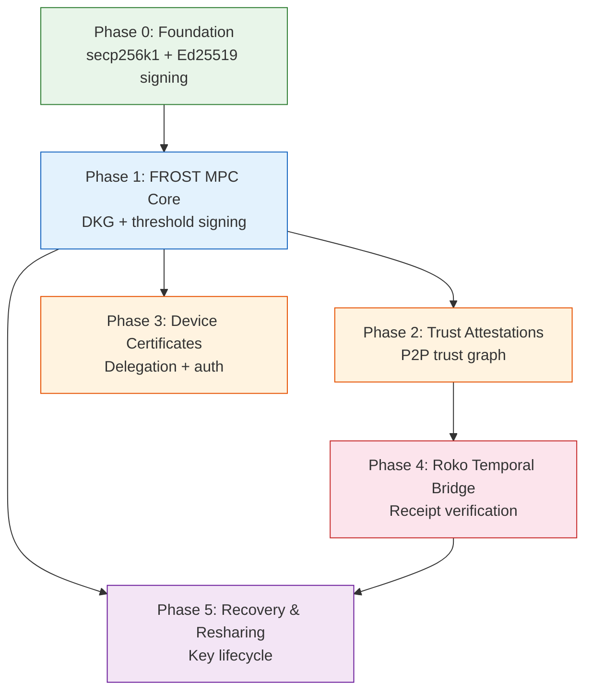

# Implementation Plan - MPC Wallet & Personal Trust Network

**Document ID:** PLAN-MPC-001
**Status:** Draft
**Created:** 2026-04-09
**Feature:** MPC Wallet with FROST threshold signing, P2P trust attestations, device delegation, Roko temporal bridge

---

## Overview

This plan adds a multi-party computation (MPC) wallet to Fortemi, built on FROST threshold signatures (RFC 9591). The MPC wallet serves as a commissioning authority -- a root of trust that issues device certificates, signs trust attestations, and anchors actions to Roko temporal receipts. The existing X25519/AES-256-GCM PKE system remains unchanged; the MPC wallet operates alongside it on additional curves (secp256k1, Ed25519).

---

## Dependency Diagram



**Critical path**: P0 -> P1 -> P2 -> P4 -> P5

Phases 2 and 3 can run in parallel after Phase 1 completes. Phase 5 requires both Phase 1 (MPC core) and Phase 4 (Roko bridge for time-locked recovery).

---

## Phase 0: Foundation (Iteration 1-2)

**Goal**: Add secp256k1 + Ed25519 signing primitives to matric-crypto (non-MPC, single-key operations), with a clear split: secp256k1 ECDSA for Roko receipt verification and secp256k1/Ed25519 Schnorr-family signing in MPC flows.

### Deliverables

**New module: `crates/matric-crypto/src/signing/`**

```
crates/matric-crypto/src/signing/
    mod.rs          # Public API, re-exports
    secp256k1.rs    # secp256k1 helpers (ECDSA verify/recover + Schnorr verify support)
    ed25519.rs      # Ed25519 sign/verify
    address.rs      # Ethereum address derivation (0x format)
    domain.rs       # Domain separation constants
```

- `secp256k1::verify_ecdsa(message, signature, public_key) -> Result<()>`
- `secp256k1::recover_ecdsa(message, signature) -> Result<PublicKey>` -- ecrecover for Roko receipt verification
- `secp256k1::verify_schnorr(message, signature, public_key) -> Result<()>` -- for FROST secp256k1 signatures
- `ed25519::sign(message, keypair) -> Signature`
- `ed25519::verify(message, signature, public_key) -> Result<()>`
- `ethereum_address(secp256k1_pubkey) -> [u8; 20]` -- keccak256 of uncompressed pubkey, last 20 bytes
- Domain separation tags: `"fortemi-sign-v1"`, `"fortemi-trust-v1"`, `"fortemi-device-v1"`

**Database changes**:

New table `signing_keys` (or extend `pke_keysets` with a `curve` discriminator column -- decision deferred to implementation, but a separate table is preferred to avoid schema coupling):

```sql
CREATE TABLE signing_keys (
    id UUID PRIMARY KEY DEFAULT gen_random_uuid(),
    curve TEXT NOT NULL CHECK (curve IN ('secp256k1', 'ed25519')),
    public_key BYTEA NOT NULL,
    address TEXT NOT NULL,           -- 0x... for secp256k1, mm:... for ed25519
    label TEXT,
    created_at TIMESTAMPTZ NOT NULL DEFAULT now(),
    UNIQUE (curve, address)
);
```

**API endpoints**:

| Method | Path | Description |
|--------|------|-------------|
| `POST` | `/api/v1/signing/sign` | Sign a message with a specified key |
| `POST` | `/api/v1/signing/verify` | Verify a signature against a public key |

**Crate dependencies (new)**:
- `k256` (secp256k1 via RustCrypto)
- `ed25519-dalek`
- `sha3` (keccak256 for Ethereum addresses)

**Tests**:
- Unit: sign/verify correctness for both curves, known-answer tests from RFC vectors
- Property-based: for any message and keypair, sign then verify succeeds; sign with key A, verify with key B fails
- Address derivation: known Ethereum addresses from known private keys

### Dependencies

None. This is foundation work that extends matric-crypto without modifying existing PKE code.

### Acceptance Criteria

- All signing unit tests pass
- All existing matric-crypto tests pass unmodified (backward compatibility)
- `cargo clippy -- -D warnings` clean
- Coverage >90% on new `signing/` module

---

## Phase 1: FROST MPC Core (Iteration 3-5)

**Goal**: Implement FROST DKG and threshold signing using the `frost-secp256k1-tr` and `frost-ed25519` crates.

### Deliverables

**New module: `crates/matric-crypto/src/mpc/`**

```
crates/matric-crypto/src/mpc/
    mod.rs              # Public API
    dkg.rs              # DKG ceremony orchestration
    signing.rs          # Threshold signing ceremony
    coordinator.rs      # Ceremony coordinator (in-process first)
    types.rs            # MpcWallet, ShareMetadata, CeremonyId
    test_helpers.rs     # #[cfg(test)] simulation helpers
```

- `DkgCeremony::new(n, t, curve)` -- initialize distributed key generation
- `DkgCeremony::round1()` -> `Round1Package` -- generate commitments
- `DkgCeremony::round2(received_packages)` -> `Round2Package` -- compute shares
- `DkgCeremony::finalize(received_packages)` -> `(KeyPackage, GroupPublicKey)`
- `ThresholdSigner::new(key_package, group_key)`
- `ThresholdSigner::commit()` -> `SigningCommitments`
- `ThresholdSigner::sign(message, all_commitments)` -> `PartialSignature`
- `aggregate_signatures(partials, commitments, group_key, message)` -> `Signature`
- Coordinator orchestrates rounds, collects packages, detects failures

**Database changes**:

```sql
CREATE TABLE mpc_wallets (
    id UUID PRIMARY KEY DEFAULT gen_random_uuid(),
    group_public_key BYTEA NOT NULL,
    curve TEXT NOT NULL CHECK (curve IN ('secp256k1', 'ed25519')),
    threshold SMALLINT NOT NULL,
    num_parties SMALLINT NOT NULL,
    address TEXT NOT NULL,            -- derived from group public key
    created_at TIMESTAMPTZ NOT NULL DEFAULT now(),
    UNIQUE (curve, address)
);

CREATE TABLE mpc_share_metadata (
    id UUID PRIMARY KEY DEFAULT gen_random_uuid(),
    wallet_id UUID NOT NULL REFERENCES mpc_wallets(id) ON DELETE CASCADE,
    party_index SMALLINT NOT NULL,
    device_label TEXT,                -- "laptop", "phone", "backup"
    created_at TIMESTAMPTZ NOT NULL DEFAULT now(),
    last_used_at TIMESTAMPTZ,
    revoked_at TIMESTAMPTZ,
    UNIQUE (wallet_id, party_index)
);

-- NOTE: Actual share secret bytes are NEVER stored in the database.
-- They remain on the device that participated in DKG.
-- This table only tracks metadata about which parties hold shares.

CREATE TABLE mpc_ceremonies (
    id UUID PRIMARY KEY DEFAULT gen_random_uuid(),
    wallet_id UUID REFERENCES mpc_wallets(id),
    ceremony_type TEXT NOT NULL CHECK (ceremony_type IN ('dkg', 'signing', 'resharing')),
    status TEXT NOT NULL CHECK (status IN ('pending', 'round1', 'round2', 'complete', 'failed')),
    participants SMALLINT NOT NULL,
    created_at TIMESTAMPTZ NOT NULL DEFAULT now(),
    completed_at TIMESTAMPTZ
);
```

**API endpoints**:

| Method | Path | Description |
|--------|------|-------------|
| `POST` | `/api/v1/mpc/dkg/init` | Start a new DKG ceremony |
| `POST` | `/api/v1/mpc/dkg/{ceremony_id}/round1` | Submit Round 1 package |
| `POST` | `/api/v1/mpc/dkg/{ceremony_id}/round2` | Submit Round 2 package |
| `GET` | `/api/v1/mpc/dkg/{ceremony_id}/status` | Get ceremony status |
| `POST` | `/api/v1/mpc/sign` | Initiate threshold signing |
| `POST` | `/api/v1/mpc/sign/{session_id}/commit` | Submit signing commitment |
| `POST` | `/api/v1/mpc/sign/{session_id}/partial` | Submit partial signature |
| `GET` | `/api/v1/mpc/wallets` | List MPC wallets |
| `GET` | `/api/v1/mpc/wallets/{id}` | Get wallet details |

**Crate dependencies (new)**:
- `frost-secp256k1-tr` (FROST Schnorr on secp256k1, Taproot-compatible)
- `frost-ed25519` (FROST for Ed25519)
- `frost-core` (shared FROST types)

**Tests**:
- Full DKG with 3 in-process parties, verify group key consistency
- Threshold signing 2-of-3 for all 3 possible subsets
- Property-based: threshold enforcement for (n,t) in {(3,2), (5,2), (5,3), (7,4)}
- Property-based: DKG ordering invariance
- Benchmark: signing latency <100ms

### Dependencies

Phase 0 (signing primitives for single-key operations, address derivation, domain separation).

### Acceptance Criteria

- 2-of-3 threshold signing works in-process for both secp256k1 and Ed25519
- Signing latency <100ms in criterion benchmark (3 in-process parties)
- t-1 shares fail to produce a valid signature (property test, 256 cases)
- All ceremony states tracked in database
- Share secret bytes never touch the database

---

## Phase 2: Trust Attestations (Iteration 6-7)

**Goal**: P2P trust attestation model with MPC-signed attestations forming a queryable trust graph.

### Deliverables

**New module: `crates/matric-core/src/trust/`**

```
crates/matric-core/src/trust/
    mod.rs              # Types and traits
    attestation.rs      # TrustAttestation struct
    scope.rs            # TrustScope enum
    graph.rs            # Trust graph query types
```

- `TrustAttestation { id, attestor, subject, scope, statement, signature, created_at, revoked_at }`
- `TrustScope` enum: `Identity`, `Data`, `Device`, `Recovery`, `Custom(String)`
- Graph query types: `TrustPath`, `TrustDepth`, `MutualTrust`

**Database changes**:

```sql
CREATE TABLE trust_attestations (
    id UUID PRIMARY KEY DEFAULT gen_random_uuid(),
    attestor_address TEXT NOT NULL,       -- MPC wallet address of attestor
    subject_address TEXT NOT NULL,        -- MPC wallet address of subject
    scope TEXT NOT NULL,                  -- 'identity', 'data', 'device', 'recovery', 'custom'
    statement TEXT,                       -- Optional human-readable statement
    signature BYTEA NOT NULL,            -- MPC threshold signature
    curve TEXT NOT NULL,                 -- Curve used for signature
    temporal_receipt_hash BYTEA,         -- Reference to Roko receipt (Phase 4)
    created_at TIMESTAMPTZ NOT NULL DEFAULT now(),
    revoked_at TIMESTAMPTZ,
    revocation_signature BYTEA,          -- MPC signature over revocation
    UNIQUE (attestor_address, subject_address, scope)
);

CREATE INDEX idx_trust_attestations_attestor ON trust_attestations(attestor_address);
CREATE INDEX idx_trust_attestations_subject ON trust_attestations(subject_address);
CREATE INDEX idx_trust_attestations_scope ON trust_attestations(scope);
```

**API endpoints**:

| Method | Path | Description |
|--------|------|-------------|
| `POST` | `/api/v1/trust/attest` | Create a trust attestation (MPC-signed) |
| `GET` | `/api/v1/trust/graph` | Query trust graph (who trusts whom) |
| `GET` | `/api/v1/trust/graph/{address}` | Get trust relationships for an address |
| `DELETE` | `/api/v1/trust/revoke` | Revoke a trust attestation (MPC-signed revocation) |
| `POST` | `/api/v1/trust/verify` | Verify an attestation signature |

**MCP tools** (added to `mcp-server/index.js`):
- `manage_trust` (discriminated union): `attest`, `revoke`, `query_graph`, `verify`

**Tests**:
- Attestation lifecycle: create -> store -> query -> verify -> revoke -> verify revocation
- Mutual trust graph queries
- Scope-filtered queries
- MPC signature verification on attestations
- Revocation prevents future trust queries from returning the attestation

### Dependencies

Phase 1 (MPC signing for attestations).

### Acceptance Criteria

- User can create and revoke trust attestations via API
- All attestations are MPC-signed (threshold signature from Phase 1)
- Trust graph queries return correct results for direct and mutual trust
- MCP tool works for trust management operations

---

## Phase 3: Device Certificates (Iteration 8-9)

**Goal**: Device delegation with short-lived certificates commissioned by the MPC wallet.

### Deliverables

**New module: `crates/matric-crypto/src/device/`**

```
crates/matric-crypto/src/device/
    mod.rs          # Public API
    cert.rs         # DeviceCert format and validation
    middleware.rs   # Axum middleware for cert-based auth
```

- `DeviceCert { id, wallet_id, device_public_key, device_label, issued_at, expires_at, signature }`
- Custom lightweight format (not X.509 -- per ADR-003 decision for minimal overhead)
- Signature is MPC threshold signature from the wallet over the cert fields
- `validate_device_cert(cert, group_public_key) -> Result<()>` -- checks signature + expiry
- Axum middleware: extract `X-Device-Cert` header, validate, inject identity into request extensions

**Database changes**:

```sql
CREATE TABLE device_certs (
    id UUID PRIMARY KEY DEFAULT gen_random_uuid(),
    wallet_id UUID NOT NULL REFERENCES mpc_wallets(id) ON DELETE CASCADE,
    device_public_key BYTEA NOT NULL,
    device_label TEXT NOT NULL,
    curve TEXT NOT NULL CHECK (curve IN ('secp256k1', 'ed25519')),
    issued_at TIMESTAMPTZ NOT NULL DEFAULT now(),
    expires_at TIMESTAMPTZ NOT NULL,
    signature BYTEA NOT NULL,          -- MPC signature over cert fields
    revoked_at TIMESTAMPTZ,
    revocation_reason TEXT,
    UNIQUE (wallet_id, device_public_key)
);

CREATE INDEX idx_device_certs_wallet ON device_certs(wallet_id);
CREATE INDEX idx_device_certs_expiry ON device_certs(expires_at) WHERE revoked_at IS NULL;
```

**API endpoints**:

| Method | Path | Description |
|--------|------|-------------|
| `POST` | `/api/v1/devices/commission` | Commission a new device (requires MPC signing) |
| `GET` | `/api/v1/devices` | List devices for a wallet |
| `GET` | `/api/v1/devices/{id}` | Get device cert details |
| `DELETE` | `/api/v1/devices/{id}` | Revoke a device cert |
| `POST` | `/api/v1/devices/{id}/renew` | Renew a device cert (new expiry, new MPC signature) |

**Auto-renewal**: Background job (via matric-jobs) checks certs approaching expiry (configurable threshold, default 24h before) and triggers renewal if the MPC wallet is available for signing.

**Tests**:
- Commission -> use for auth -> cert expires -> auth fails
- Commission -> revoke -> auth fails immediately
- Multiple devices per wallet
- Device cert cannot commission other devices (no delegation chain deeper than 1)
- Auto-renewal job triggers correctly

### Dependencies

Phase 1 (MPC signing for certificate issuance).

### Acceptance Criteria

- Device gets a short-lived cert signed by MPC wallet
- Cert-based auth works via Axum middleware
- Expired certs are rejected
- Revoked certs are rejected immediately
- Auto-renewal works for active devices

---

## Phase 4: Roko Temporal Bridge (Iteration 10-12)

**Goal**: Verify and store Roko Network temporal receipts, linking them to trust attestations.

### Deliverables

**New module: `crates/matric-crypto/src/temporal/`** (or new crate `crates/matric-roko/` if dependencies are heavy)

```
crates/matric-crypto/src/temporal/
    mod.rs              # Public API
    receipt.rs          # TemporalReceiptPayload, TemporalTxReceipt types
    verify.rs           # Receipt signature verification (ecrecover)
    nanomoment.rs       # NanoMoment type for nanosecond precision
    rpc.rs              # Roko RPC client (optional, behind feature flag)
```

- `TemporalReceiptPayload { tx_hash, block_hash, timestamp_nanos, authority, payload_hash }`
- `TemporalTxReceipt { payload, signature }` -- signed by Roko PoAT authority
- `verify_receipt(receipt) -> Result<AuthorityAddress>` -- ecrecover on payload hash + signature, returns authority
- `NanoMoment` -- wrapper around `u128` nanoseconds since epoch, with `Ord`, `Display`, `Serialize`
- RPC client using `jsonrpsee` for `temporal_getReceipt`, `temporal_verifyTimestamp` (behind `roko-rpc` feature flag)

**Database changes**:

```sql
CREATE TABLE temporal_receipts (
    id UUID PRIMARY KEY DEFAULT gen_random_uuid(),
    tx_hash BYTEA NOT NULL UNIQUE,
    block_hash BYTEA NOT NULL,
    timestamp_nanos NUMERIC(38,0) NOT NULL,  -- u128 nanoseconds
    authority_address TEXT NOT NULL,          -- 0x... recovered from signature
    payload_hash BYTEA NOT NULL,
    signature BYTEA NOT NULL,
    verified_at TIMESTAMPTZ NOT NULL DEFAULT now()
);

CREATE INDEX idx_temporal_receipts_tx ON temporal_receipts(tx_hash);
CREATE INDEX idx_temporal_receipts_ts ON temporal_receipts(timestamp_nanos);

-- Add temporal_receipt_id to trust_attestations (Phase 2 table)
ALTER TABLE trust_attestations
    ADD COLUMN temporal_receipt_id UUID REFERENCES temporal_receipts(id);
```

**API endpoints**:

| Method | Path | Description |
|--------|------|-------------|
| `POST` | `/api/v1/temporal/verify` | Verify a temporal receipt and store it |
| `GET` | `/api/v1/temporal/receipt/{hash}` | Get a stored receipt by tx hash |
| `GET` | `/api/v1/temporal/receipts` | List receipts with time-range filters |

**MCP tools**:
- Extend `manage_trust` with `anchor_temporal` action (link attestation to receipt)

**Tests**:
- Receipt verification against known-good receipts from Roko testnet
- ecrecover returns correct authority address
- NanoMoment ordering correctness (property-based)
- Temporal receipt linked to trust attestation
- Invalid signature rejection
- Modified payload rejection

**Crate dependencies (new)**:
- `jsonrpsee` (Roko RPC client, behind feature flag)

### Dependencies

Phase 2 (trust attestations need temporal receipt references).
Phase 0 (secp256k1 ecrecover for receipt verification).

### Acceptance Criteria

- Can verify Roko temporal receipts (ecrecover -> authority mapping)
- Trust attestations can reference temporal receipts
- NanoMoment preserves nanosecond precision end-to-end
- Works offline with fixture receipts (no hard dependency on live Roko node)

---

## Phase 5: Recovery & Resharing (Iteration 13-14)

**Goal**: Key lifecycle management -- resharing, threshold modification, backup, and social/time-locked recovery.

### Deliverables

**Extend `crates/matric-crypto/src/mpc/`**:

```
crates/matric-crypto/src/mpc/
    resharing.rs        # Resharing protocol
    recovery.rs         # Social and time-locked recovery
    backup.rs           # Encrypted share backup (MMPKEKEY format extension)
```

- `ReshareProtocol::new(old_key_packages, new_n, new_t)` -- produce new shares for same group public key
- Threshold modification: change (2,3) to (3,5) without changing the group public key
- `EncryptedShareBackup` -- extend MMPKEKEY format to wrap a serialized key package, encrypted to the wallet's own public key
- Social recovery: require m-of-n trusted peers (from Phase 2 trust graph) to approve recovery
- Time-locked recovery: submit recovery request to Roko, enforced 72-hour delay before shares released

**Database changes**:

```sql
CREATE TABLE recovery_requests (
    id UUID PRIMARY KEY DEFAULT gen_random_uuid(),
    wallet_id UUID NOT NULL REFERENCES mpc_wallets(id) ON DELETE CASCADE,
    recovery_type TEXT NOT NULL CHECK (recovery_type IN ('social', 'timelocked')),
    status TEXT NOT NULL CHECK (status IN ('pending', 'approved', 'executed', 'cancelled', 'expired')),
    required_approvals SMALLINT NOT NULL,
    received_approvals SMALLINT NOT NULL DEFAULT 0,
    temporal_receipt_id UUID REFERENCES temporal_receipts(id),  -- For timelocked
    unlock_after TIMESTAMPTZ,          -- Earliest execution time (72h default)
    created_at TIMESTAMPTZ NOT NULL DEFAULT now(),
    resolved_at TIMESTAMPTZ
);

CREATE TABLE recovery_approvals (
    id UUID PRIMARY KEY DEFAULT gen_random_uuid(),
    request_id UUID NOT NULL REFERENCES recovery_requests(id) ON DELETE CASCADE,
    approver_address TEXT NOT NULL,     -- Must be in trust graph with scope=Recovery
    signature BYTEA NOT NULL,          -- Approver's MPC signature
    created_at TIMESTAMPTZ NOT NULL DEFAULT now(),
    UNIQUE (request_id, approver_address)
);

CREATE TABLE resharing_events (
    id UUID PRIMARY KEY DEFAULT gen_random_uuid(),
    wallet_id UUID NOT NULL REFERENCES mpc_wallets(id) ON DELETE CASCADE,
    old_threshold SMALLINT NOT NULL,
    old_num_parties SMALLINT NOT NULL,
    new_threshold SMALLINT NOT NULL,
    new_num_parties SMALLINT NOT NULL,
    ceremony_id UUID NOT NULL REFERENCES mpc_ceremonies(id),
    created_at TIMESTAMPTZ NOT NULL DEFAULT now()
);
```

**API endpoints**:

| Method | Path | Description |
|--------|------|-------------|
| `POST` | `/api/v1/mpc/reshare` | Initiate resharing ceremony |
| `POST` | `/api/v1/recovery/initiate` | Start a recovery request |
| `POST` | `/api/v1/recovery/{id}/approve` | Approve a recovery request (trusted peer) |
| `GET` | `/api/v1/recovery/{id}/status` | Get recovery request status |
| `POST` | `/api/v1/recovery/{id}/execute` | Execute recovery (after approval + timelock) |
| `DELETE` | `/api/v1/recovery/{id}` | Cancel a recovery request |
| `POST` | `/api/v1/mpc/backup` | Create encrypted share backup |

**Tests**:
- Resharing produces new shares that sign correctly with same group public key
- Old shares are invalidated after resharing
- Threshold modification (2,3) -> (3,5) preserves group key
- Social recovery: enough approvals -> recovery succeeds
- Social recovery: insufficient approvals -> recovery blocked
- Time-locked recovery: execution before 72h -> rejected
- Time-locked recovery: execution after 72h -> succeeds
- Encrypted backup round-trip: backup -> restore -> sign

### Dependencies

Phase 1 (MPC core for resharing protocol).
Phase 4 (Roko temporal bridge for time-locked recovery).

### Acceptance Criteria

- Resharing to new devices preserves the group public key
- Threshold modification works without changing the public key
- Social recovery requires m-of-n trusted peer approvals
- Time-locked recovery enforces 72-hour delay via Roko temporal proof
- Recovery from below-threshold loss (e.g., lost 2 of 3 devices) works via social recovery

---

## Summary: New Database Tables by Phase

| Phase | Table | Purpose |
|-------|-------|---------|
| 0 | `signing_keys` | Single-key secp256k1 and Ed25519 public keys |
| 1 | `mpc_wallets` | MPC wallet metadata (group key, threshold, parties) |
| 1 | `mpc_share_metadata` | Which parties hold shares (NO secret material) |
| 1 | `mpc_ceremonies` | DKG, signing, and resharing ceremony state |
| 2 | `trust_attestations` | P2P trust attestations with MPC signatures |
| 3 | `device_certs` | Device delegation certificates |
| 4 | `temporal_receipts` | Verified Roko temporal receipts |
| 4 | (alter) `trust_attestations` | Add `temporal_receipt_id` FK |
| 5 | `recovery_requests` | Social and time-locked recovery requests |
| 5 | `recovery_approvals` | Per-approver signatures for recovery |
| 5 | `resharing_events` | Audit log of resharing operations |

## Summary: API Endpoints by Phase

| Phase | Endpoints | Prefix |
|-------|-----------|--------|
| 0 | `POST /sign`, `POST /verify` | `/api/v1/signing/` |
| 1 | `POST /dkg/init`, `POST /dkg/{id}/round1`, `POST /dkg/{id}/round2`, `GET /dkg/{id}/status`, `POST /sign`, `POST /sign/{id}/commit`, `POST /sign/{id}/partial`, `GET /wallets`, `GET /wallets/{id}` | `/api/v1/mpc/` |
| 2 | `POST /attest`, `GET /graph`, `GET /graph/{addr}`, `DELETE /revoke`, `POST /verify` | `/api/v1/trust/` |
| 3 | `POST /commission`, `GET /`, `GET /{id}`, `DELETE /{id}`, `POST /{id}/renew` | `/api/v1/devices/` |
| 4 | `POST /verify`, `GET /receipt/{hash}`, `GET /receipts` | `/api/v1/temporal/` |
| 5 | `POST /reshare`, `POST /backup` | `/api/v1/mpc/` |
| 5 | `POST /initiate`, `POST /{id}/approve`, `GET /{id}/status`, `POST /{id}/execute`, `DELETE /{id}` | `/api/v1/recovery/` |

## Summary: Crate Changes by Phase

| Phase | Crate | Change |
|-------|-------|--------|
| 0 | `matric-crypto` | New `signing/` module (secp256k1, ed25519, address derivation) |
| 0 | `matric-db` | New `signing_keys` repository |
| 0 | `matric-api` | New `/signing/*` route module |
| 1 | `matric-crypto` | New `mpc/` module (FROST DKG, threshold signing, coordinator) |
| 1 | `matric-db` | New `mpc_wallets`, `mpc_share_metadata`, `mpc_ceremonies` repositories |
| 1 | `matric-api` | New `/mpc/*` route module |
| 2 | `matric-core` | New `trust/` module (attestation types, scope, graph queries) |
| 2 | `matric-db` | New `trust_attestations` repository |
| 2 | `matric-api` | New `/trust/*` route module |
| 2 | `mcp-server` | New `manage_trust` tool |
| 3 | `matric-crypto` | New `device/` module (cert format, validation) |
| 3 | `matric-api` | New `/devices/*` route module + cert auth middleware |
| 3 | `matric-db` | New `device_certs` repository |
| 3 | `matric-jobs` | Auto-renewal background job |
| 4 | `matric-crypto` | New `temporal/` module (receipt types, verification, NanoMoment) |
| 4 | `matric-db` | New `temporal_receipts` repository + alter `trust_attestations` |
| 4 | `matric-api` | New `/temporal/*` route module |
| 4 | `mcp-server` | Extend `manage_trust` with `anchor_temporal` |
| 5 | `matric-crypto` | Extend `mpc/` with resharing, recovery, backup |
| 5 | `matric-db` | New `recovery_requests`, `recovery_approvals`, `resharing_events` repositories |
| 5 | `matric-api` | New `/recovery/*` route module, extend `/mpc/*` |

## Summary: New Crate Dependencies

| Crate | Phase | Purpose |
|-------|-------|---------|
| `k256` | 0 | secp256k1 ECDSA (RustCrypto) |
| `ed25519-dalek` | 0 | Ed25519 signatures |
| `sha3` | 0 | keccak256 for Ethereum address derivation |
| `frost-core` | 1 | Shared FROST types |
| `frost-secp256k1-tr` | 1 | FROST Schnorr threshold signatures on secp256k1 |
| `frost-ed25519` | 1 | FROST threshold signatures on Ed25519 |
| `jsonrpsee` | 4 | Roko RPC client (behind `roko-rpc` feature flag) |
