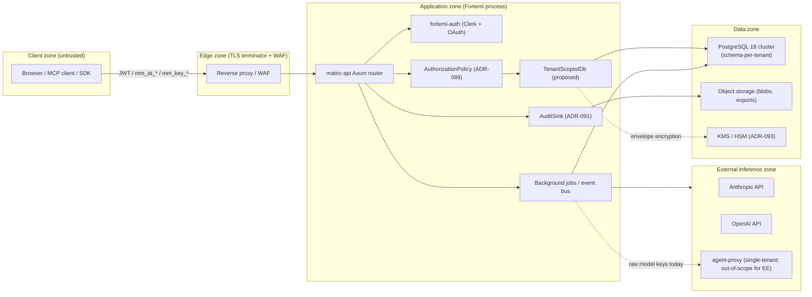

# Multi-Tenant SaaS Threat Model Addendum (Fortemi)

**Status:** Draft for ADR-090 / ADR-089 input
**Audience:** Security reviewers, EE plugin authors
**Scope:** Hosted multi-tenant deployment of Fortemi (one PostgreSQL cluster, many tenants)
**Companion ADRs:** ADR-090 (Multi-Tenancy Model), ADR-089 (Authorization Policy Trait), ADR-091 (Audit Plane), ADR-093 (Key Management Plane), ADR-098 (Quota Plane), ADR-100 (MCP Tool Gating)
**License context:** BSL-1.1 with a custom "matric-memory Change License" Additional Use Grant whose exact terms are referenced by ADR-090 but not re-asserted here.

---

## 1. Scope & Assumptions

### 1.1 In-scope

- A hosted Fortemi deployment serving multiple independent tenants ("orgs", "workspaces") from a single API process group and a single PostgreSQL cluster.
- The shared crates: `matric-api`, `matric-core`, `matric-db`, `matric-auth`, `matric-crypto`.
- Authentication via Clerk OIDC (xjp-oidc) for end-user JWTs, plus the local OAuth2 server endpoints under `/oauth/*` (`crates/matric-db/src/oauth.rs`).
- API-key principals (`mm_key_*`) and OAuth access tokens (`mm_at_*`), both SHA-256 hashed at rest (ADR-071).
- The "archive" tenancy unit (ADR-068) and its schema-per-archive implementation in `crates/matric-db/src/schema_context.rs` (`SchemaContext` wraps `SET LOCAL search_path TO {schema}, public`).
- The `AuthPrincipal` enum in `crates/matric-core/src/models.rs` (`OAuthClient { client_id, scope, user_id } | ApiKey { key_id, scope } | Anonymous`).

### 1.2 Out-of-scope

- **CE (self-hosted single-tenant)** deployments are out-of-scope here except where we explicitly note "this gap is acceptable in CE because…". The default `REQUIRE_AUTH=false` posture (`crates/matric-api/src/main.rs:1756`) is a CE convenience that **must not** ship to multi-tenant EE.
- The `agent-proxy` HotM sidecar (Node, localhost-bound, holds raw Anthropic/OpenAI keys) is explicitly NOT in scope for multi-tenant operation. It is single-tenant by design and must be replaced by a tenant-aware proxy (referenced by ADR-093) before EE go-live.
- Bytes-on-the-wire (TLS), platform/IaaS hardening, and physical security are assumed and not enumerated.
- The Clerk identity provider's internal threat model is delegated to Clerk; we only model how Fortemi consumes its JWTs.

### 1.3 Trust boundaries (Mermaid)



Crossing any solid arrow is a trust-boundary transit and demands authentication, authorization, and audit. Dashed arrows are infrastructure/secret-handling paths.

---

## 2. Tenancy Model Alternatives

The current implementation (ADR-068) is **schema-per-archive**, but "archive" today is closer to a namespace than a tenant — there is no first-class `tenant_id`, and the `default_archive` flag in `archive_registry` was largely cosmetic until ADR-068 wired up middleware-driven schema selection. For a hosted multi-tenant EE we have three viable choices.

### (a) Schema-per-tenant (extension of ADR-068)

- **Implementation:** One PostgreSQL schema per tenant, plus a `public` schema for shared catalogs and the registry. Every request resolves a `TenantContext` and issues `SET LOCAL search_path` before any query.
- **Isolation strength:** Strong logical isolation if and only if every code path goes through the scoped accessor. Today the contract is implicit — `Database::for_schema()` exists, but a handler that uses `state.db` directly hits `public`. That is the central weakness this addendum aims to type-enforce (§4).
- **Scaling limits:** Practitioner reports describe pain at roughly **500 schemas** in a single database for operations like `pg_dump`, planner statistics caching, and migration sweeps. This number is *practitioner heuristic*, not a benchmark-verified ceiling. We have NOT measured Fortemi at scale; the figure is included only to mark the order of magnitude at which (a) starts to need help. Beyond that point, planner cache thrash, autovacuum churn, and `pg_dump` serialization become real operational concerns.
- **Operational complexity:** Low at small N. Migrations need a per-schema runner (already partially solved by `matric-db` migration tooling). Backup granularity is per-schema, which is good for restore-of-one-tenant but expensive if you `pg_dump` everything.
- **Cost:** Lowest per-tenant overhead — one cluster, one connection pool, one set of background jobs.

### (b) Row-level isolation via PostgreSQL RLS + tenant_id everywhere

- **Implementation:** Every multi-tenant table grows a `tenant_id UUID NOT NULL` column. RLS policies on every table enforce `tenant_id = current_setting('app.tenant_id')::uuid`. Application sets `app.tenant_id` per-connection via `SET LOCAL`.
- **Isolation strength:** Strong if RLS is `FORCE`d (so even table owners are subject) AND every table has policies AND no handler uses a connection in the wrong role. RLS bypass is one missing policy away.
- **Scaling limits:** Scales further than (a) for tenant count — you don't pay the per-schema cost. But hot-tenant query performance degrades because indexes and table statistics are global; a 90/10 traffic distribution lets a heavy tenant evict a light tenant's working set from buffer cache. Vector indexes (HNSW) are especially affected because the index structure is shared.
- **Operational complexity:** Higher application-side discipline (every query reads `tenant_id`), but simpler operationally — one schema, standard backup story. `pg_dump` is single-step. Migrations are normal.
- **Cost:** Lowest infra cost, highest ongoing schema-discipline tax. One forgotten policy is a cross-tenant disclosure (see §3 Information Disclosure I-2).

### (c) Database-per-large-tenant + schema-per-tenant for small

- **Implementation:** Small tenants live in a shared cluster under (a). Large tenants are promoted to their own database (or their own cluster) on demand, with a route table in the registry. The application layer treats both the same; only the connection pool resolver differs.
- **Isolation strength:** Highest for the promoted tenants (true database boundary, separate WAL, separate vacuum). Same as (a) for the long-tail tenants.
- **Scaling limits:** Effectively unbounded — you graduate hot tenants out of the shared pool before they hurt anyone.
- **Operational complexity:** Highest. Tenant promotion is a migration. Cross-tenant admin queries become impossible (or require a federation layer). Backup, monitoring, and on-call all have N+1 surfaces.
- **Cost:** Highest. Each promoted tenant carries fixed cluster overhead.

### Recommendation for ADR-090

For Fortemi's expected near-term footprint, **(a) is the right starting point**, with the explicit constraint that the design must support graduating to **(c) hybrid** without an application rewrite. Concretely:

- Build the abstraction so that `TenantContext` resolution returns a *connection pool handle*, not "the database." Today's pool is one of one; in a hybrid future, the resolver returns the pool for that tenant's home cluster.
- Treat the ~500-schema number as an *operational signal* to start planning the hybrid migration, not a hard limit. Validate the actual ceiling with benchmarks before committing to a graduation policy.
- Explicitly reject (b) as the primary mechanism. Schema isolation aligns better with how matric-crypto's per-archive key derivation already works (ADR-006/007/010) and is more defensible at security review.

ADR-090 should record this as a *decision point*, not a fait accompli. The threat model below assumes (a) but its mitigations are largely independent of the choice between (a) and (c).

---

## 3. STRIDE Matrix (Multi-Tenant EE)

Risk levels assume **EE multi-tenant context with `REQUIRE_AUTH=true`**. Where a threat is already substantively mitigated in CE, we say so.

### 3.1 Spoofing

| ID | Threat | Risk | Mitigation | Owner |
|----|--------|------|------------|-------|
| S-1 | Cross-tenant JWT replay: token issued for tenant A is presented to a tenant-B endpoint and accepted because the handler only checks "is this token valid?" | **HIGH** | Bind every JWT to a `tenant_id` claim at issuance. Authorization layer (ADR-089) rejects when token tenant ≠ request tenant. AuthContext must carry both. | ADR-089 |
| S-2 | Service-account impersonation: an OAuth client issued for one tenant's service principal is used to call another tenant's API by changing the `archive` path segment | **HIGH** | The path segment must NOT be the authority for tenancy. The tenant identity flows from the token claim; the path segment is a UX hint and must match. Mismatch is 403, not 200. | ADR-089 + ADR-090 |
| S-3 | API-key replay across deployments: an `mm_key_*` issued in staging used in production (or vice versa) | MED | Include an environment/issuer claim or namespace the hash. Today: rotation. | matric-db `oauth.rs` |
| S-4 | Anonymous principal in EE: `AuthPrincipal::Anonymous` reaching a handler under EE configuration | **HIGH** | `REQUIRE_AUTH=true` must be enforced at startup (panic if not set in EE); router-level rejection of `Anonymous` for every `/api/v1/*` route. | ADR-089 middleware |

### 3.2 Tampering

| ID | Threat | Risk | Mitigation | Owner |
|----|--------|------|------------|-------|
| T-1 | JWT claim modification — claim added/changed claiming elevated scope or different tenant | LOW (signature catches it) but worth restating | Verify signature *and* claim semantics; reject tokens missing `tenant_id`. | matric-auth |
| T-2 | `archive_name` query parameter tampering to escape schema (e.g. `archive=../public` or `archive=other_tenant`) | **HIGH** | (a) Resolve archive from token claim, not from request input. (b) If request *also* carries an archive identifier, it must match or 403. (c) Whitelist archive name to `^[a-z][a-z0-9_]*$` and resolve through the registry, never as raw SQL. | ADR-090 |
| T-3 | SQL identifier injection through schema name | MED | All schema names already pass through identifier quoting; no raw concatenation. Audit every new handler for `format!("SET search_path TO {}", ...)` patterns. | matric-db/schema_context.rs |
| T-4 | Embedding/vector tampering: a malicious tenant uploads embeddings designed to skew shared HNSW index behavior | LOW (indexes are per-schema today) | Keep vector indexes per-schema. If a global index is ever introduced for cost reasons, this threat moves to HIGH. | ADR-090 |

### 3.3 Repudiation

| ID | Threat | Risk | Mitigation | Owner |
|----|--------|------|------------|-------|
| R-1 | No audit trail: today there is no `AuditSink`, so a tenant admin reading another tenant's data (via misconfiguration) leaves no trace | **HIGH** | Introduce `AuditSink` trait (ADR-091). Default `TracingSink` for CE. EE plugins for S3-WORM/SIEM. | ADR-091 |
| R-2 | Token operations not audited: token issue/revoke/introspect not durably logged | **HIGH** | Audit on every state-changing OAuth event; payload includes principal, tenant, scope delta. | ADR-091 |
| R-3 | Plugin lifecycle not audited: EE plugin loaded with elevated capability leaves no record | MED | Audit `plugin loaded`, `plugin unloaded`, capability assertion. | ADR-091 |

### 3.4 Information Disclosure

| ID | Threat | Risk | Mitigation | Owner |
|----|--------|------|------------|-------|
| I-1 | Schema search_path bypass via a handler that uses `state.db` directly instead of `Database::for_schema(ctx)`, reading from `public` and exposing the registry or a sibling tenant's data | **HIGH** | Type-enforce: see §4. Make "raw `Database`" unavailable in EE builds. | ADR-090 |
| I-2 | If alternative (b) is ever adopted: cross-tenant disclosure via a missing RLS policy on a newly-added table | **HIGH** (if (b)) | Schema convention: every new table requires a policy; CI lints `CREATE TABLE` without a matching policy. | ADR-090 |
| I-3 | Cross-tenant embedding similarity: a vector search that joins or scans across schemas returns rows belonging to other tenants | **HIGH** | Vector queries must execute under `TenantScopedDb`; never via `state.db`. Add integration test: tenant A's `search()` cannot surface tenant B's vectors even if the test forces a name collision. | ADR-090 |
| I-4 | Error message leakage: SQL error containing schema names or table names returned in HTTP body | MED | Sanitize error responses in production mode; map DB errors to opaque codes. | matric-api error layer |
| I-5 | Backup/export crossing tenant boundary: an admin export operation that reads from `public` and includes archive_registry, leaking tenant list | MED | Export endpoints require `system:*` scope and are themselves audited (§3.3 R-1). | ADR-100 |
| I-6 | Plaintext provider keys in `agent-proxy`: today's HotM sidecar holds raw model keys. In a hosted EE this is a tenant-aggregation risk — one process compromise exposes every tenant's BYOK keys. | **HIGH** | `agent-proxy` is out-of-scope for EE multi-tenant (see §1.2). EE must use the ADR-093 KMS-backed key plane. | ADR-093 |

### 3.5 Denial of Service

| ID | Threat | Risk | Mitigation | Owner |
|----|--------|------|------------|-------|
| D-1 | Noisy-neighbor connection pool exhaustion: one tenant runs many long-running queries and starves others | **HIGH** | Per-tenant in-flight cap on connection acquisition. Connection-pool-aware semaphore keyed on tenant. | ADR-098 |
| D-2 | Noisy-neighbor inference budget: one tenant pegs the shared Anthropic/OpenAI rate limit | **HIGH** | Per-tenant token budget AND per-tenant provider rate limit (separate from process-wide). | ADR-098 |
| D-3 | Job queue starvation: bulk import or re-embedding job from one tenant clogs the queue | MED | Fair-share queue (weighted round-robin by tenant) for background workers. | ADR-098 |
| D-4 | Storage exhaustion: a tenant uploads to fill disk | MED | Per-tenant storage cap; reject upload at proxy when over cap. | ADR-098 |
| D-5 | HNSW build-time cost from a tenant adding millions of embeddings | MED | Throttle embedding ingestion; surface as a quota metric. | ADR-098 |

### 3.6 Elevation of Privilege

| ID | Threat | Risk | Mitigation | Owner |
|----|--------|------|------------|-------|
| E-1 | Tenant admin escalates to deployment admin via a scope upgrade attack on `/oauth/token` (e.g., requesting `system:*` in a refresh) | **HIGH** | Refresh tokens cannot widen scope; the authorization server enforces scope ⊆ original grant. Verify in matric-db/oauth.rs. | matric-db/oauth.rs + ADR-089 |
| E-2 | Tenant principal accesses cross-tenant admin endpoints (e.g., a tenant-list endpoint that should be `system:*` only) | **HIGH** | Every cross-tenant endpoint declares its required scope; `AuthorizationPolicy` rejects principals whose token lacks it. | ADR-089 |
| E-3 | MCP tool gains elevated capability: an EE plugin tool declares `tenant:read` but actually performs cross-tenant reads | **HIGH** | Tool registration declares scopes that the AuthZ layer verifies at invocation; capability assertion is signed at plugin-load time. | ADR-100 |
| E-4 | Background job runs with elevated principal (a "system" job that touches a tenant's data without an audit trail) | MED | Jobs always carry an originating `AuthContext`; system-initiated jobs (e.g., scheduled cleanup) use a dedicated `system_job:*` principal whose actions are audited. | ADR-089 + ADR-091 |

---

## 4. Type-Enforced Tenant Scope

The single highest-leverage architectural change this addendum proposes: make "forgot to scope" a **compile error** in EE builds.

### 4.1 Proposed shape

```rust
/// A database handle that is guaranteed to be scoped to a single tenant.
/// Constructable only from an authenticated AuthContext that carries a
/// resolved TenantId.
pub struct TenantScopedDb<'a> {
    inner: &'a Database,
    ctx: TenantContext,
}

impl Database {
    /// The only public way to acquire a queryable handle in multi-tenant mode.
    #[cfg(any(feature = "single-tenant", debug_assertions))]
    pub fn raw(&self) -> &Self { self }

    pub fn for_tenant<'a>(&'a self, ctx: &AuthContext) -> Result<TenantScopedDb<'a>> {
        let tenant = ctx.tenant_id().ok_or(Error::MissingTenant)?;
        Ok(TenantScopedDb {
            inner: self,
            ctx: TenantContext::resolve(tenant)?,
        })
    }
}
```

Every query method (`query`, `execute`, `transaction`) is implemented on `TenantScopedDb`, not on `Database`. `Database::raw()` exists for migration tooling and for CE/single-tenant builds — gated behind `cfg(feature = "single-tenant")` so EE compilation fails if a handler reaches for it.

In debug builds we also keep `raw()` available, but the EE production build (`cargo build --release --features ee` or equivalent) does NOT enable that feature. The compiler stops "forgot to scope" at build time, not at audit time.

### 4.2 Migration plan

This is intrusive — every handler that currently uses `state.db` directly must be rewritten to acquire `state.db.for_tenant(&ctx)?` first. The migration is:

1. Add `TenantScopedDb` and `Database::for_tenant`.
2. Rewrite handlers incrementally; each rewrite is a small, reviewable PR.
3. Once 100% migrated, gate `Database::query`/`execute` behind `cfg(feature = "single-tenant")`. CI for EE builds will fail until done.
4. The middleware that resolves `TenantContext` from the token is the single point where a tenant boundary is established; everything downstream is type-safe.

### 4.3 What this does NOT solve

- It does not stop raw SQL strings that include another tenant's schema name. Defense-in-depth: schema names are still validated against the registry.
- It does not stop background jobs from spinning up a `TenantScopedDb` for the *wrong* tenant. Defense-in-depth: jobs carry the originating `AuthContext`; a job created by tenant A cannot mint a `TenantContext` for tenant B (§3.6 E-4).
- It does not enforce *authorization* — that is the AuthorizationPolicy layer (§5).

---

## 5. Authorization Plane (forward-look to ADR-089)

Today there is no authorization decision layer downstream of authentication. `AuthPrincipal` answers "who are you?" but not "are you allowed?" Every handler either implicitly allows everyone (when `REQUIRE_AUTH=false`) or implicitly allows any authenticated principal.

### 5.1 Proposed trait

```rust
pub trait AuthorizationPolicy: Send + Sync {
    fn authorize(
        &self,
        principal: &AuthPrincipal,
        action: &Action,
        resource: &Resource,
        ctx: &AuthContext,
    ) -> AuthzDecision;
}

pub enum AuthzDecision {
    Allow,
    Deny { reason: DenyReason },
    AllowWithAudit { tag: AuditTag },
}
```

### 5.2 Defaults and EE plugins

- **Default CE: `AllowAll`** — preserves current behavior. ADR-089 must explicitly acknowledge that this is a known gap in CE and is acceptable because CE is single-tenant and self-hosted.
- **EE default: `ScopeBasedPolicy`** — derives decisions from OAuth scopes (`memory:read`, `memory:write`, `tenant_admin:*`, `system:*`). This is the minimum bar for EE; richer ABAC/RBAC can be plugged in via the trait.
- **EE plugins:** Open Policy Agent (Rego), Cedar, custom Rust implementations.

### 5.3 Decision points

Every one of the following requires an `authorize()` call before performing the action:

1. **Router middleware** for every `/api/v1/*` route. The action is derived from the route and method; the resource is derived from path params.
2. **Background job dispatch** — before a job runs, the policy reauthorizes the originating principal against the job's stated effect.
3. **MCP tool invocation** — every tool call passes through the policy with the tool's declared scope.
4. **Plugin load** — every EE plugin asserts its capabilities; the policy validates them against the deployment configuration.

Centralization is mandatory: handlers do not call `authorize()` themselves. The Axum extractor that resolves `AuthContext` from headers also resolves the authorization decision, and a handler that wants to bypass it must be explicitly marked (with audit). This pattern parallels the `TenantScopedDb` approach — the type system carries the answer.

### 5.4 Default-deny

The policy must default to deny. Today the implicit default is allow. The semantic shift to default-deny is the single most consequential change between CE and EE.

---

## 6. Key Management Plane (forward-look to ADR-093)

Today `matric-crypto` (ADR-006/007/010) supplies envelope encryption with an in-memory KEK (typically loaded from an env var). The PKE handler at `handlers/pke.rs` consumes this. For hosted EE, this is inadequate — a single KEK across tenants is a single-point-of-compromise risk.

### 6.1 Requirements

- **Per-tenant KEK.** Each tenant has its own Key Encryption Key. The KEK never leaves the KMS/HSM. The application uses the KMS API to wrap/unwrap data keys.
- **Per-archive (and possibly per-record-class) DEKs**, derived from the tenant KEK via **HKDF with explicit domain separation** per `no-adhoc-kdf` and `no-key-reuse-across-purposes` rules. Distinct `info` labels for `enc`, `mac`, `embedding`, `export`, etc. Versioned (`-v1`) so rotation is a re-derive with `-v2`.
- **BYOK option.** Enterprise tenants may bring their own KMS-resident KEK (AWS KMS, GCP KMS, HashiCorp Vault Transit, YubiHSM2 are the supported plugins).
- **Default CE.** Single env-var key, current behavior preserved. ADR-093 must explicitly state that CE is not BYOK and that this is a deliberate scope choice.

### 6.2 EE plugin shape

```rust
pub trait KeyManagementProvider: Send + Sync {
    fn wrap_dek(&self, tenant: &TenantId, dek: &[u8]) -> Result<WrappedKey>;
    fn unwrap_dek(&self, tenant: &TenantId, wrapped: &WrappedKey) -> Result<SecretKey>;
    fn rotate(&self, tenant: &TenantId) -> Result<RotationOutcome>;
}
```

Implementations:
- `EnvKmsProvider` — CE default; the KEK is a 32-byte env var.
- `AwsKmsProvider` — `kms:Encrypt` / `kms:Decrypt` calls; KEK is `aws/fortemi-tenant-{tenant_id}` or a key per tenant ARN.
- `GcpKmsProvider`, `VaultTransitProvider`, `YubiHsm2Provider` — symmetrical.

### 6.3 Cross-references

- `no-adhoc-kdf.md`: every DEK derivation must use HKDF, not concat-and-hash. The existing AIWG rule is the authority.
- `no-key-reuse-across-purposes.md`: separate DEKs for separate purposes within a tenant; never reuse a DEK for encryption AND for MAC.
- `crypto-flag-verification.md`: any CLI-tool-mediated key material (e.g. backups encrypted with `openssl enc`) must use explicit AEAD flags. Backups for hosted EE should use a libsodium-backed format, not `openssl enc`.

### 6.4 Out-of-scope key paths

The current `agent-proxy` (Node sidecar, localhost-bound, raw Anthropic/OpenAI keys in memory) is not an acceptable key path in EE. ADR-093 must replace it with a tenant-aware proxy whose secrets resolve through the KMS plane. This is called out in §1.2 and §3.4 I-6 and is *not* re-litigated here.

---

## 7. Audit Plane (forward-look to ADR-091)

Today the system effectively has no audit. In a hosted EE, this is a release blocker.

### 7.1 Events that MUST be audited

| Category | Events |
|----------|--------|
| Authentication | Token issued; token refreshed; token revoked; token introspected; authentication failure with reason class |
| Authorization | Decision: deny (always); decision: allow with sensitive scope (configurable); scope upgrade attempted |
| Tenant boundary | Admin reading any tenant; cross-tenant data movement (export, copy, migration) |
| Data lifecycle | Bulk export started/completed; deletion of tenant data; restore from backup |
| Key operations | KEK reference rotated; DEK rotated; export-key generated; BYOK key bound/unbound |
| Plugin lifecycle | Plugin loaded with capability assertion; plugin unloaded; plugin denied at load |
| Configuration | `REQUIRE_AUTH` toggled; `AuthorizationPolicy` swapped; quota changed |

### 7.2 Trait shape

```rust
pub trait AuditSink: Send + Sync {
    fn emit(&self, event: AuditEvent) -> Result<()>;
}
```

- **Default CE: `TracingSink`** — emits structured `tracing` events at INFO. Adequate for self-hosted CE.
- **EE plugins:** `SplunkHecSink`, `S3WormSink` (object-locked bucket), `KafkaSink` for SIEM ingestion, `DatadogLogsSink`.
- **Integrity:** Each sink is append-only at its layer. For tamper-evidence we offer an optional hash-chain side-channel: each `AuditEvent` includes the hash of the previous event for that tenant, allowing post-hoc detection of missing or reordered events. This is opt-in; many SIEMs already provide it.

### 7.3 Failure mode

If `AuditSink::emit` fails for an event that MUST be audited (auth/authorization/key/plugin), the operation that produced the event must fail-closed. We do not perform a sensitive operation we cannot record. Configurable per-event-class, default fail-closed for the categories above.

---

## 8. Quota Plane (forward-look to ADR-098)

The noisy-neighbor threats in §3.5 are not theoretical — they are the first incident any multi-tenant system encounters. Pre-launch quota enforcement is mandatory.

### 8.1 Dimensions

| Dimension | Default CE | EE per-tenant cap |
|-----------|-----------|-------------------|
| Request rate (req/s) | Process-wide | Per-tenant |
| Inference input tokens | None | Per-tenant per-window |
| Inference output tokens | None | Per-tenant per-window |
| Storage (bytes) | None | Per-tenant cap |
| Embedding count | None | Per-tenant cap |
| Background job concurrency | Process-wide | Per-tenant cap |
| DB connection in-flight | Pool size | Per-tenant semaphore |

### 8.2 Trait shape

```rust
pub trait UsageMeter: Send + Sync {
    fn observe(&self, tenant: &TenantId, dim: Dimension, qty: u64);
    fn current(&self, tenant: &TenantId, dim: Dimension) -> u64;
}

pub trait QuotaPolicy: Send + Sync {
    fn check(&self, tenant: &TenantId, dim: Dimension, qty: u64) -> QuotaDecision;
}
```

Quota decisions are made at the *entry* to a resource — at the router for request-rate, at the inference dispatcher for tokens, at the upload handler for storage. Exceeding a quota returns 429 with a `Retry-After` and surfaces a usage metric. Quotas are billable signals as well as DoS controls.

---

## 9. MCP Tool Gating (forward-look to ADR-100)

The Model Context Protocol tool surface is the part of Fortemi that most directly executes user intent at LLM speed, so it gets its own gate.

- **Every MCP tool declares a scope.** The OAuth client invoking the tool must possess that scope. The authorization layer (§5) is the enforcer.
- **Cross-tenant tools require elevated scope.** Admin search, backup export, tenant list, billing readout — all require `tenant_admin:*` or `system:*`. The tool catalog is split: per-tenant tools (`memory:*`) and cross-tenant tools (separate catalog, separate audit class).
- **Plugin tools are capability-asserted at load.** An EE plugin that ships an MCP tool declares its scopes in its manifest. The authorization layer verifies that those scopes exist and are appropriately privileged. Plugins cannot widen scopes at runtime.
- **Tool invocation is audited per §7.1.**

---

## 10. Pre-Launch Checklist for Multi-Tenant EE Go-Live

Concrete, must-pass items. Each row maps to a section above and an ADR.

| # | Item | Ref | Status owner |
|---|------|-----|--------------|
| 1 | `REQUIRE_AUTH=true` enforced at startup in EE build; process refuses to start without it | §1.1, `main.rs:1756` | ADR-090 |
| 2 | `Database::raw()` gated behind `cfg(feature = "single-tenant")`; EE release build cannot link a handler that bypasses `TenantScopedDb` | §4 | ADR-090 |
| 3 | JWTs carry `tenant_id` claim; AuthContext carries TenantId; mismatch with path is 403 | §3.1 S-1, S-2 | ADR-089 |
| 4 | `AuthorizationPolicy` installed; default-deny; every `/api/v1/*` route covered by middleware | §5 | ADR-089 |
| 5 | Per-tenant KEK in KMS plane; HKDF domain-separation between purposes (enc/mac/embedding/export); cross-references `no-adhoc-kdf` and `no-key-reuse-across-purposes` | §6 | ADR-093 |
| 6 | `agent-proxy` removed from multi-tenant deployment topology; tenant-aware inference proxy in its place | §1.2, §3.4 I-6 | ADR-093 |
| 7 | `AuditSink` installed; all events in §7.1 emit; fail-closed on emit failure for sensitive categories | §7 | ADR-091 |
| 8 | Per-tenant quotas on request rate, inference tokens, storage, embeddings, jobs, DB connections | §8 | ADR-098 |
| 9 | MCP tool catalog split per-tenant vs cross-tenant; cross-tenant tools require `tenant_admin:*` or `system:*`; all tool invocations audited | §9 | ADR-100 |
| 10 | Refresh tokens cannot widen scope (`scope ⊆ original grant`); verified in `crates/matric-db/src/oauth.rs` | §3.6 E-1 | matric-db/oauth.rs |
| 11 | Vector search isolation test in CI: tenant A's search cannot surface tenant B's vectors under any input | §3.4 I-3 | ADR-090 |
| 12 | Error responses sanitized in production mode (no schema names or table names in 5xx bodies) | §3.4 I-4 | matric-api error layer |
| 13 | Tenant export/admin endpoints require `system:*` AND emit audit events | §3.4 I-5, §7.1 | ADR-100, ADR-091 |
| 14 | Background jobs carry the originating `AuthContext`; system-initiated jobs use a distinct `system_job:*` principal | §3.6 E-4 | ADR-089, ADR-091 |
| 15 | Operational runbook: "evict a tenant" procedure; "rotate a tenant KEK" procedure; "respond to suspected cross-tenant disclosure" procedure | §10 | Ops |
| 16 | Load test confirming per-tenant DB connection cap actually prevents noisy-neighbor pool exhaustion | §3.5 D-1, §8 | ADR-098 |
| 17 | Disaster-recovery story for schema-per-tenant: per-tenant restore tested | §2(a) | Ops |
| 18 | Quota usage exposed as billable signal AND DoS signal (single source of truth) | §8 | ADR-098 |

OWASP ASVS L2 and NIST SP 800-53 controls AC-3, AC-4, AC-6, AU-2, AU-9, SC-12, SC-13 are the broad reference families for the auth/audit/key items above; map specific controls in the ADRs rather than here.

---

## 11. Out-of-Scope Today / Accept-Risk Register

Explicit acknowledgements of what CE multi-tenant does NOT defend against. These exist so the boundary is visible at review time and so EE work knows what to inherit.

| Item | Why we accept it | Compensating control |
|------|-------------------|----------------------|
| **CE runs with `REQUIRE_AUTH=false` by default** | CE is single-tenant self-hosted; the operator owns the network boundary. | Default must NOT propagate to EE. EE build refuses to start without it. |
| **CE has no `AuthorizationPolicy`** | CE is single-tenant; "the user owns everything" is the model. | Default `AllowAll` is documented in ADR-089 as a known CE limitation. |
| **CE has no `AuditSink` beyond tracing logs** | Self-hosted operators handle their own log retention. | EE installs `AuditSink` at startup with deployment-required sink configured. |
| **CE shares a single env-var KEK across all data** | Single-tenant; the KEK and the data live on the same host. | EE replaces with KMS-backed per-tenant KEKs (ADR-093). |
| **CE has no per-tenant quotas** | Process-wide quotas are sufficient for a single-tenant install. | EE adds per-tenant quotas as a release-blocker (§10 item 8). |
| **`agent-proxy` is single-tenant** | The HotM sidecar predates multi-tenant design and is wedded to localhost. | EE replaces it; not shipped in EE topology. |
| **No defense against a compromised PostgreSQL superuser** | If superuser is compromised, all isolation models lose. | Out of scope; addressed at IaaS/operational layer. |
| **No defense against a malicious EE plugin that has been load-approved with deployment-admin privilege** | Plugins are trusted code once loaded with `system:*` capability. | Plugin load is itself audited; plugin signing/verification is an open question for ADR-100 follow-up. |
| **Vector index information leakage at the embedding-model layer** (e.g., adversarial prompts that surface another tenant's training data via the inference model) | Mitigation lives at the model provider, not in Fortemi. | Document in ADR-090; reference upstream provider's tenant-isolation claims rather than re-asserting them. |
| **No verified planner-cache or `pg_dump` scaling benchmark above ~500 schemas** | The number is practitioner-reported, not benchmark-confirmed for Fortemi specifically. | Treat as an *operational signal* to plan hybrid (c) migration; do not treat as a hard limit until measured. |

---

## Appendix A: Mapping to existing AIWG rules

This addendum should be read alongside, not in conflict with:

- `.claude/rules/no-adhoc-kdf.md` — authority for KDF choice in §6.
- `.claude/rules/no-key-reuse-across-purposes.md` — authority for DEK separation in §6.
- `.claude/rules/no-unauthenticated-encryption.md` — applies to any backup/export format in §10 item 13.
- `.claude/rules/crypto-flag-verification.md` — applies if any CLI crypto is used in backup paths.
- `.claude/rules/token-security.md` — applies to the operational handling of `mm_at_*` and `mm_key_*` (already enforced today).
- `.claude/rules/sec-key-material-handling.md` — applies to KEK material in §6.

## Appendix B: Open questions for ADR-090 / ADR-089 authors

1. Does `tenant_id` get its own column in the public registry (`tenant_registry`) separate from `archive_registry`, or does "archive" become the canonical tenant unit? The latter is simpler but conflates namespace and tenant in a way that may bite when one tenant wants multiple archives.
2. What is the contract for cross-tenant admin endpoints — are they exposed on the same API surface as tenant endpoints with elevated scopes, or on a separate admin API (different port, different auth)?
3. Plugin signing/verification: is plugin code signed by Fortemi, by the operator, or unsigned-with-explicit-load-approval?
4. Is there a tenant-export format that allows a tenant to leave with their data, including their KEK-wrapped DEKs? (This is a customer commitment question as much as a technical one.)
5. For hybrid (c): what is the promotion trigger — manual operator action only, or auto-promotion at a measurable threshold?

These belong in their respective ADRs; this addendum surfaces them but does not answer them.
