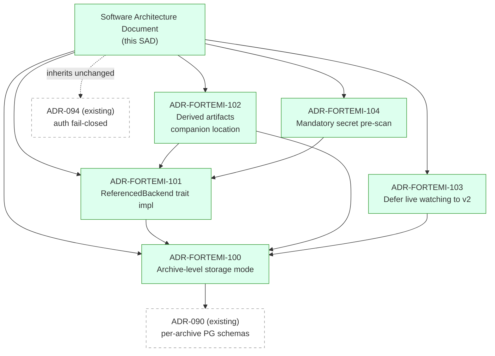

# Architecture Summary — fortemi/fortemi#736 (External Storage Backend + Scan-and-Ingest)

**Status**: Proposed (Elaboration; awaiting Phase 5 operator approval and Elaboration→Construction gate)
**Date**: 2026-05-21
**Phase 3 output**: SAD + 5 ADRs, all under `.aiwg/working/issue-planner-storage/architecture/`

## Index

| Artifact | Path | What it addresses |
|---|---|---|
| **SAD** | `software-architecture-doc.md` | The full system architecture for adding Referenced storage mode: C4 context + container diagrams, component-level design for all 8 active workstreams (WS-1, 2, 3, 4, 6, 7, 8, 9), process state model per `stateless-processes.md`, data model changes (3 new tables / 5 new columns), cross-cutting concerns (security, multi-tenant isolation, observability, deployment), 8 open architecture questions for the Phase 5 gate, references back to synthesis §sections. |
| **ADR-FORTEMI-100** | `adr-FORTEMI-100-storage-mode-archive-level.md` | Storage mode is an archive-level property (`archive_registry.storage_mode ∈ {managed, referenced}`), not per-blob. Per-blob `storage_backend` column is retained as implementation detail (specifically to accommodate derived artifacts — see ADR-102), but user-facing concept is single-mode-per-archive. Source: synthesis §3 Decision 1. |
| **ADR-FORTEMI-101** | `adr-FORTEMI-101-referenced-storage-backend.md` | Extend existing `StorageBackend` trait with `ReferencedBackend` impl. No breaking change. `write`/`delete` return `Err(ReadOnlyBackend)`; `read`/`exists`/`resolve_path` work against absolute user paths. Leverages the existing optional `resolve_path()` method that was already designed for this case. Add streaming `compute_content_hash_stream` for large files. Source: synthesis §3 Decision 2. |
| **ADR-FORTEMI-102** | `adr-FORTEMI-102-derived-artifacts-companion-location.md` | Derived artifacts (thumbnails, transcripts, embeddings) for Referenced archives go to a managed companion location at `{FORTEMI_DERIVED_STORAGE_PATH}/{archive_id}/{blob_id}.bin`, never sidecar in user's source. Per-blob backend dispatch handles the mix (source blobs = `referenced`, derived blobs = `filesystem`). `drop_archive_schema` cleans up the companion directory; source path is never touched. Source: synthesis §3 Decision 3. |
| **ADR-FORTEMI-103** | `adr-FORTEMI-103-defer-live-watching.md` | v1 ships with `POST /rescan` only. `notify-rs` + polling hybrid is deferred to v2 (separate design RFC required). Rationale: Docker bind-mount inotify silently fails on `overlay2`; macOS/Windows event coalescing/overflow; failure modes are silent index drift. v1 user-facing semantic is "eventually consistent on operator action, not on filesystem events." Source: synthesis §3 Decision 4. |
| **ADR-FORTEMI-104** | `adr-FORTEMI-104-mandatory-secret-prescan.md` | Pre-ingest secret detection is mandatory; combined path-denylist + content-regex (PEM private keys, AWS access keys, GitHub PATs, JWTs); no opt-out in v1. Skipped files are written to per-archive `archive_quarantine_log` (path + rule name only — file contents never logged per `token-security.md`). Audit via `GET /quarantined-files`. Source: synthesis §3 Decisions 5 & 7. |

## Three-Bullet TL;DR

- **Architecture is additive, not a redesign.** The existing `StorageBackend` trait, per-archive PostgreSQL schema model (ADR-090), and extraction pipeline path-access mechanism are all leveraged unchanged; the Referenced mode rides on existing rails. Net new components: `ReferencedBackend` impl, `ScanWalker` module, `DirectoryScanHandler` job, 4 new API routes, 1 new MCP tool, 4 new DB columns on `archive_registry`, 2 new per-archive tables (`archive_file_cache`, `archive_quarantine_log`), 2 new env vars (`FORTEMI_REFERENCED_STORAGE_ROOTS`, `FORTEMI_DERIVED_STORAGE_PATH`).
- **The read-only invariant on user source directories is defended in three layers.** Trait level: `ReferencedBackend::{write,delete}` return `Err(ReadOnlyBackend)`. API level: the `archive_routing_middleware` write-gate rejects mutating routes with 403 for Referenced archives. Filesystem level: derived artifacts route to a companion managed location (ADR-102), never sidecar to source. The trait-level guarantee is the bedrock; the other two are defense-in-depth.
- **Three deliberate v1 deferrals keep scope bounded.** (1) Live filesystem watching → v2 (ADR-103, eliminates Docker bind-mount silent-failure class). (2) Tree-sitter activation for code parsing → parallel epic (synthesis §5 R-6, non-blocking). (3) Remote storage backends (S3/GCS) → separate epic (synthesis §7 non-goal 1). All three are documented out-of-scope items, not gaps.

## ADR Dependency Graph

**How to read this:**
- **ADR-FORTEMI-100 (archive-level mode)** is the keystone — every other ADR depends on the user model it establishes. It in turn extends ADR-090's per-archive isolation philosophy from schema-level to storage-level.
- **ADR-FORTEMI-101 (`ReferencedBackend`)** depends on ADR-100 to know what "Referenced" means as an archive-level property, then provides the trait-level read-only invariant the rest of the architecture relies on.
- **ADR-FORTEMI-102 (derived companion location)** depends on both 100 (knowing the archive is Referenced) and 101 (the trait guarantee that source can't be written to, which the companion location avoids violating).
- **ADR-FORTEMI-103 (defer live watching)** depends on 100 because the scope of "what gets rescanned on-demand" is archive-level. It does NOT depend on 101 or 102 — deferral is independent of the trait-level design.
- **ADR-FORTEMI-104 (mandatory secret pre-scan)** depends on 101 because the gate fires in the ingest pipeline that uses `ReferencedBackend::read`. It does NOT depend on the other ADRs.
- **Auth (ADR-094) is inherited unchanged** — the new API routes mount under existing `/api/v1/` and inherit the existing fail-closed auth model.

## Workstream-to-ADR Map

| Workstream | Primary ADRs | Notes |
|---|---|---|
| WS-1 Storage Backend Abstraction Extension | ADR-101 | The trait extension itself |
| WS-2 Archive Schema and Registry | ADR-100 | `storage_mode` column = ADR-100's user model in the schema |
| WS-3 Walker + Ignore + Secret-Scan | ADR-104 | The mandatory secret gate |
| WS-4 Scan-and-Ingest Job Pipeline | ADR-101, ADR-102 | Uses `ReferencedBackend` for source reads; routes derived to companion location |
| WS-5 Live Update Detection | ADR-103 | DEFERRED to v2 by this ADR |
| WS-6 Derived Artifact Companion Location | ADR-102 | The companion location itself |
| WS-7 API Surface | ADR-100, ADR-103, ADR-104 | Write-gate (100); `/rescan` endpoint (103); `/quarantined-files` (104) |
| WS-8 MCP Tool Surface | ADR-100 | Extends `manage_archives` with `storage_mode` param |
| WS-9 Multi-Tenant Security Tests | ADR-101, ADR-102, ADR-104 | Validates trait-level read-only, companion location safety, secret-scan gate |
| WS-10 Documentation and Deployment Plan | (all 5) | Operator-facing docs covering every ADR's user-visible consequences |

## Open Questions for Phase 5 Operator Approval

Per the synthesis (§6), eight open architecture questions are surfaced for the operator. The five ADRs delivered with this SAD lock in **Q-1, Q-2, Q-3** definitively, and **Q-4** by implication (MCP extends existing tools). The remaining four are operator-tunable defaults:

| ID | Question | Recommendation | Lock-in |
|---|---|---|---|
| Q-1 | Live update detection in v1? | (A) Defer to v2 | **Locked by ADR-FORTEMI-103** |
| Q-2 | Per-blob mode user-facing? | (A) Archive-level only | **Locked by ADR-FORTEMI-100** |
| Q-3 | Secret-scan opt-out? | (A) No opt-out in v1 | **Locked by ADR-FORTEMI-104** |
| Q-4 | MCP tool surface | (A) Extend `manage_archives` | Locked by SAD §4.7 |
| Q-5 | Path allowlist | (C) Always-on in multi-tenant | Tunable; default in SAD §7.1 |
| Q-6 | Multi-archive overlap | (A) Allowed with warning | Tunable; default in SAD §4.6 |
| Q-7 | Initial scan perf target | (B) <10 min / 10k-file repo | Tunable; default in SAD §7.2 |
| Q-8 | Source-unavailable failure mode | (A) Lenient (warn-on-read, 503-on-write) | Tunable; default in SAD §4.6, §7.2 |

The operator approval gate at Phase 5 should explicitly confirm or override each of the four tunable defaults before the Elaboration→Construction gate.

## Status and Next Steps

All artifacts in this Phase 3 corpus are marked **Status: Proposed**. The ADRs are designed to be promoted to **Status: Accepted** at the Elaboration→Construction gate (after operator approval of the open questions at Phase 5, after construction begins, or as agreed by the operator). The SAD is similarly draft.

Phase 4 (issue backlog generation) takes this corpus as input: the 8 active workstreams (WS-1 through WS-10 minus the deferred WS-5) become epics; the within-workstream items become issues; the ADRs become the architectural reference for review at each implementation step.

## References

- `@.aiwg/working/issue-planner-storage/synthesis.md` — Phase 2 synthesis; §3 decisions are the source of all 5 ADRs
- `@.aiwg/working/issue-planner-storage/architecture/software-architecture-doc.md` — full SAD
- `@.aiwg/working/issue-planner-storage/architecture/adr-FORTEMI-100-storage-mode-archive-level.md`
- `@.aiwg/working/issue-planner-storage/architecture/adr-FORTEMI-101-referenced-storage-backend.md`
- `@.aiwg/working/issue-planner-storage/architecture/adr-FORTEMI-102-derived-artifacts-companion-location.md`
- `@.aiwg/working/issue-planner-storage/architecture/adr-FORTEMI-103-defer-live-watching.md`
- `@.aiwg/working/issue-planner-storage/architecture/adr-FORTEMI-104-mandatory-secret-prescan.md`
