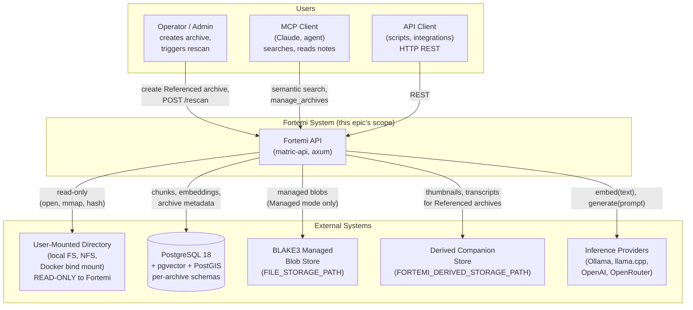
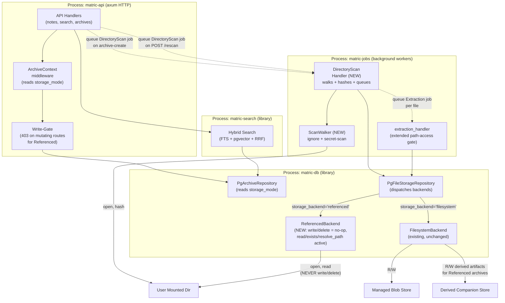
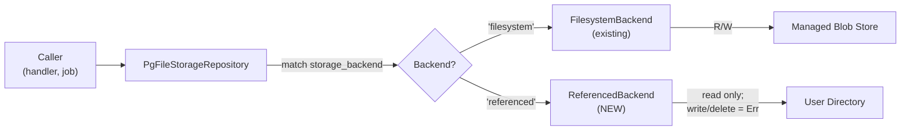
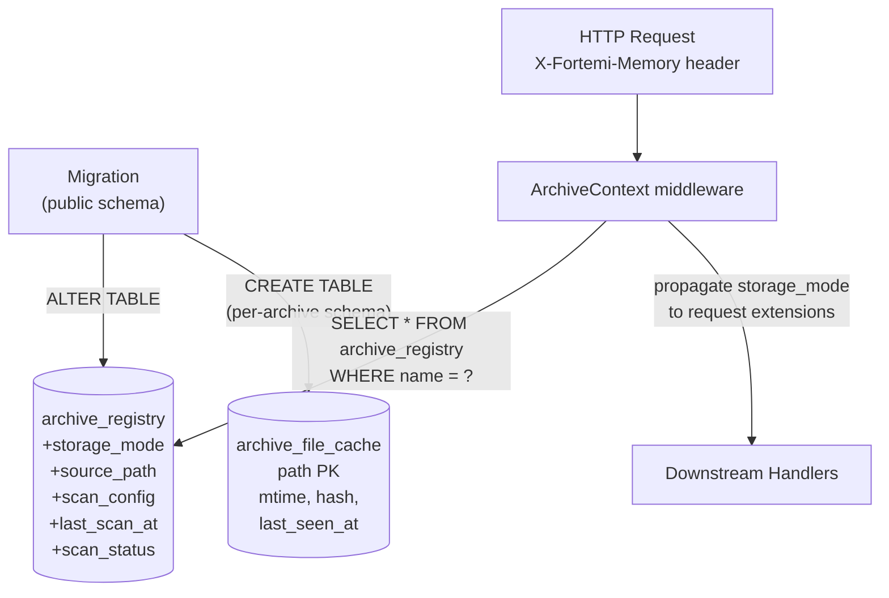
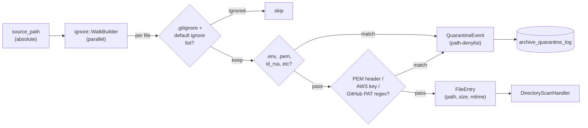
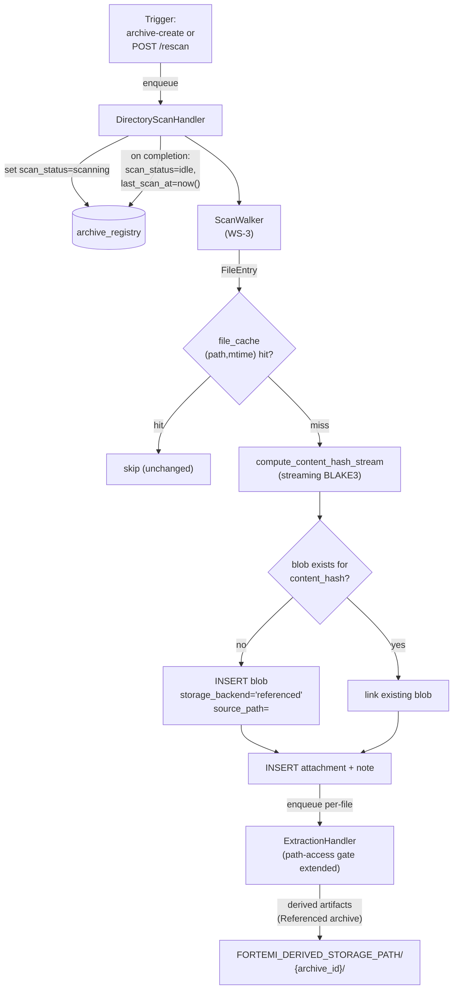
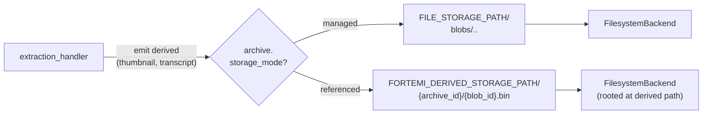
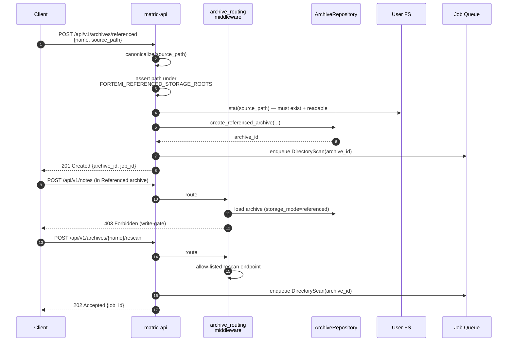
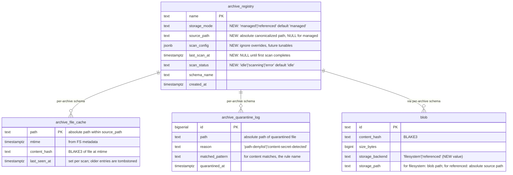

# Software Architecture Document — External Storage Backend + Scan-and-Ingest

**Issue**: fortemi/fortemi#736
**Status**: DRAFT (Elaboration Phase)
**Date**: 2026-05-21
**Source**: Synthesis §3 (load-bearing decisions), §4 (workstreams), §5 (risks), §6 (open questions)

---

## 1. Overview

This SAD describes the architecture for adding a **Referenced storage mode** to Fortemi alongside the existing Managed mode. In Referenced mode, an archive points at a user-owned local directory (or mounted volume); Fortemi indexes the source files in place — BLAKE3-hashing, chunking, embedding — without ever copying, modifying, or deleting source bytes. The semantic-search and MCP surfaces serve the archive identically to a Managed one. Fortemi owns the index; the user owns the data (synthesis §1, §3 Decision 1).

The change is **additive, not a redesign**. The existing `StorageBackend` trait's optional `resolve_path()` escape hatch maps cleanly onto Referenced semantics (synthesis §2.3 constraint 1); the existing `extraction_handler.rs:146` path-access code path used by video/audio adapters extends to Referenced source files (synthesis §2.3 constraint 2); per-archive PostgreSQL schema isolation (ADR-090-style) is preserved unchanged (synthesis §2.1). Storage mode becomes an archive-level property recorded in a new `archive_registry.storage_mode` column; derived artifacts (thumbnails, transcripts, embeddings) land in a companion managed location per archive so Fortemi never writes to user-owned directories (synthesis §3 Decision 3).

The risk hot-spots — secret leakage, multi-tenant boundary violations, FS-event reliability on Docker bind mounts — are addressed by combined path-denylist + content-regex secret detection (mandatory, no opt-out in v1), path canonicalization + allowlist enforcement at archive-create time, and the deliberate deferral of live filesystem watching to a follow-up workstream (synthesis §3 Decisions 4, 5; §5 risks R-1, R-2, R-4).

## 2. C4 Context

The context diagram answers: "Who interacts with the system, and what external systems does it touch when serving a Referenced archive?"

The new external relationship is **Fortemi → UserFS (read-only)**. The user mounts a host directory into the Fortemi container (or points at a local path in non-containerized deployments); Fortemi opens, reads, and hashes — but never writes or deletes. The `DerivedBlob` companion store is new (synthesis §3 Decision 3) and prevents derived artifacts from polluting the user's source tree (synthesis §5 R-8 mitigation).

## 3. C4 Container

The container diagram answers: "What internal processes participate in a Referenced-archive ingest and serve, and how do they communicate?"

Key wiring notes:
- **DirectoryScanHandler is new** (WS-4). It orchestrates: walk (WS-3) → per-file streaming BLAKE3 (WS-1) → dedup query → INSERT blob/attachment/note rows → queue per-file Extraction job.
- **ReferencedBackend is new** (WS-1). `write` and `delete` return `Err(NotSupported)` or no-op; `read`/`exists`/`resolve_path` work against the absolute user path stored in the blob row.
- **extraction_handler's path-access gate at line 146 is extended** (WS-4) from `strategy_supports_path_access(strategy)` to `strategy_supports_path_access(strategy) || storage_backend == "referenced"`. No new code path; the existing video/audio path-access mechanism handles all file types in Referenced mode.
- **The write-gate in ArchiveContext middleware rejects mutating routes** (POST/PUT/DELETE on notes/attachments) with 403 for Referenced archives, except the rescan endpoint (WS-7).

## 4. Component-Level Design

This section addresses each of the 8 active workstreams from synthesis §4 (WS-5 live-watch deferred per ADR-FORTEMI-103). Each subsection identifies components changed/added and a flow diagram showing the relevant data path.

### 4.1 WS-1: Storage Backend Abstraction Extension

**Components changed**:
- `crates/matric-db/src/file_storage.rs`: Add `FileSource::Referenced(PathBuf)` variant; implement `ReferencedBackend: StorageBackend` struct; add `compute_content_hash_stream(path: &Path)` streaming-hash function.
- `crates/matric-db/src/file_storage.rs` `PgFileStorageRepository`: Extend backend-dispatch match arm to recognize `storage_backend='referenced'`.

**Rationale**: ADR-FORTEMI-101. Synthesis §3 Decision 2 explains why the trait extension beats a sibling-trait split or compile-time mode enum: the existing `resolve_path()` was already designed for this case (synthesis §2.3 constraint 1).

### 4.2 WS-2: Archive Schema and Registry

**Components changed**:
- New migration `migrations/<N>_referenced_storage.sql`: ADD COLUMNs to `archive_registry` for `storage_mode`, `source_path`, `scan_config` (JSONB), `last_scan_at`, `scan_status`. Add new `archive_file_cache` table (per-archive schema) keyed by `(path, mtime)` storing `content_hash` and `last_seen_at` for delta-scan speedup.
- `crates/matric-db/src/archives.rs`: Extend `ArchiveInfo` struct; add `create_referenced_archive()` to `ArchiveRepository` trait; update `drop_archive_schema()` (no behavior change required per synthesis §2.3 constraint 6).
- `crates/matric-api/src/middleware/archive_routing.rs`: Extend `ArchiveContext` to carry `storage_mode` (read once at request entry, propagated to handlers and middleware).

### 4.3 WS-3: Walker + Ignore + Secret-Scan (`ScanWalker`)

**Components added**:
- `Cargo.toml`: Add `ignore = "0.4"` workspace dep (BurntSushi crate; synthesis §2.1).
- `crates/matric-jobs/src/scan_walker.rs` (new): `ScanWalker` wraps `ignore::WalkBuilder`. Threaded walk via `build_parallel()` capped at `min(4, num_cpus())`. Default ignore list from synthesis §3 Decision 7. Secret detection layer: path-denylist match → skip + log quarantine; for files passing path check, read first N bytes (~64 KB) and apply gitleaks-style regex set.

**Rationale**: Decision 5 (ADR-FORTEMI-104) — secret detection is mandatory, non-overridable in v1. Decision 7 (synthesis §3) — explicit conservative defaults that catch the 95% case without false-positive overload.

### 4.4 WS-4: Scan-and-Ingest Job Pipeline (`DirectoryScanHandler`)

**Components added/changed**:
- `crates/matric-core/src/lib.rs`: Add `JobType::DirectoryScan` variant.
- `crates/matric-jobs/src/directory_scan_handler.rs` (new): Orchestrator. Sets `archive_registry.scan_status='scanning'`; calls `ScanWalker`; for each emitted file streams BLAKE3 (`compute_content_hash_stream` from WS-1) → checks `archive_file_cache` for `(path, mtime)` hit → on miss queries blob table by `content_hash` for dedup → INSERT blob row with `storage_backend='referenced'` and `source_path` set → INSERT attachment/note → queue `Extraction` job. On completion sets `scan_status='idle'` and updates `last_scan_at`.
- `crates/matric-jobs/src/extraction_handler.rs` (line 146 area): Extend path-access gate to include `storage_backend='referenced'`. Mixed-mode at blob layer per Decision 3 — when handler emits a derived artifact for a Referenced-archive source, derived blob is written via `FilesystemBackend` rooted at `FORTEMI_DERIVED_STORAGE_PATH` (WS-6).

### 4.5 WS-6: Derived Artifact Companion Location

**Components changed**:
- `crates/matric-jobs/src/extraction_handler.rs` `store_derived_attachment_tx` helper: When archive's `storage_mode='referenced'`, route derived-artifact writes to `{FORTEMI_DERIVED_STORAGE_PATH}/{archive_id}/{blob_id}.bin` using `FilesystemBackend`. Existing behavior for Managed archives unchanged.
- New env var `FORTEMI_DERIVED_STORAGE_PATH` (default `{FILE_STORAGE_PATH}/derived/`).
- `drop_archive_schema()` extension: best-effort `rm -rf {derived_root}/{archive_id}/` after schema drop. Source path is **never** touched (invariant enforced by trait — `ReferencedBackend::delete` is a no-op).

**Rationale**: ADR-FORTEMI-102 (companion location). Synthesis §3 Decision 3 names sidecar (option C) as a critical anti-pattern (some users mount read-only volumes; some have CI that fails on dirty working trees).

### 4.6 WS-7: API Surface

**Components changed**:
- `crates/matric-api/src/main.rs`: Mount four new routes:
  - `POST /api/v1/archives/referenced` — create Referenced archive (validates `source_path` against allowlist + existence)
  - `POST /api/v1/archives/{name}/rescan` — queue DirectoryScan job (returns 202 + job_id)
  - `GET /api/v1/archives/{name}/scan-status` — return current `scan_status` + `last_scan_at` + counts
  - `GET /api/v1/archives/{name}/quarantined-files` — paginated audit of secret-scan skips
- `crates/matric-api/src/middleware/archive_routing.rs`: Extend `archive_routing_middleware`. For Referenced archives, mutating routes (POST/PUT/DELETE on `/notes`, `/attachments`) return 403. The rescan endpoint is allow-listed.
- New env var `FORTEMI_REFERENCED_STORAGE_ROOTS` (colon-separated allowlist of directory roots; canonicalized at startup).

### 4.7 WS-8: MCP Tool Surface (Node.js)

**Components changed** (in `mcp-server/`):
- `manage_archives` tool: Extend `create` operation with `storage_mode: "managed" | "referenced"` (default `"managed"` for backcompat) and `source_path: string?` params. Validates with the JSON schema; passes through to `POST /api/v1/archives/referenced` when Referenced.
- New `rescan_archive` tool: Async-job-returning (returns `job_id`; agent polls via existing `manage_jobs`).
- `get_documentation` tool output: Surface new Referenced-archive capabilities.

**Rationale**: Synthesis §3 Decision 6 — extend existing tools rather than create a parallel `directory_archive_*` family. Preserves agent mental model; existing invocations continue working unchanged.

### 4.8 WS-9: Multi-Tenant Security Tests (TI-style suite)

**Components added** (test code only, no production surface):
- `crates/matric-api/tests/referenced_path_traversal.rs`: Path-traversal red-team (`../../../etc/passwd` via download endpoint must 404).
- `crates/matric-api/tests/referenced_cross_tenant.rs`: Tenant A's Referenced archive cannot be addressed by Tenant B even with shared archive name.
- `crates/matric-db/tests/referenced_security.rs`: Drop-archive safety (verify `drop_archive_schema` never touches `source_path`); symlink-out-of-root (verify `ignore` crate's symlink-loop protection is active; verify out-of-root targets skipped).
- `crates/matric-jobs/tests/secret_scan_red_team.rs`: Drop fixtures with PEM private-key header, AWS access key, GitHub PAT into a scanned directory; verify all are quarantined and no chunks/embeddings persist.
- `crates/matric-api/tests/referenced_mount_disappearance.rs`: Unmount source mid-query; verify Decision 8 semantics (read returns stale results with warning header; write returns 503).

## 5. Process State Model

Per `.claude/rules/stateless-processes.md`, every process type's state and storage location:

| Process | Process type | State kind | Storage location | Survives restart? |
|---|---|---|---|---|
| `matric-api` (axum) | Stateless HTTP | Request-scoped only; per-request `ArchiveContext` | None (in-request memory) | Yes (stateless) |
| `matric-api` (axum) | Stateless HTTP | Per-archive connection pool (`SchemaContext`) | Lazy-initialized HashMap; pool itself external | Pool re-created; PG state persists |
| `matric-jobs` worker | Background worker | In-flight job | PG job queue (`SHARED_TABLES`); visibility timeout pattern | Job returns to queue on crash |
| `matric-jobs` `DirectoryScanHandler` (NEW) | Background worker | Walk progress | Externalized: rows written incrementally; `archive_file_cache` updated per file; `scan_status` updated start/end | Resumable on next run (idempotent via `archive_file_cache`) |
| `matric-jobs` `extraction_handler` | Background worker | Chunking + embed progress | Existing PG persistence model (unchanged) | Existing model unchanged |
| Postgres 18 | Stateful service | All canonical state | PG WAL + datafiles | Yes |
| BLAKE3 managed blob store | Stateful (filesystem) | Managed blob bytes | `FILE_STORAGE_PATH` volume | Yes |
| BLAKE3 derived companion store (NEW) | Stateful (filesystem) | Derived artifact bytes for Referenced archives | `FORTEMI_DERIVED_STORAGE_PATH` volume | Yes |
| User-mounted directory (NEW external) | External (user-owned) | Source bytes | Host filesystem / NFS / external drive | Yes (out of Fortemi scope) |

All process state belonging to Fortemi is externalized to backing services (PG, filesystem volumes). No in-memory session, cache, or business state in worker memory. Compliance with `stateless-processes.md` is preserved.

## 6. Data Model Changes

**Migration safety** (synthesis §4 WS-2 gate): default `storage_mode='managed'` makes the migration a no-op for existing archives. New columns are nullable except `storage_mode` and `scan_status` which have safe defaults. `archive_registry` is in `public` schema (synthesis §2.3 constraint 5) — uncontroversial to ALTER. `archive_file_cache` and `archive_quarantine_log` are per-archive (live in each archive's schema, created via the existing per-archive auto-migration mechanism).

## 7. Cross-Cutting Concerns

### 7.1 Security and Multi-Tenant Isolation

- **Per-archive schema isolation preserved.** Referenced archives use the same `SchemaContext` + `SET LOCAL search_path` mechanism as Managed archives. The architectural difference is *where blob bytes live*, not *who can see them*. Tenant A's Referenced archive's chunks/embeddings reside in Tenant A's schema and are reachable only via Tenant A's `X-Fortemi-Memory` header (synthesis §2.1).
- **Path canonicalization + allowlist** at archive-create time (synthesis §5 R-2 mitigation). `FORTEMI_REFERENCED_STORAGE_ROOTS` is canonicalized at startup; submitted `source_path` is canonicalized via `std::fs::canonicalize` and must be a prefix-match under one allowlisted root. Multi-tenant deployments (`FORTEMI_MULTI_TENANT=true`) MUST set the allowlist to a tenant-scoped root.
- **Secret detection is mandatory** at ingest (ADR-FORTEMI-104). Combined path-denylist + content-regex. Quarantine log exposed via API for audit.
- **Read-only enforcement is defense-in-depth**. The trait makes `write`/`delete` impossible for Referenced backends (compile-time-adjacent guarantee). Operators are additionally instructed to use Docker `:ro` bind-mount flag for OS-level enforcement.
- **Source-path mutation forbidden.** `archive_registry.source_path` is set at create-time and never updated (synthesis §7 non-goal 9). To "move" a Referenced archive, drop and recreate.

### 7.2 Observability

New metrics:
- `fortemi_referenced_scan_duration_seconds{archive_id, status}` (histogram) — full-scan time.
- `fortemi_referenced_scan_files_total{archive_id, outcome}` — counter; outcome ∈ `indexed | dedup_hit | quarantined | ignored | error`.
- `fortemi_referenced_archive_offline{archive_id}` (gauge) — 1 if source path unreachable on last integrity sweep, else 0.
- `fortemi_referenced_quarantine_total{archive_id, reason}` — counter for secret-scan skips.

New structured logs (JSON, per `logs-as-event-streams.md`):
- `event=referenced_scan_started archive_id=... source_path=...` (info)
- `event=referenced_scan_completed archive_id=... duration_ms=... files_indexed=... files_quarantined=...` (info)
- `event=referenced_secret_quarantined archive_id=... path=... rule=...` (warn; path included but file contents never logged per `token-security.md`)
- `event=referenced_source_unreachable archive_id=... source_path=... last_seen=...` (warn)

### 7.3 Deployment (Docker bind-mount requirements per OS)

Documented in WS-10 operator guide (synthesis §4). Per `config-in-environment.md`, two new env vars:
- `FORTEMI_REFERENCED_STORAGE_ROOTS` (colon-separated absolute paths; empty/unset allows any path in single-user deployments; MUST be set in multi-tenant)
- `FORTEMI_DERIVED_STORAGE_PATH` (absolute path; default `{FILE_STORAGE_PATH}/derived/`)

Platform-specific caveats (deployment-guide content):
- **Linux Docker**: bind-mount with `:ro` flag enforces OS-level read-only. uid/gid must match container user (`matric` user) or use `:Z`/`:U` selinux/podman flag.
- **Docker Desktop (macOS/Windows)**: `gRPC FUSE` shared filesystem has performance penalty on large repos; `VirtioFS` (macOS) is faster.
- **NFS / SMB mounts**: `noatime,nodiratime` mount options reduce metadata writes from Fortemi's read operations. Network latency directly affects scan time.

### 7.4 Existing Authentication / Authorization (No Change)

Referenced-archive routes are mounted under existing `/api/v1/` umbrella and inherit the existing fail-closed auth model (ADR-094). MCP `manage_archives` extensions use the existing OAuth/MCP credential model. No new auth surface introduced by this epic.

## 8. Open Architecture Questions

These are surfaced from synthesis §6 and require operator decision at the Phase 5 approval gate. They are not blockers to Elaboration but are blockers to Construction.

| ID | Question | Recommendation | Synthesis ref |
|---|---|---|---|
| Q-1 | Live update detection in v1? | (A) Defer to v2 — `POST /rescan` only | §6 Q-1; locked in ADR-FORTEMI-103 |
| Q-2 | Per-blob storage mode as user-facing concept? | (A) No — archive-level only | §6 Q-2; locked in ADR-FORTEMI-100 |
| Q-3 | Secret-scan opt-out for performance? | (A) No opt-out in v1 | §6 Q-3; locked in ADR-FORTEMI-104 |
| Q-4 | MCP tool surface — extend existing or new family? | (A) Extend `manage_archives` + new `rescan_archive` | §6 Q-4 |
| Q-5 | Path allowlist for Referenced source paths? | (C) Always-on in `FORTEMI_MULTI_TENANT=true`, optional otherwise | §6 Q-5 |
| Q-6 | Multi-archive directory overlap? | (A) Allowed with warning | §6 Q-6 |
| Q-7 | Initial scan performance target? | (B) <10 minutes for 10k-file repo (default CPU embedding) | §6 Q-7 |
| Q-8 | Failure mode for source-path unavailability — strict or lenient? | (A) Lenient (warn-on-read, 503-on-write) | §6 Q-8 |

Five of the eight are locked in by the ADRs delivered with this SAD (FORTEMI-100, 101, 102, 103, 104). The remaining three (Q-5, Q-6, Q-7, Q-8) carry operator-tunable defaults but should be confirmed at the gate.

## 9. References

**Synthesis (sole design source per Phase 3 prompt)**:
- `@.aiwg/working/issue-planner-storage/synthesis.md` — Phase 2 synthesis; §3 architectural decisions and §4 workstreams are the load-bearing inputs to this SAD
- `@.aiwg/working/issue-planner-storage/research-vendor-docs.md` — Stream C Fortemi source survey

**ADRs commissioned with this SAD** (status: Proposed; promote at Elaboration→Construction gate):
- `@.aiwg/working/issue-planner-storage/architecture/adr-FORTEMI-100-storage-mode-archive-level.md` — archive-level storage mode (Decision 1)
- `@.aiwg/working/issue-planner-storage/architecture/adr-FORTEMI-101-referenced-storage-backend.md` — `ReferencedBackend` trait impl (Decision 2)
- `@.aiwg/working/issue-planner-storage/architecture/adr-FORTEMI-102-derived-artifacts-companion-location.md` — derived artifact placement (Decision 3)
- `@.aiwg/working/issue-planner-storage/architecture/adr-FORTEMI-103-defer-live-watching.md` — defer notify-rs to v2 (Decision 4)
- `@.aiwg/working/issue-planner-storage/architecture/adr-FORTEMI-104-mandatory-secret-prescan.md` — mandatory secret detection at ingest (Decision 5)

**Existing Fortemi architecture context** (referenced by synthesis, preserved unchanged):
- ADR-090 (per-archive PostgreSQL schemas) — synthesis §2.1
- ADR-094 (auth fail-closed) — `CLAUDE.md` authentication section
- ADR-093 (`KeyProvider`+KMS) — `CLAUDE.md` reference

**Key source files** (synthesis Stream C survey):
- `crates/matric-db/src/file_storage.rs` lines 40-220 — `StorageBackend` trait + `FilesystemBackend`
- `crates/matric-db/src/archives.rs` lines 100-200 — `PgArchiveRepository`
- `crates/matric-api/src/middleware/archive_routing.rs` lines 10-80 — `ArchiveContext`
- `crates/matric-jobs/src/extraction_handler.rs` line 146 area — path-access gate (to be extended)

**Project rules applied**:
- `.claude/rules/stateless-processes.md` — Process State Model table (§5)
- `.claude/rules/config-in-environment.md` — new env vars documented (§7.3)
- `.claude/rules/logs-as-event-streams.md` — observability stream format (§7.2)
- `.claude/rules/token-security.md` — quarantine log path-only logging (§7.2)
- `.claude/rules/no-time-estimates.md` — no wall-clock estimates in this SAD or any workstream description
- `.claude/rules/diagram-generation.md` — mermaid throughout, ≤15 nodes per diagram
