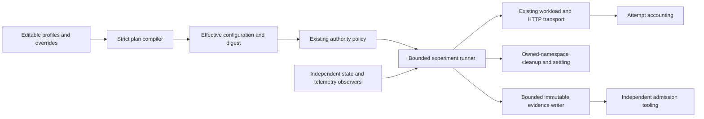

# Configurable load experiment plans

Status: accepted implementation direction; operator approved the #1141 research
recommendations and requested easy parameter reconfiguration.
Owner: [Fortemi #1141](https://git.integrolabs.net/Fortemi/fortemi/issues/1141).
Authority coordination: [#1136](https://git.integrolabs.net/Fortemi/fortemi/issues/1136),
[AIWG #2242](https://git.integrolabs.net/roctinam/aiwg/issues/2242).

## Decision

Use an editable versioned JSON configuration with defaults, named profiles and
explicit ordered overrides. Compile all selected values and the complete schedule
into a deterministic content-addressed artifact before execution. Reject unknown
keys, missing required shape, impossible samples and budget overflow. Unselected
site-specific values remain visible and cannot authorize execution. Parameter
changes require a fresh compiled digest and its corresponding authorization binding.

Retain the existing Node dataset controller, scheduler, transport and evidence
writer. Add one experiment lifecycle around them, complete attempt identities,
exact decimal provider budgets and a deterministic inventory oracle. Use a small
k6 arrival reference as a generator check. Calibration remains distinct from
qualification; all five certification phases and all operation/window floors remain
mandatory. No passing aggregate compensates for failed or missing cells.

The local authoring format does not change candidate 2.0.0 authority/receipt
schemas. The executable consumer is Fortemi's local experiment tooling. Existing
AIWG/React/HotM authority adoption and clean-destination gates remain separate.
An incompatible signed-contract change must receive its own version and coordinated
consumer delivery; a local configuration digest is not an approval signature.

## Components and data flow

## Consequences and delivery

Selected rates, windows, weights, thresholds, deadlines, concurrency, cost caps and
budgets can be changed without source edits. Effective configuration is reproducible;
operating-system scheduling is not. Pure checks and synthetic tests do not prove
capacity or independent observation. Provider snapshots enforce stop-on-breach;
reservation at the actual dispatch boundary is still required to prevent overspend.

Install the local compiler/runner first, wire the selected runtime adapters and
resource domains next, and run bounded calibration before frozen certification.
Rollback selects a prior complete configuration/runtime/fixture tuple under valid
authority. Do not reuse old signatures for changed parameters.

The [tooling guide](../../../scripts/qualification/README.md) defines parameters,
adapter contracts, lifecycle behavior and remaining runtime gates. The
[research proposal](../../../.aiwg/research/reports/issue-1141-load-qualification-research-proposal-2026-09-05.md)
provides the approved rationale. The existing
[admission ADR](ADR-dataset-qualification-admission.md), suite contract authority and
July audit remain controlling; suite NO-GO is unchanged.
