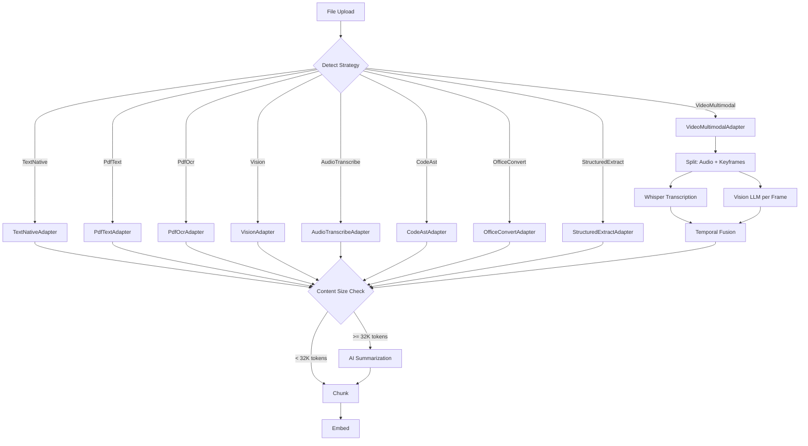
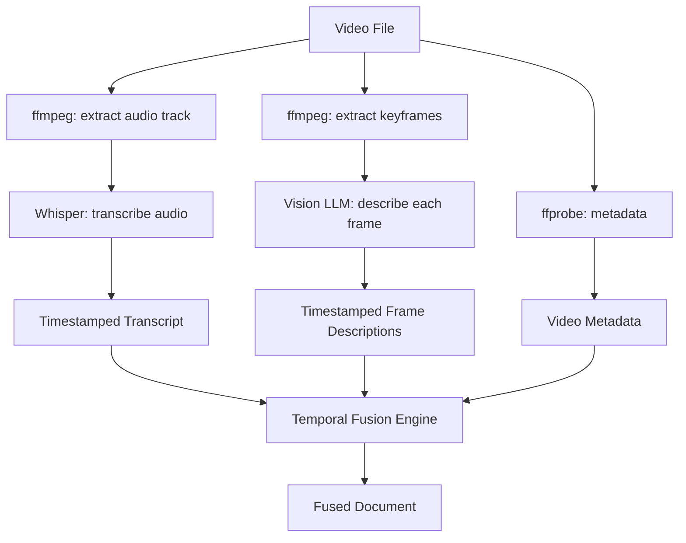

# Extraction Pipeline Design

Technical architecture for the complete content extraction pipeline covering all 9 `ExtractionStrategy` variants, multi-modal processing, AI summarization, and job orchestration.

**Status:** Design document (not yet implemented for 6 of 9 strategies)
**Last updated:** 2026-02-06

---

## Table of Contents

1. [Pipeline Overview](#pipeline-overview)
2. [Pipeline Stages](#pipeline-stages)
3. [Adapter Specifications](#adapter-specifications)
4. [Multi-Modal Processing](#multi-modal-processing)
5. [AI Summarization Layer](#ai-summarization-layer)
6. [Content Fusion](#content-fusion)
7. [Job Orchestration](#job-orchestration)
8. [Docker Dependencies Matrix](#docker-dependencies-matrix)
9. [New Types and Trait Extensions](#new-types-and-trait-extensions)
10. [Configuration](#configuration)
11. [Error Handling and Fallbacks](#error-handling-and-fallbacks)
12. [Phased Rollout Plan](#phased-rollout-plan)
13. [ADRs](#architectural-decision-records)

---

## Pipeline Overview

```
                                        Extraction Pipeline
 +---------------------------------------------------------------------------+
 |                                                                           |
 |  Upload      Detect         Extract           Fuse        Summarize       |
 |  +------+   +--------+   +----------+      +--------+   +-----------+    |
 |  | File |-->| MIME + |-->| Adapter  |--+-->| Multi- |-->| AI        |    |
 |  | data |   | DocType|   | dispatch |  |   | modal  |   | summarize |    |
 |  +------+   +--------+   +----------+  |   | fuse   |   | (if large)|    |
 |                                         |   +--------+   +-----------+    |
 |              For simple strategies      |       |              |          |
 |              (text, PDF, code, etc.)    |       |              |          |
 |              the fuse step is a         +-------+---------+----+          |
 |              pass-through                                 |               |
 |                                                           v               |
 |                                                    +------------+         |
 |                                                    |   Chunk    |         |
 |                                                    | (per doc   |         |
 |                                                    |  type cfg) |         |
 |                                                    +------------+         |
 |                                                           |               |
 |                                                           v               |
 |                                                    +------------+         |
 |                                                    |   Embed    |         |
 |                                                    +------------+         |
 +---------------------------------------------------------------------------+
```

### Data Flow



---

## Pipeline Stages

### Stage 1: Upload and Storage

Files arrive via `POST /api/v1/notes/:id/attachments` as base64-encoded JSON. The attachment service:

1. Decodes base64 data
2. Validates via `file_safety::validate_file()` (magic bytes, extension blocklist, size limits)
3. Computes BLAKE3 content hash for deduplication
4. Stores the file (inline in DB for files < 1 MB, filesystem otherwise)
5. Creates an `attachment` row with metadata
6. Queues an extraction job

### Stage 2: Detection

Strategy detection follows a two-tier lookup:

1. **DocumentType lookup** -- if the note has an explicit `document_type_id`, use its `extraction_strategy` field
2. **MIME + extension fallback** -- `ExtractionStrategy::from_mime_and_extension(mime, ext)` (already implemented in `matric-core/src/models.rs`)

The existing `from_mime_and_extension` method handles all 9 strategies with comprehensive MIME and extension mappings.

### Stage 3: Extraction

The `ExtractionRegistry` dispatches to the appropriate adapter. Each adapter returns `ExtractionResult`:

```rust
pub struct ExtractionResult {
    pub extracted_text: Option<String>,
    pub metadata: JsonValue,
    pub ai_description: Option<String>,
    pub preview_data: Option<Vec<u8>>,
}
```

### Stage 4: Multi-Modal Fusion (VideoMultimodal only)

For video, extraction produces multiple sub-results (transcript + frame descriptions) that must be fused into a single coherent document. See [Content Fusion](#content-fusion).

### Stage 5: AI Summarization (conditional)

When extracted text exceeds 32,000 tokens (roughly 128K characters), a summarization pass compresses it before chunking. See [AI Summarization Layer](#ai-summarization-layer).

### Stage 6: Chunk

Uses the document type's `chunking_strategy`, `chunk_size_default`, and `chunk_overlap_default`. The `ChunkingService` in `matric-api` delegates to `SemanticChunker` or `SyntacticChunker` depending on strategy.

### Stage 7: Embed

The existing embedding pipeline (`JobType::Embedding`) generates vectors via `matric-inference` and stores them in the `embeddings` table.

---

## Adapter Specifications

### 1. TextNativeAdapter (IMPLEMENTED)

**Strategy:** `ExtractionStrategy::TextNative`
**Location:** `crates/matric-jobs/src/adapters/text_native.rs`

| Attribute | Value |
|-----------|-------|
| External deps | None |
| Input | `&[u8]` raw file bytes |
| Output | UTF-8 text, `char_count`, `line_count` metadata |
| Large file handling | Lossy UTF-8 conversion; no size limit |
| Timeout | N/A (in-process) |
| Health check | Always `true` |

**Handles:** plaintext, markdown, HTML, CSS, restructuredText, org-mode, AsciiDoc

---

### 2. PdfTextAdapter (IMPLEMENTED)

**Strategy:** `ExtractionStrategy::PdfText`
**Location:** `crates/matric-jobs/src/adapters/pdf_text.rs`

| Attribute | Value |
|-----------|-------|
| External deps | `pdftotext`, `pdfinfo` (poppler-utils) |
| Input | `&[u8]` PDF bytes (validated via `%PDF` magic) |
| Output | Extracted text, PDF metadata (title, author, pages) |
| Large file handling | Batch extraction in 50-page chunks for PDFs > 100 pages |
| Timeout | 60s per `pdftotext`/`pdfinfo` invocation |
| Fallback | Sets `metadata.needs_ocr = true` when text < 50 chars on multi-page PDF |
| Health check | Runs `pdftotext -v` |

---

### 3. StructuredExtractAdapter (IMPLEMENTED)

**Strategy:** `ExtractionStrategy::StructuredExtract`
**Location:** `crates/matric-jobs/src/adapters/structured_extract.rs`

| Attribute | Value |
|-----------|-------|
| External deps | None |
| Input | `&[u8]` raw file bytes |
| Output | Raw text + format-specific metadata (JSON schema, CSV headers/counts) |
| Large file handling | Direct string conversion; metadata extraction is O(1) for headers |
| Timeout | N/A (in-process) |
| Health check | Always `true` |

**Handles:** JSON, YAML, TOML, CSV/TSV, XML, GeoJSON, NDJSON, BibTeX, iCalendar

---

### 4. PdfOcrAdapter (NOT IMPLEMENTED)

**Strategy:** `ExtractionStrategy::PdfOcr`
**File:** `crates/matric-jobs/src/adapters/pdf_ocr.rs`

| Attribute | Value |
|-----------|-------|
| External deps | `tesseract` (tesseract-ocr), `pdftoppm` (poppler-utils) |
| Input | `&[u8]` PDF bytes |
| Output | OCR text, per-page confidence scores, language detection |
| Large file handling | Page-by-page processing: `pdftoppm` renders one page at a time to PNG, `tesseract` OCRs each |
| Timeout | 120s per page (OCR is slow), 60s for `pdftoppm` |
| Fallback | If `tesseract` unavailable, return error with `needs_ocr: true` metadata |
| Health check | Runs `tesseract --version` |

**Processing flow:**

```
PDF bytes
  --> write to temp file
  --> pdfinfo (get page count)
  --> for each page (batched, 10 pages at a time):
        pdftoppm -png -f {page} -l {page} input.pdf -> page-{N}.png
        tesseract page-{N}.png stdout -l {lang} --oem 1
        collect text + confidence
  --> concatenate all page texts
  --> compute aggregate confidence
```

**Adapter pseudocode:**

```rust
pub struct PdfOcrAdapter;

#[async_trait]
impl ExtractionAdapter for PdfOcrAdapter {
    fn strategy(&self) -> ExtractionStrategy {
        ExtractionStrategy::PdfOcr
    }

    async fn extract(
        &self,
        data: &[u8],
        filename: &str,
        _mime_type: &str,
        config: &JsonValue,
    ) -> Result<ExtractionResult> {
        // 1. Validate PDF magic bytes
        // 2. Write to temp file
        // 3. Get page count from pdfinfo
        // 4. For each page batch (10 pages):
        //    a. pdftoppm renders page to PNG
        //    b. tesseract OCRs the PNG
        //    c. Parse confidence from tesseract stderr
        // 5. Concatenate all pages
        // 6. Return result with per-page confidence metadata

        let lang = config.get("ocr_language")
            .and_then(|v| v.as_str())
            .unwrap_or("eng");

        // ... implementation
    }
}
```

**Config options (`extraction_config` JSON):**

```json
{
  "ocr_language": "eng",
  "dpi": 300,
  "page_segmentation_mode": 3,
  "oem": 1
}
```

---

### 5. VisionAdapter (NOT IMPLEMENTED)

**Strategy:** `ExtractionStrategy::Vision`
**File:** `crates/matric-jobs/src/adapters/vision.rs`

| Attribute | Value |
|-----------|-------|
| External deps | Vision LLM via Ollama (LLaVA, llava-phi3, etc.) or OpenAI Vision API; `exiftool` (optional) |
| Input | `&[u8]` image bytes (JPEG, PNG, WebP, TIFF, etc.) |
| Output | AI description, EXIF metadata, dimensions |
| Large file handling | Resize images > 4MP before sending to vision model (max 2048px longest edge) |
| Timeout | 90s for vision model inference, 10s for exiftool |
| Fallback | If vision model unavailable, extract EXIF only and set `ai_description: None` |
| Health check | Check Ollama `/api/tags` for vision model availability |

**Processing flow:**

```
Image bytes
  --> detect format (magic bytes: JPEG FFD8, PNG 89504E47, etc.)
  --> extract EXIF metadata:
        exiftool -json -n input.{ext}
        parse GPS, timestamp, camera, dimensions
  --> resize if needed (imagemagick or image crate)
  --> base64-encode image for LLM
  --> call vision model:
        POST /api/generate
        {
          "model": "llava-phi3",
          "prompt": "Describe this image in detail...",
          "images": ["base64..."]
        }
  --> return ExtractionResult {
        extracted_text: Some(ai_description),
        metadata: { exif, dimensions, format },
        ai_description: Some(ai_description),
        preview_data: Some(thumbnail_bytes),
      }
```

**Vision model prompt:**

```
Describe this image in detail. Include:
- What the image shows (objects, people, scene)
- Any text visible in the image
- Colors, layout, and composition
- Context or purpose if apparent

Be factual and concise. Output plain text, not markdown.
```

**Adapter structure:**

```rust
pub struct VisionAdapter {
    /// Ollama/OpenAI client for vision model calls
    inference_url: String,
    /// Vision model name (e.g., "llava-phi3")
    model: String,
    /// Maximum image dimension before resize
    max_dimension: u32,
}

impl VisionAdapter {
    pub fn new(inference_url: String, model: String) -> Self {
        Self {
            inference_url,
            model,
            max_dimension: 2048,
        }
    }
}
```

**Note on Ollama vision API:** The Ollama `/api/generate` endpoint accepts an `images` array of base64-encoded strings alongside the prompt. The `matric-inference` crate currently does not have a vision method on `GenerationBackend`. A new trait method `generate_with_images` will be needed (see [New Types and Trait Extensions](#new-types-and-trait-extensions)).

---

### 6. AudioTranscribeAdapter (NOT IMPLEMENTED)

**Strategy:** `ExtractionStrategy::AudioTranscribe`
**File:** `crates/matric-jobs/src/adapters/audio_transcribe.rs`

| Attribute | Value |
|-----------|-------|
| External deps | Whisper (via `whisper-cli`, or Whisper.cpp, or Ollama whisper, or OpenAI Whisper API); `ffprobe` for metadata |
| Input | `&[u8]` audio bytes (MP3, WAV, FLAC, M4A, OGG, Opus) |
| Output | Transcript text with timestamps, audio metadata |
| Large file handling | Split audio > 30 min into 10-minute segments with 30s overlap |
| Timeout | 180s per segment (Whisper can be slow on CPU) |
| Fallback | If Whisper unavailable, extract metadata only (duration, bitrate, codec) |
| Health check | Runs whisper CLI `--help` or checks Ollama for whisper model |

**Processing flow:**

```
Audio bytes
  --> write to temp file
  --> ffprobe -v quiet -print_format json -show_format -show_streams input
        extract: duration, bitrate, codec, sample_rate, channels
  --> if duration > 30min:
        split into 10-min segments with 30s overlap:
          ffmpeg -i input -f segment -segment_time 600 -c copy seg_%03d.{ext}
        transcribe each segment
        merge transcripts, dedup overlapping text
  --> else:
        transcribe whole file
  --> whisper invocation:
        whisper input.wav --model small --output_format json --language auto
        parse: text, segments[{start, end, text}]
  --> return ExtractionResult {
        extracted_text: Some(full_transcript),
        metadata: {
          duration_secs, bitrate, codec, sample_rate, channels,
          language_detected, segments: [{start, end, text}],
          word_count, confidence_avg
        },
        ai_description: None,
      }
```

**Timestamp format in extracted text:**

```
[00:00:00] Welcome to the presentation on extraction pipelines.
[00:00:05] Today we will cover the architecture of content processing.
[00:01:30] Let me start with the overview of the system...
```

**Config options:**

```json
{
  "whisper_model": "small",
  "language": "auto",
  "segment_duration_secs": 600,
  "overlap_secs": 30,
  "backend": "cli"
}
```

`backend` can be `"cli"` (whisper CLI), `"api"` (OpenAI Whisper API), or `"ollama"` (Ollama whisper model).

---

### 7. VideoMultimodalAdapter (NOT IMPLEMENTED)

**Strategy:** `ExtractionStrategy::VideoMultimodal`
**File:** `crates/matric-jobs/src/adapters/video_multimodal.rs`

| Attribute | Value |
|-----------|-------|
| External deps | `ffmpeg`, `ffprobe`, Whisper (for audio), Vision LLM (for frames) |
| Input | `&[u8]` video bytes (MP4, WebM, MOV, AVI, MKV) |
| Output | Fused document: interleaved transcript + frame descriptions |
| Large file handling | Process in temporal segments; limit keyframes to 1 per 30s |
| Timeout | 300s total (5 min, matching `JOB_TIMEOUT_SECS`); extend to 600s for videos > 30 min |
| Fallback | Audio-only transcript if vision model unavailable |
| Health check | Checks `ffmpeg`, `ffprobe`, whisper, and vision model |

This is the most complex adapter. See [Multi-Modal Processing](#multi-modal-processing) for the full architecture.

---

### 8. CodeAstAdapter (NOT IMPLEMENTED)

**Strategy:** `ExtractionStrategy::CodeAst`
**File:** `crates/matric-jobs/src/adapters/code_ast.rs`

| Attribute | Value |
|-----------|-------|
| External deps | `tree-sitter` (Rust crate, already in `matric-db` Cargo.toml) |
| Input | `&[u8]` source code bytes |
| Output | Structured code text with AST metadata |
| Large file handling | tree-sitter handles large files efficiently; chunk at function/class boundaries |
| Timeout | N/A (in-process, tree-sitter is fast) |
| Fallback | Falls back to `TextNativeAdapter` if language unsupported |
| Health check | Always `true` (compiled-in) |

**Processing flow:**

```
Code bytes
  --> detect language from filename extension or mime type
  --> parse with tree-sitter to get AST
  --> extract code units via SyntacticChunker:
        functions, methods, classes, structs, enums, imports, constants
  --> generate structured extraction text:
        "File: main.rs (Rust)
         Language: rust
         Imports: std::io, tokio, serde

         ## Function: main (line 10-45)
         pub async fn main() -> Result<()> { ... }

         ## Struct: AppConfig (line 47-62)
         pub struct AppConfig { ... }

         ## Impl: AppConfig (line 64-120)
         impl AppConfig { ... }"
  --> metadata includes:
        language, function_count, class_count, line_count,
        imports[], exports[], dependencies inferred
```

**Integration with existing code:**

The `SyntacticChunker` in `crates/matric-db/src/syntactic_chunker.rs` already provides tree-sitter parsing for Rust, Python, JavaScript, and TypeScript. The `CodeAstAdapter` reuses this infrastructure:

```rust
use matric_db::syntactic_chunker::{SyntacticChunker, CodeChunk};

pub struct CodeAstAdapter {
    chunker: SyntacticChunker,
}

#[async_trait]
impl ExtractionAdapter for CodeAstAdapter {
    fn strategy(&self) -> ExtractionStrategy {
        ExtractionStrategy::CodeAst
    }

    async fn extract(
        &self,
        data: &[u8],
        filename: &str,
        _mime_type: &str,
        _config: &JsonValue,
    ) -> Result<ExtractionResult> {
        let text = String::from_utf8_lossy(data);
        let lang = detect_language(filename);

        let chunks = self.chunker.chunk_code(&text, &lang);
        let structured_text = format_code_extraction(&text, &chunks, filename, &lang);
        let metadata = build_code_metadata(&chunks, &lang, &text);

        Ok(ExtractionResult {
            extracted_text: Some(structured_text),
            metadata,
            ai_description: None,
            preview_data: None,
        })
    }
}
```

**Supported languages (via tree-sitter grammars in workspace):**

| Language | Grammar crate | Status |
|----------|--------------|--------|
| Rust | `tree-sitter-rust` | In Cargo.toml |
| Python | `tree-sitter-python` | In Cargo.toml |
| JavaScript | `tree-sitter-javascript` | In Cargo.toml |
| TypeScript | `tree-sitter-typescript` | In Cargo.toml |
| Go | -- | Future |
| Java | -- | Future |
| C/C++ | -- | Future |

For unsupported languages, fall back to `TextNativeAdapter` behavior (raw text + line count).

---

### 9. OfficeConvertAdapter (NOT IMPLEMENTED)

**Strategy:** `ExtractionStrategy::OfficeConvert`
**File:** `crates/matric-jobs/src/adapters/office_convert.rs`

| Attribute | Value |
|-----------|-------|
| External deps | `pandoc` |
| Input | `&[u8]` document bytes (docx, xlsx, pptx, rtf, odt, LaTeX, email) |
| Output | Converted markdown/plain text, document metadata |
| Large file handling | Pandoc handles large docs well; for xlsx with many sheets, extract sheet-by-sheet |
| Timeout | 120s per pandoc invocation |
| Fallback | If pandoc unavailable, attempt basic ZIP-based XML extraction for docx |
| Health check | Runs `pandoc --version` |

**Processing flow:**

```
Document bytes
  --> detect input format from extension/mime:
        .docx -> docx
        .xlsx -> xlsx (special handling)
        .pptx -> pptx
        .rtf  -> rtf
        .odt  -> odt
        .tex  -> latex
        .eml  -> email (custom parsing)
  --> for most formats:
        write to temp file
        pandoc -f {format} -t markdown --wrap=none input.{ext}
        capture stdout as markdown text
  --> for xlsx:
        pandoc -f xlsx -t markdown (converts first sheet)
        or use calamine crate for multi-sheet extraction
  --> for email (.eml, .mbox):
        parse headers (From, To, Subject, Date)
        extract body text (prefer text/plain, fall back to text/html)
        list attachments (names only, not recursive extraction)
  --> return ExtractionResult {
        extracted_text: Some(markdown_text),
        metadata: {
          original_format, page_count (if available),
          char_count, word_count,
          // for email:
          from, to, subject, date, attachment_names[]
        },
      }
```

**Pandoc format mapping:**

| Extension | Pandoc input format | Notes |
|-----------|-------------------|-------|
| .docx | docx | Best support |
| .xlsx | -- | Use calamine or csv export |
| .pptx | pptx | Extracts slide text |
| .rtf | rtf | Good support |
| .odt | odt | OpenDocument text |
| .ods | -- | Use calamine |
| .odp | -- | Limited; extract text only |
| .tex, .latex | latex | Excellent support |
| .epub | epub | Via pandoc |
| .eml | -- | Custom parser (not pandoc) |
| .mbox | -- | Custom parser |

---

## Multi-Modal Processing

### VideoMultimodal Architecture

Video processing is the most complex extraction strategy. It decomposes a video into two parallel tracks (audio and visual), processes each independently, then fuses the results into a temporally coherent document.



### Step 1: Metadata Extraction

```bash
ffprobe -v quiet -print_format json -show_format -show_streams input.mp4
```

Extracts: duration, resolution, fps, codec, bitrate, audio channels/sample rate.

### Step 2: Audio Track Extraction

```bash
ffmpeg -i input.mp4 -vn -acodec pcm_s16le -ar 16000 -ac 1 audio.wav
```

Converts to 16kHz mono WAV (optimal for Whisper). For long videos (> 30 min), segment the audio:

```bash
ffmpeg -i input.mp4 -vn -f segment -segment_time 600 \
  -acodec pcm_s16le -ar 16000 -ac 1 audio_seg_%03d.wav
```

### Step 3: Keyframe Extraction

Two strategies, chosen based on video length:

**Strategy A: Scene-change detection (videos < 30 min)**

```bash
ffmpeg -i input.mp4 -vf "select='gt(scene,0.3)',showinfo" \
  -vsync vfr -frame_pts 1 frame_%04d.jpg
```

This extracts frames at scene changes (threshold 0.3). Cap at 60 frames max.

**Strategy B: Fixed interval (videos >= 30 min)**

```bash
ffmpeg -i input.mp4 -vf "fps=1/30" frame_%04d.jpg
```

One frame every 30 seconds. For a 2-hour video, this produces 240 frames.

**Frame timestamp extraction:**

```bash
ffprobe -v quiet -print_format json -show_frames -select_streams v \
  -show_entries frame=pts_time input.mp4
```

Or parse from the `showinfo` filter output to get exact timestamps for each extracted frame.

### Step 4: Whisper Transcription

Same as `AudioTranscribeAdapter`, but invoked as a sub-operation:

```bash
whisper audio.wav --model small --output_format json --language auto
```

Returns segments with timestamps:

```json
{
  "segments": [
    {"start": 0.0, "end": 4.5, "text": "Welcome to the presentation."},
    {"start": 4.5, "end": 9.2, "text": "Today we will discuss..."}
  ]
}
```

### Step 5: Vision LLM Frame Analysis

For each keyframe, call the vision model:

**Prompt:**

```
Describe what is shown in this video frame. Be specific about:
- Visual content (objects, people, text, diagrams)
- Any on-screen text or UI elements
- Scene context

This is frame at timestamp {timestamp} of a {duration}-second video.
Keep the description to 2-3 sentences.
```

**Parallelization:** Process frames in batches of 4 concurrently (limited by GPU memory for local models). Use `tokio::task::JoinSet` or `futures::stream::FuturesUnordered`.

**Rate limiting:** For API-based vision models (OpenAI), respect rate limits with a semaphore.

### Step 6: Temporal Fusion

See [Content Fusion](#content-fusion).

---

## AI Summarization Layer

### When to Summarize

| Content size (tokens) | Action |
|-----------------------|--------|
| < 32,000 | No summarization; pass directly to chunking |
| 32,000 -- 128,000 | Single-pass summarization to ~8,000 tokens |
| 128,000 -- 512,000 | Map-reduce summarization (2 levels) |
| > 512,000 | Map-reduce summarization (3 levels) |

Token counting uses the `Tokenizer` trait (TikToken-based) already in `matric-core`.

### Summarization Strategies

#### Single-Pass Summarization

For moderately large content (32K--128K tokens):

```
Full extracted text (e.g., 80K tokens)
  --> split into 8K-token windows with 500-token overlap
  --> for each window, generate a 1K-token summary
  --> concatenate summaries (~10K tokens)
  --> final condensation pass to ~8K tokens
```

#### Map-Reduce Summarization

For very large content (128K+ tokens):

```
Level 0: Raw text (e.g., 200K tokens)
  --> split into 8K-token chunks (25 chunks)

Level 1: Map phase
  --> summarize each chunk to ~1K tokens (in parallel, batch of 4)
  --> 25 chunks x 1K tokens = 25K tokens

Level 2: Reduce phase
  --> group L1 summaries into sets of 8
  --> summarize each group to ~2K tokens
  --> ~6K tokens total

Level 3 (if needed): Final reduce
  --> single summarization pass on L2 output
  --> target: 4K--8K tokens
```

**Parallelization:** Map phases run concurrently using `tokio::task::JoinSet` with a concurrency limit matching `JOB_MAX_CONCURRENT` (default 4).

#### Implementation Type

```rust
/// Configuration for AI summarization of large extracted content.
pub struct SummarizationConfig {
    /// Token threshold to trigger summarization.
    pub threshold_tokens: usize,           // default: 32_000
    /// Target output size in tokens.
    pub target_tokens: usize,              // default: 8_000
    /// Window size for splitting input.
    pub window_tokens: usize,              // default: 8_000
    /// Overlap between windows.
    pub window_overlap_tokens: usize,      // default: 500
    /// Max concurrent summarization calls.
    pub max_concurrent: usize,             // default: 4
}

/// Summarizes large extracted content using map-reduce pattern.
pub struct ContentSummarizer {
    config: SummarizationConfig,
    generation_backend: Arc<dyn GenerationBackend>,
    tokenizer: Arc<dyn Tokenizer>,
}

impl ContentSummarizer {
    /// Summarize if content exceeds threshold; otherwise return as-is.
    pub async fn maybe_summarize(&self, text: &str) -> Result<SummarizationResult> {
        let token_count = self.tokenizer.count_tokens(text);
        if token_count < self.config.threshold_tokens {
            return Ok(SummarizationResult {
                text: text.to_string(),
                was_summarized: false,
                original_tokens: token_count,
                summary_tokens: token_count,
                levels: 0,
            });
        }
        // ... map-reduce implementation
    }
}

pub struct SummarizationResult {
    pub text: String,
    pub was_summarized: bool,
    pub original_tokens: usize,
    pub summary_tokens: usize,
    pub levels: usize,
}
```

**Summarization prompt:**

```
Summarize the following content, preserving key facts, names, dates, and
technical details. Maintain the original structure where possible (headings,
lists). Do not add information not present in the source.

Content:
{chunk_text}
```

### Preserving Original Text

The summarized text replaces `extracted_text` for chunking/embedding purposes, but the full original extraction is preserved in the attachment's `extracted_content` field in the database. This allows re-processing if models improve.

---

## Content Fusion

### Temporal Fusion for Video

The fusion engine interleaves transcript segments with frame descriptions by timestamp, producing a readable document.

**Algorithm:**

```
1. Collect all events into a unified timeline:
   - Transcript segments: (start_time, end_time, "transcript", text)
   - Frame descriptions: (timestamp, timestamp, "frame", description)

2. Sort by start_time

3. Group into temporal windows (30-second blocks)

4. For each window:
   - Emit a timestamp header: "## [MM:SS - MM:SS]"
   - Emit transcript text for this window
   - If any frame descriptions fall in this window:
     - Emit "[Visual: {description}]" inline

5. Concatenate all windows into final document
```

**Example fused output:**

```
# Video: project-demo.mp4
Duration: 5:30 | Resolution: 1920x1080 | Extracted: 2026-02-06

## [00:00 - 00:30]
Welcome to the project demo. Today I'll walk you through the new
extraction pipeline architecture.
[Visual: Title slide showing "Extraction Pipeline v2" with a diagram
of connected boxes representing pipeline stages]

## [00:30 - 01:00]
The pipeline starts with file upload. When a user attaches a file,
we first detect the content type using MIME headers and magic bytes.
[Visual: Screen recording of a web interface with a file upload dialog.
A PDF file named "research-paper.pdf" is being dragged into the upload area]

## [01:00 - 01:30]
For video files, we split processing into two parallel tracks:
audio transcription and keyframe analysis.
[Visual: Architecture diagram showing a video file splitting into
"Audio Track" and "Keyframe Extraction" branches]
```

**Fusion data types:**

```rust
/// A temporal event from one modality of the video.
pub struct TemporalEvent {
    pub start_secs: f64,
    pub end_secs: f64,
    pub modality: Modality,
    pub content: String,
}

pub enum Modality {
    Transcript,
    FrameDescription,
}

/// Fuses multi-modal temporal events into a single document.
pub fn fuse_temporal_events(
    events: &[TemporalEvent],
    video_metadata: &JsonValue,
    window_secs: f64,  // default: 30.0
) -> String {
    // Sort events by start time
    // Group into temporal windows
    // Interleave transcript and frame descriptions
    // Return formatted document
}
```

### Multi-Modal Metadata

The fused document's `metadata` JSON includes source information:

```json
{
  "video": {
    "duration_secs": 330,
    "resolution": "1920x1080",
    "fps": 30,
    "codec": "h264"
  },
  "audio": {
    "transcript_segments": 42,
    "language_detected": "en",
    "confidence_avg": 0.92
  },
  "visual": {
    "keyframes_extracted": 12,
    "scene_changes_detected": 8,
    "vision_model": "llava-phi3"
  },
  "fusion": {
    "temporal_windows": 11,
    "total_tokens": 4500
  }
}
```

---

## Job Orchestration

### Single Extraction Job Model

All extraction is triggered by a single `JobType::Extraction` job (or by extending an existing job type). The job handler dispatches to the `ExtractionRegistry`, which selects the correct adapter.

**Note:** The current `JobType` enum does not include an `Extraction` variant. Two options:

1. **Add `JobType::Extraction`** -- Clean separation; requires a migration to add the enum value
2. **Use existing job payload** -- Encode extraction as a payload variant of an existing job type

**Recommendation:** Add `JobType::Extraction` to the enum. This aligns with how other job types are structured and makes monitoring/filtering clear.

### Job Payload Schema

```json
{
  "attachment_id": "uuid",
  "note_id": "uuid",
  "strategy": "video_multimodal",
  "extraction_config": {},
  "parent_job_id": null
}
```

### Sub-Job Spawning for VideoMultimodal

Video extraction requires orchestrating multiple sub-operations. Rather than spawning separate database-level jobs (which adds complexity for progress tracking), the `VideoMultimodalAdapter` handles orchestration internally using Tokio tasks:

```
ExtractionJob (VideoMultimodal)
  |
  +--> [internal] spawn audio extraction task
  |      +--> ffmpeg: extract audio
  |      +--> whisper: transcribe
  |      +--> return timestamped transcript
  |
  +--> [internal] spawn keyframe extraction task
  |      +--> ffmpeg: extract keyframes
  |      +--> for each frame (batched):
  |      |      +--> vision LLM: describe
  |      +--> return timestamped descriptions
  |
  +--> await both tasks (tokio::join!)
  +--> fuse results
  +--> return ExtractionResult
```

**Progress tracking within the adapter:**

The adapter receives no direct progress callback (the `ExtractionAdapter` trait does not include one). Progress is reported at the job level. For internal progress visibility, the adapter logs progress via `tracing`:

```rust
debug!(stage = "audio_extraction", progress = 30, "Extracting audio track");
debug!(stage = "keyframe_extraction", progress = 50, "Extracted 12 keyframes");
debug!(stage = "transcription", progress = 70, "Whisper transcription complete");
debug!(stage = "vision_analysis", progress = 85, "Analyzed 12/12 keyframes");
debug!(stage = "fusion", progress = 95, "Fusing multi-modal content");
```

**Future enhancement:** Add an optional progress callback to `ExtractionAdapter::extract()` to enable fine-grained progress updates for long-running adapters. This would be a non-breaking change (add a default no-op implementation).

### Dependency Chain: Extract -> Summarize -> Chunk -> Embed

After extraction completes, the existing job pipeline takes over:

```
Extraction Job completes
  --> Job handler checks extracted_text size
  --> If large: run ContentSummarizer inline (same job)
  --> Store extracted_text + metadata on attachment row
  --> Update note content if attachment_generates_content = true
  --> Queue Embedding job (existing pipeline)
  --> Embedding job chunks + embeds (existing pipeline)
  --> Queue Linking, TitleGeneration, ConceptTagging (existing pipeline)
```

This reuses the existing job chain rather than introducing new job types for summarization and chunking. The extraction job is the "entry point" that feeds into the established pipeline.

### Job Timeout Strategy

| Strategy | Default timeout | Extended timeout | Justification |
|----------|---------------|-----------------|---------------|
| TextNative | 300s | -- | Fast; in-process |
| PdfText | 300s | -- | pdftotext is fast |
| PdfOcr | 300s | 600s for > 50 pages | Tesseract is CPU-intensive |
| Vision | 300s | -- | Single model call |
| AudioTranscribe | 300s | 600s for > 30 min | Whisper on CPU is slow |
| VideoMultimodal | 300s | 900s for > 10 min | Multiple model calls |
| CodeAst | 300s | -- | In-process tree-sitter |
| OfficeConvert | 300s | -- | Pandoc is fast |
| StructuredExtract | 300s | -- | In-process |

Extended timeouts are set via `extraction_config`:

```json
{
  "timeout_secs": 600
}
```

The job handler reads this before applying `tokio::time::timeout`.

---

## Docker Dependencies Matrix

### Required System Packages Per Adapter

| Adapter | Debian packages | Container size impact | Required? |
|---------|----------------|----------------------|-----------|
| TextNative | (none) | 0 MB | Always |
| PdfText | `poppler-utils` | ~3 MB | Already in Dockerfile.bundle |
| PdfOcr | `tesseract-ocr`, `tesseract-ocr-eng` | ~30 MB (+ ~15 MB per language) | Phase 2 |
| Vision | (none -- uses Ollama API) | 0 MB | Phase 3 |
| AudioTranscribe | `ffmpeg` + Whisper binary | ~80 MB (ffmpeg) + ~500 MB (whisper model) | Phase 3 |
| VideoMultimodal | `ffmpeg` | ~80 MB (shared with Audio) | Phase 4 |
| CodeAst | (none -- Rust crate) | 0 MB | Phase 2 |
| OfficeConvert | `pandoc` | ~100 MB | Phase 2 |
| StructuredExtract | (none) | 0 MB | Always |

### Optional Packages

| Package | Used by | Purpose |
|---------|---------|---------|
| `exiftool` (libimage-exiftool-perl) | Vision | EXIF metadata extraction |
| `imagemagick` | Vision | Image resize before vision model |
| Additional tesseract language packs | PdfOcr | Multi-language OCR |

### Dockerfile.bundle Updates

The `Dockerfile.bundle` currently installs `poppler-utils`. For the full pipeline:

```dockerfile
# Phase 2 additions
RUN apt-get update && apt-get install -y --no-install-recommends \
    # OCR
    tesseract-ocr \
    tesseract-ocr-eng \
    # Office conversion
    pandoc \
    && rm -rf /var/lib/apt/lists/*

# Phase 3 additions (separate layer for caching)
RUN apt-get update && apt-get install -y --no-install-recommends \
    # Audio/Video processing
    ffmpeg \
    # Image metadata
    libimage-exiftool-perl \
    && rm -rf /var/lib/apt/lists/*
```

### Whisper Deployment Options

Whisper is the largest dependency. Options:

1. **Sidecar container** -- Run Whisper as a separate service (whisper-asr-webservice). API-based, no binary in main container.
2. **Whisper.cpp binary** -- Compile statically, include in image. ~10 MB binary + model files.
3. **Ollama whisper** -- If Ollama supports whisper (experimental). Zero additional dependencies.
4. **OpenAI Whisper API** -- Cloud-based. No local deps. Requires API key.

**Recommendation:** Default to sidecar (option 1) for self-hosted, OpenAI API (option 4) for cloud deployments. Configure via `WHISPER_BACKEND` env var.

---

## New Types and Trait Extensions

### VisionBackend Trait

The existing `GenerationBackend` trait does not support image inputs. Add a new trait:

```rust
/// Backend for vision model inference (image + text -> text).
#[async_trait]
pub trait VisionBackend: Send + Sync {
    /// Generate text description from an image with a prompt.
    async fn describe_image(
        &self,
        image_data: &[u8],
        mime_type: &str,
        prompt: &str,
    ) -> Result<String>;

    /// Generate text descriptions for multiple images (batch).
    async fn describe_images(
        &self,
        images: &[(Vec<u8>, String)],  // (data, mime_type)
        prompt: &str,
    ) -> Result<Vec<String>> {
        // Default: sequential processing
        let mut results = Vec::with_capacity(images.len());
        for (data, mime) in images {
            results.push(self.describe_image(data, mime, prompt).await?);
        }
        Ok(results)
    }

    /// Get the vision model name.
    fn vision_model_name(&self) -> &str;

    /// Check if the vision backend is available.
    async fn health_check(&self) -> Result<bool>;
}
```

### TranscriptionBackend Trait

```rust
/// Backend for audio transcription (audio -> timestamped text).
#[async_trait]
pub trait TranscriptionBackend: Send + Sync {
    /// Transcribe audio data to timestamped text segments.
    async fn transcribe(
        &self,
        audio_data: &[u8],
        config: &TranscriptionConfig,
    ) -> Result<TranscriptionResult>;

    /// Get the model name.
    fn model_name(&self) -> &str;

    /// Check availability.
    async fn health_check(&self) -> Result<bool>;
}

pub struct TranscriptionConfig {
    pub language: Option<String>,   // None = auto-detect
    pub model_size: String,         // "tiny", "base", "small", "medium", "large"
}

pub struct TranscriptionResult {
    pub full_text: String,
    pub segments: Vec<TranscriptSegment>,
    pub language_detected: String,
    pub duration_secs: f64,
}

pub struct TranscriptSegment {
    pub start_secs: f64,
    pub end_secs: f64,
    pub text: String,
    pub confidence: f32,
}
```

### Extended ExtractionResult

Consider adding optional fields for richer extraction metadata:

```rust
pub struct ExtractionResult {
    pub extracted_text: Option<String>,
    pub metadata: JsonValue,
    pub ai_description: Option<String>,
    pub preview_data: Option<Vec<u8>>,
    // --- New fields (Phase 2+) ---
    /// Whether the content was AI-summarized from a larger original.
    pub was_summarized: bool,
    /// Original token count before summarization.
    pub original_token_count: Option<usize>,
    /// Per-page or per-segment sub-results (for multi-modal).
    pub sub_results: Vec<SubExtractionResult>,
}

pub struct SubExtractionResult {
    pub modality: String,       // "transcript", "frame_description", "page_ocr"
    pub start_offset: f64,      // seconds (for temporal) or page number
    pub end_offset: f64,
    pub text: String,
    pub confidence: Option<f32>,
}
```

**Migration note:** Adding fields with `#[serde(default)]` is backward-compatible. Existing adapters will produce results with `was_summarized: false` and empty `sub_results`.

---

## Configuration

### Environment Variables

```bash
# Extraction pipeline
EXTRACTION_CMD_TIMEOUT_SECS=60      # Per-command timeout (already exists)
EXTRACTION_JOB_TIMEOUT_SECS=300     # Per-job timeout (already JOB_TIMEOUT_SECS)

# Vision
VISION_MODEL=llava-phi3             # Ollama vision model name
VISION_MAX_DIMENSION=2048           # Max image dimension before resize

# Transcription
WHISPER_BACKEND=cli                 # cli | api | ollama | sidecar
WHISPER_MODEL=small                 # tiny | base | small | medium | large
WHISPER_API_URL=                    # For sidecar/API backend
WHISPER_API_KEY=                    # For OpenAI Whisper API

# OCR
TESSERACT_LANGUAGE=eng              # Tesseract language (eng, deu, fra, etc.)
TESSERACT_OEM=1                     # OCR engine mode (0=legacy, 1=LSTM, 2=both)

# Summarization
SUMMARIZATION_THRESHOLD_TOKENS=32000
SUMMARIZATION_TARGET_TOKENS=8000
SUMMARIZATION_MAX_CONCURRENT=4

# Video
VIDEO_KEYFRAME_INTERVAL_SECS=30    # Seconds between keyframes
VIDEO_MAX_KEYFRAMES=60             # Maximum keyframes to extract
VIDEO_SCENE_CHANGE_THRESHOLD=0.3   # Scene detection sensitivity
```

### Constants in `matric-core/src/defaults.rs`

```rust
// Extraction pipeline (additions to existing file)
pub const VISION_MAX_DIMENSION: u32 = 2048;
pub const WHISPER_MODEL_DEFAULT: &str = "small";
pub const TESSERACT_LANGUAGE_DEFAULT: &str = "eng";
pub const TESSERACT_OEM_DEFAULT: u32 = 1;
pub const OCR_DPI_DEFAULT: u32 = 300;
pub const OCR_BATCH_PAGES: usize = 10;
pub const SUMMARIZATION_THRESHOLD_TOKENS: usize = 32_000;
pub const SUMMARIZATION_TARGET_TOKENS: usize = 8_000;
pub const SUMMARIZATION_WINDOW_TOKENS: usize = 8_000;
pub const SUMMARIZATION_WINDOW_OVERLAP: usize = 500;
pub const VIDEO_KEYFRAME_INTERVAL_SECS: f64 = 30.0;
pub const VIDEO_MAX_KEYFRAMES: usize = 60;
pub const VIDEO_SCENE_CHANGE_THRESHOLD: f32 = 0.3;
pub const AUDIO_SEGMENT_DURATION_SECS: u64 = 600;
pub const AUDIO_SEGMENT_OVERLAP_SECS: u64 = 30;
pub const VISION_INFERENCE_TIMEOUT_SECS: u64 = 90;
pub const WHISPER_TIMEOUT_PER_SEGMENT_SECS: u64 = 180;
pub const OCR_TIMEOUT_PER_PAGE_SECS: u64 = 120;
```

---

## Error Handling and Fallbacks

### Fallback Chain

Each adapter has a defined fallback when external dependencies are missing:

```
PdfOcr (tesseract missing)
  --> Fall back to PdfText
  --> If PdfText yields empty text, set needs_ocr: true in metadata

Vision (Ollama/vision model unavailable)
  --> Extract EXIF metadata only
  --> Set ai_description: None
  --> Log warning: "Vision model unavailable, metadata-only extraction"

AudioTranscribe (Whisper unavailable)
  --> Extract audio metadata only (ffprobe)
  --> Set extracted_text: None
  --> Log warning

VideoMultimodal (partial availability)
  --> If Whisper available but Vision not:
        Extract audio transcript only, skip frame analysis
  --> If Vision available but Whisper not:
        Extract keyframe descriptions only, skip transcript
  --> If neither available:
        Extract video metadata only (ffprobe)

CodeAst (unsupported language)
  --> Fall back to TextNative (raw text extraction)

OfficeConvert (pandoc unavailable)
  --> For .docx: attempt basic ZIP XML extraction
  --> For others: return error
```

### Health Check Integration

The `ExtractionRegistry::health_check_all()` method already exists. On startup, the API should:

1. Run health checks for all registered adapters
2. Log which adapters are healthy/unhealthy
3. Expose via `GET /health` endpoint (under `extraction.adapters` key)
4. Degrade gracefully: unhealthy adapters return errors, don't crash the worker

### Error Types

Extraction errors should be categorized for retry logic:

```rust
pub enum ExtractionError {
    /// External tool not installed (non-retryable)
    DependencyMissing { tool: String, adapter: String },
    /// External tool timed out (retryable)
    Timeout { tool: String, elapsed_secs: u64 },
    /// External tool returned non-zero exit (retryable on transient errors)
    ToolFailed { tool: String, exit_code: i32, stderr: String },
    /// Invalid input data (non-retryable)
    InvalidInput(String),
    /// Inference model unavailable (retryable)
    ModelUnavailable { model: String, backend: String },
    /// Inference model returned error (retryable)
    ModelError { model: String, error: String },
}
```

Map these to `JobResult::Retry` (for transient) or `JobResult::Failed` (for permanent).

---

## Phased Rollout Plan

### Phase 1: Foundation (Current State)

**Status: COMPLETE**

- [x] `ExtractionAdapter` trait
- [x] `ExtractionRegistry` with dispatch
- [x] `TextNativeAdapter` (plaintext, markdown, code as text)
- [x] `PdfTextAdapter` (pdftotext + pdfinfo, batch processing)
- [x] `StructuredExtractAdapter` (JSON, YAML, TOML, CSV, XML)
- [x] `ExtractionStrategy` enum with all 9 variants
- [x] `ExtractionStrategy::from_mime_and_extension()` detection
- [x] Per-job timeout (5 min)
- [x] Per-command timeout (60s)
- [x] DocumentType extraction_strategy field

### Phase 2: In-Process Adapters (No New External Dependencies)

**Estimated effort: 1--2 weeks**

Adds adapters that rely on compiled-in Rust crates or tools already in the Docker image.

- [ ] `CodeAstAdapter` -- tree-sitter integration (crate already in workspace)
  - Reuse `SyntacticChunker` from `matric-db`
  - Structured output with function/class boundaries
  - Fallback to TextNative for unsupported languages
- [ ] `PdfOcrAdapter` -- tesseract OCR
  - Add `tesseract-ocr` to Dockerfile.bundle
  - Page-by-page rendering via `pdftoppm`
  - Configurable language and DPI
- [ ] `OfficeConvertAdapter` -- pandoc conversion
  - Add `pandoc` to Dockerfile.bundle
  - Support docx, pptx, rtf, odt, LaTeX
  - Email parsing for .eml/.mbox
- [ ] Add `JobType::Extraction` to enum (migration)
- [ ] Wire extraction job into the worker dispatch loop
- [ ] Health check endpoint integration

### Phase 3: AI-Powered Adapters (Requires Inference Backend)

**Estimated effort: 2--3 weeks**

Adds adapters that require LLM inference (vision, transcription).

- [ ] `VisionBackend` trait in `matric-inference`
- [ ] Ollama vision implementation (LLaVA support)
- [ ] `VisionAdapter` -- image description + EXIF
  - Add `exiftool` to Dockerfile.bundle
  - Image resize before model call
  - EXIF metadata extraction
- [ ] `TranscriptionBackend` trait in `matric-inference`
- [ ] Whisper integration (CLI + API backends)
- [ ] `AudioTranscribeAdapter` -- whisper transcription
  - Add `ffmpeg` to Dockerfile.bundle
  - Audio segmentation for long files
  - Timestamp-aligned output
- [ ] `ContentSummarizer` for large extracted content
  - Map-reduce summarization
  - Token-based thresholds

### Phase 4: Video Multi-Modal (Complex Orchestration)

**Estimated effort: 2--3 weeks**

Builds on Phase 3 (requires both Vision and Audio adapters).

- [ ] `VideoMultimodalAdapter`
  - Audio track extraction via ffmpeg
  - Keyframe extraction (scene-change + fixed-interval)
  - Parallel audio transcription + frame analysis
  - Temporal fusion engine
- [ ] `fuse_temporal_events()` fusion function
- [ ] Extended timeouts for long videos
- [ ] Progress logging for multi-stage processing

### Phase 5: Polish and Optimization

**Estimated effort: 1--2 weeks**

- [ ] Extended `ExtractionResult` with `was_summarized`, `sub_results`
- [ ] Extraction progress callback on `ExtractionAdapter` trait
- [ ] Extraction analytics dashboard (success rates, avg duration per adapter)
- [ ] Retry logic tuning (which errors are transient vs permanent)
- [ ] Performance benchmarking: extraction throughput per adapter
- [ ] Documentation: operator's guide for configuring external tools

---

## Architectural Decision Records

### ADR-E01: Single Adapter Trait for All Strategies

**Status:** Accepted

**Context:** All 9 extraction strategies have very different processing requirements (in-process text parsing vs. multi-stage video decomposition with multiple LLM calls). Should we have one trait or specialized traits per category?

**Decision:** Keep the single `ExtractionAdapter` trait with the uniform `extract(&self, data, filename, mime, config) -> ExtractionResult` interface.

**Rationale:**
- The `ExtractionRegistry` dispatch logic stays simple (HashMap lookup)
- Complex adapters (VideoMultimodal) handle their internal complexity privately
- The `config: &JsonValue` parameter provides per-adapter configuration flexibility
- All adapters produce the same output type, which simplifies downstream processing

**Consequences:**
- VideoMultimodal adapter will be internally complex (hundreds of lines)
- Progress reporting is coarse-grained (at the job level, not per-stage)
- Future: may add an optional progress callback parameter if needed

### ADR-E02: In-Process Video Orchestration Over Sub-Jobs

**Status:** Accepted

**Context:** Video processing has multiple stages (extract audio, extract frames, transcribe, analyze, fuse). Should these be separate database-level jobs with dependency tracking, or internal tasks within a single job?

**Decision:** Keep video orchestration within a single job, using Tokio tasks internally.

**Rationale:**
- Avoids complexity of job dependency graphs in the database
- Progress tracking for sub-jobs would require new DB schema
- A single job with 5--15 minute timeout is sufficient
- Internal parallelism (audio + keyframes) is handled by `tokio::join!`
- Failure is atomic: if any stage fails, the whole extraction fails and can be retried

**Consequences:**
- No partial results if video extraction fails partway through
- Worker thread is blocked for the full video processing duration
- May need to increase `JOB_MAX_CONCURRENT` or use a dedicated "heavy extraction" worker pool

### ADR-E03: Whisper Deployment as Sidecar

**Status:** Proposed

**Context:** Whisper is the largest dependency (~500 MB for model files). Including it in the main Docker image significantly increases image size.

**Decision:** Support multiple Whisper backends via configuration (`WHISPER_BACKEND`), defaulting to sidecar for self-hosted and OpenAI API for cloud.

**Rationale:**
- Keeps the main container slim (~200 MB currently)
- Sidecar scales independently (can run on GPU node)
- API backend works for users who prefer cloud services
- CLI backend available for single-server deployments that accept larger images

**Consequences:**
- More complex deployment for self-hosted users (need to run whisper sidecar)
- Need to implement and test multiple backends
- Default (no whisper configured) gracefully degrades to metadata-only audio extraction

### ADR-E04: Map-Reduce Summarization Over Truncation

**Status:** Accepted

**Context:** Extracted content can be very large (400-page PDF = ~200K tokens, 2-hour video transcript = ~100K tokens). This exceeds chunking limits and produces too many embedding vectors.

**Decision:** Use hierarchical map-reduce summarization to compress large content, with configurable thresholds.

**Rationale:**
- Preserves information from the entire document (no content is dropped)
- Parallelizable: map phase runs concurrent summarization calls
- Configurable: threshold and target tokens tunable per deployment
- Original text preserved in database for future re-processing
- Alternative (truncation) loses end-of-document information

**Consequences:**
- Additional LLM calls for large documents (cost/latency)
- Summarization quality depends on the generation model
- Need to tune thresholds: too low wastes compute, too high loses detail

### ADR-E05: Temporal Fusion Window Size

**Status:** Accepted

**Context:** When fusing video transcript and frame descriptions, what temporal resolution should be used?

**Decision:** Use 30-second windows for fusion.

**Rationale:**
- 30 seconds captures a single concept/scene transition
- Produces readable document sections (not too granular, not too coarse)
- Aligns with the default keyframe extraction interval
- For a 5-minute video: 10 windows (manageable output)
- For a 2-hour video: 240 windows, but summarization will compress this

**Consequences:**
- Fast-paced content (music videos, action sequences) may merge distinct scenes
- Very slow content (lectures) may have sparse windows
- Future: could adapt window size based on scene-change density
